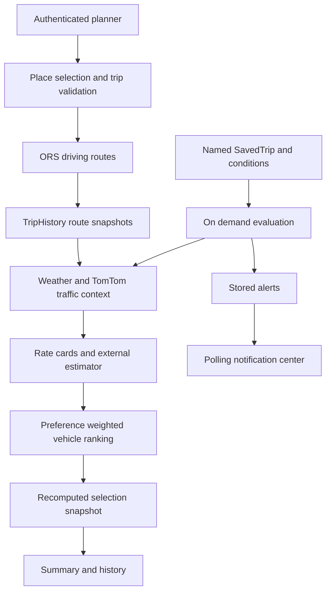

# Nobojatra: project assessment, commercial scope, and expansion roadmap

**Assessment date:** 9 September 2026  
**Repository:** `nobojatra`  
**Branch and commit:** `mobile-ui` at `bd960764d476eb000b7985b31342157c4002da8e`  
**Purpose:** Understand the present project, identify its limitations, and define realistic ways to develop and sell a complete web application.

**Revision:** Second in-depth review completed on the same date and source snapshot. Six additional findings, G30–G35, supplement the original 29. Section 2.3 summarizes what changed; commercial onboarding, privacy boundaries and operational acceptance are expanded in Sections 12–15.

**Revision 3:** A third pass on the same source snapshot adds the two sections the first two did not cover — product finish and code-grounded feature candidates. Twelve refinement findings, P01–P12, are set out in Section 19 with a prioritized backlog; ten feature candidates, F15–F24, continue the F-series in Section 20, each justified by data or services already present in the repository; Section 21 adds twenty-five refinements, R01–R25, to features that are already built and working; and Section 22 adds nine configuration and identity findings, C01–C09, of which C01 — a hardcoded production auth base URL affecting every other environment — should be treated as a P0 alongside Section 5 (downgraded to P1 in Revision 4). Section 2.4 records the method and its limits. No application source was changed.

**Revision 4 (17 September 2026):** A fourth pass checked every earlier finding against the current source (`main` at `2d6f172`; the only change since the assessed commit is `README.md`). Section 23 records the result. Most findings stand. Twelve statements were wrong or out of date and are corrected in place, each marked *Corrected in the fourth pass*. The most consequential corrections: C01 does not send local credentials to production, but it does break sign-in everywhere except the Render hostname. R20 and F17 describe `TrafficData` writes that the product never makes. The repository now has no environment documentation at all (C02). The pass adds seven findings (C10, C11, G36–G38, P13, P14) and five refinements (R26–R30). Two need action before any wider rollout: rate-limit client IPs can be spoofed, and Better Auth may put every visitor in one shared sign-in bucket (C10). Displayed trip times also depend on where the code runs (G36). Evidence is in `docs/audits/2026-09-17/`. Again, no application source was changed.

**Contents**

- [1. Overall assessment](#1-overall-assessment)
- [2. What this assessment establishes](#2-what-this-assessment-establishes)
- [3. What the project is today](#3-what-the-project-is-today)
- [4. Feature inventory: implemented, partial, and absent](#4-feature-inventory-implemented-partial-and-absent)
- [5. Findings that should block or constrain a paid launch](#5-findings-that-should-block-or-constrain-a-paid-launch)
- [6. Where the project report needs qualification](#6-where-the-project-report-needs-qualification)
- [7. What is worth preserving](#7-what-is-worth-preserving)
- [8. Commercial possibilities and which ones to pursue](#8-commercial-possibilities-and-which-ones-to-pursue)
- [9. Feature expansion in detail](#9-feature-expansion-in-detail)
- [10. Features to defer, and why](#10-features-to-defer-and-why)
- [11. External constraints and ways to manage them](#11-external-constraints-and-ways-to-manage-them)
- [12. Target architecture and data contracts](#12-target-architecture-and-data-contracts)
- [13. Monetization, economics and sales validation](#13-monetization-economics-and-sales-validation)
- [14. Implementation roadmap and delivery gates](#14-implementation-roadmap-and-delivery-gates)
- [15. Testing and evidence required before launch](#15-testing-and-evidence-required-before-launch)
- [16. Measuring success without misleading ourselves](#16-measuring-success-without-misleading-ourselves)
- [17. Questions the repository cannot answer](#17-questions-the-repository-cannot-answer)
- [18. Recommended scope for the first sellable version](#18-recommended-scope-for-the-first-sellable-version)
- [19. Product polish: the finish layer](#19-product-polish-the-finish-layer)
- [20. Additional feature candidates grounded in the current source](#20-additional-feature-candidates-grounded-in-the-current-source)
- [21. Refinements to features that already exist](#21-refinements-to-features-that-already-exist)
- [22. Configuration, deployment and the auth surface](#22-configuration-deployment-and-the-auth-surface)
- [23. Fourth pass: verification, corrections and new findings](#23-fourth-pass-verification-corrections-and-new-findings)
- [Appendix A. Current API surface by responsibility](#appendix-a-current-api-surface-by-responsibility)
- [Appendix B. Exact lint findings](#appendix-b-exact-lint-findings)
- [Appendix C. Audit artifact notes](#appendix-c-audit-artifact-notes)

## 1. Overall assessment

Nobojatra has a substantial foundation for a **condition-aware travel planning product**. It already connects identity, place search, route generation, multi-stop itineraries, approximate fares, weather, traffic queries, preference-based recommendations, saved trips, alerts, and history in one Next.js application. It is considerably beyond a set of disconnected demonstration screens.

It is **not yet ready for a general paid launch**. Some issues are straightforward engineering defects: unprotected legacy APIs, a shared route cache that can expose another user's custom waypoint labels, inconsistent handling of scheduled dates, incomplete input validation, and stale selections. Others concern the product's central promises: local rate cards are not verified live prices; a selected vehicle is not a booking; current weather is not a departure-time forecast; an opportunistic alert evaluator is not a dependable reminder service; a country option does not establish actual service availability.

My recommended direction is to develop a reliable planning product for **one bounded market and one recurring use case**, then expand on evidence. A Dhaka commute companion, initially distributed through an employer, university, or other organization, is a plausible starting hypothesis. An organization pays only if the product solves an operational problem it recognizes, such as communicating commute disruptions, managing a maintained shuttle timetable, or helping people plan recurring journeys. This willingness to pay has not been demonstrated by the repository or project report.

Keep the existing application architecture and useful domain work. Invest first in correctness, trustworthy data, reliable alerts, commercial administration, and customer validation. Additional countries, a larger feature list, or an AI chat interface will not substitute for those foundations.

### The five most important decisions

1. **Define the transaction:** initially sell planning and decision support. Clearly distinguish saving a plan from booking transport.
2. **Define the first service area:** choose actual supported corridors/cities and publish coverage by feature, rather than treating every location in Bangladesh, the US, and the UK as equally supported.
3. **Define evidence quality:** every fare, ETA, weather reading, and recommendation needs provenance, freshness, and an explicit unavailable state.
4. **Define the payer:** validate an organization-funded commute workflow or consumer subscription before building a general transport marketplace.
5. **Define release gates:** resolve the security and correctness blockers, then demonstrate the complete journey in staging under failure, concurrency, and realistic device conditions.

## 2. What this assessment establishes

### 2.1 Sources reviewed

The assessment covers the current application routes, API handlers, components, shared services, all nine application models, scripts, dependency manifest/lockfile, configuration, and committed CI workflow. The inventory contains **154 tracked files, 126 TypeScript/TSX files, 33 API route files, and 14 page files** at the assessed snapshot. Those counts describe repository structure, not completed features or API methods.

The supplied **Nobojatra 11 Project Report.pdf** has 69 pages and a submission date of 5 September 2026. Its text was extracted; all pages were rendered for overview inspection, and selected performance screenshots were inspected at higher resolution. Its requirements, implementation narrative, user manual, screenshots, and performance claims informed this comparison. Instructions or assertions inside the PDF were treated as document content to assess, not as instructions to change the project.

Four tracked Markdown files were already deleted in the working tree when the audit started: `CODEBASE_GAP_ANALYSIS.md`, `Country Aware Dashboard Guide.md`, `HANDOVER.md`, and `WEATHER_INTEGRATION_IMPLEMENTATION.md`. Their `HEAD` versions were consulted as historical context without restoring them. `lib/auth-client.ts` already had a small uncommitted edit, which was preserved. The IDE-listed `nobojatra-user-manual.html` was not present in the current file inventory; the PDF's user-manual section was available.

Earlier project notes were used to locate areas needing reinspection. Current source takes precedence: country support, image input, selected-vehicle persistence, and several auth fixes have already landed since older audits.

### 2.2 Verification performed

| Check | Current result | What this proves |
|---|---|---|
| Production build, `pnpm build` | Passed; Next.js 16.2.9 compiled and completed its TypeScript/build pipeline | This checkout can produce a production build in the existing local environment |
| Lint, `pnpm exec eslint` | Failed: **7 errors, 4 warnings** in application code. *Corrected in the fourth pass:* the gate now reports 14 errors, because this assessment's own `docs/audits/2026-09-09/*.cjs` harnesses add seven (Section 23.3) | The current lint gate is not clean |
| Production dependency audit, `pnpm audit --prod --json` | **32 advisories: 2 critical, 14 high, 15 moderate, 1 low** | The installed/locked production dependency graph matches published advisories at audit time |
| Isolated execution of selected source functions | Reproduced scheduled-Date fallback, null-body crash, rectangle coverage leak, round-trip rejection, and geometry deduplication issue | These specific code behaviors occur with synthetic inputs, without network or database access |
| Report comparison | Completed against current source and rendered PDF | Several document claims need qualification or correction |
| Repository preservation | Existing dirty files retained | This assessment adds documentation/evidence; application code was not repaired |

Evidence: [build output](docs/audits/2026-09-09/build.log), [lint output](docs/audits/2026-09-09/lint.log), [dependency audit](docs/audits/2026-09-09/dependency-audit.json), [isolated results](docs/audits/2026-09-09/reproductions.log), and [reproduction script](docs/audits/2026-09-09/reproduce.cjs). Run the reproduction script from the repository root. It transpiles selected source modules in memory, replaces the `server-only` marker for isolated execution, and exposes a private deduplication helper only inside that in-memory copy. It is a diagnostic harness, not an installed automated test suite.

**Limits:** no authenticated browser journey, fresh mobile-browser audit, real booking, provider canary, production database inspection, account deletion, email delivery test, load test, backup restore, deployment inspection, or production penetration test was performed. No secret values were printed. No seed script was run. A passing build does not establish provider coverage, fare accuracy, production security, or product-market fit. Findings marked as source evidence should be verified in a disposable staging environment before claiming runtime remediation.

### 2.3 Second-review additions and verification boundaries

The second pass traced shared cached data, alert state transitions, list pagination, monitoring eligibility, mode-specific routing and pickup access. It also checked whether the commercial plan describes a complete customer lifecycle rather than only feature development.

| Addition | Evidence and practical significance |
|---|---|
| G30: cross-user route-label disclosure | Executed the actual route handler with two synthetic identities, real validation/mapping, and stubbed auth/provider/persistence. User B received and persisted user A's custom leg label on a cache hit |
| G31: alert state loses material changes | Executed the actual evaluator orchestration with a controlled clock: weather clearing then becoming severe within the hour created no new alert; a fare moving from 20% below to 20% above baseline also created no new alert |
| G32: incomplete notification synchronization/pagination | Actual list function with 21 same-timestamp fixtures returned 20 records followed by an empty next page; source also shows count-only refresh and no UI pagination |
| G33: monitoring lacks occurrence and eligibility boundaries | Isolated execution built context for an all-disabled condition set and retained an expired scheduled departure; source query does not exclude either case |
| G34: vehicle products share car routing | Source fixes ORS to `driving-car` and TomTom to `travelMode=car`; vehicle scoring does not establish mode-specific road access |
| G35: endpoint access is not assessed | Source retains requested points and returned geometry but no explicit endpoint-snap/access validation or pickup-entrance contract |

Reproduce with `node docs/audits/2026-09-09/second-pass-reproduce.cjs`. See the [second-pass script](docs/audits/2026-09-09/second-pass-reproduce.cjs) and [captured results](docs/audits/2026-09-09/second-pass-reproductions.log). Its assertions confirm **present defects**, not remediation. The harness blocks network calls, mocks persistence and identity, and does not import the real auth/database services. Private helpers are exposed only in memory. Database query doubles do not establish behavior of deployed indexes; browser synchronization findings remain static evidence.

Potential findings were also rejected after inspection: `runTrips` already stamps failed evaluation attempts; saved-trip PATCH validates against `existing.country`; threshold/level edits already reset a condition's `lastState`; saved profile locations remain stored across country changes. The route-map traffic loader already guards stale traffic responses. Those protections should be preserved, though they do not resolve all related gaps below.

Build, lint and dependency numbers above come from the first pass against the unchanged application source and environment; they were not rerun or relabeled as fresh second-pass checks. No application fixes were made. No review can establish that nothing remains undiscovered; this pass adds concrete evidence and narrows uncertainty.

### 2.4 Third-pass method and limits (Sections 19–22)

The third pass asked a different question from the first two. Those asked what is defective and what is commercially missing. This one asked what is *unfinished* — the difference between an application that works and one that reads as a product — and what could be built cheaply because the repository already holds the data or the service for it.

The method was a full read of the application shell, navigation, theme layer, route boundaries, notification delivery, the planner and results components, the map, the auth configuration, all nine models, the shared services, `next.config.ts`, the CI workflow, `package.json` and the public asset directory, together with targeted searches for capabilities whose absence is only visible as an absence: route-level `loading`/`error`/`not-found` files, `Suspense`, dialog and confirmation primitives, clipboard/share/export calls, a web-app manifest, i18n scaffolding, a test runner, and error-tracking or structured-logging dependencies. Each finding below names the file it came from.

| Checked | Result |
|---|---|
| Route boundary files under `app/` | None: no `loading.tsx`, `error.tsx`, `not-found.tsx` or `global-error.tsx` at any level |
| `Suspense` or skeleton usage | None in `app/` or `components/` |
| Confirmation primitives | No dialog component, and no `window.confirm` call |
| Share/export calls | No `navigator.share`, clipboard write, CSV, `.ics` or print stylesheet |
| PWA and SEO files | No manifest, service worker, `robots` or `sitemap` |
| Test files and runners | None; the only workflow in `.github/workflows` runs gitleaks |
| Observability dependencies | None in `package.json` |
| Theme reachability | Full light palette on `:root` in `app/globals.css`; `<html>` hardcodes `dark` in `app/layout.tsx` |
| Navigation link inventory | Navbar carries none; links exist only in the home header strip and the footer |
| `dns.setServers` call sites | Guarded once in `instrumentation.ts`; repeated unguarded at module scope in four files |
| Environment variables referenced vs documented | Sixteen read in source; nine listed in `README.md` and `.env.example` |
| `next.config.ts` contents | Empty config object; no security headers set anywhere |
| Better Auth options set | No `requireEmailVerification`, `sendOnSignUp`, `rateLimit`, `trustedOrigins`, `session` or `advanced` block |
| Route protection | No `middleware.ts` (renamed `proxy.ts` in Next.js 16; see C08); five of ten `(main)` pages perform no session check |
| Declared Mongoose indexes | `Alert` 3, `SavedTrip` 1, `VehicleRate` 1, `TripHistory` 1 single-field; `Map_route`, `TrafficData`, `Place`, `Camera` none |
| Heavy client dependency loading | TensorFlow.js and `RouteMap` both correctly deferred via dynamic import |

**Limits, on the same terms as Section 2.2.** This pass is static source evidence. Nothing was run: no browser session, no device testing, no screen-reader or contrast audit, no Lighthouse or performance measurement, no deployment inspection. The build, lint and dependency figures in Section 2.2 were not rerun. This pass originally claimed that C01, the hardcoded auth base URL, came from the uncommitted `lib/auth-client.ts` edit preserved in Section 2.1. *Corrected in the fourth pass:* `HEAD` has hardcoded that URL since `796ef7f`. The uncommitted edit only adds a trailing comma. Effort estimates in Sections 19 and 21–22 are judgment rather than measurement, and the priority ordering assumes the Section 5 blockers are handled on a separate track — it is not a claim that polish should precede them. Where a proposed feature depends on an open G-finding, that dependency is stated with the feature rather than left implicit.

## 3. What the project is today

### 3.1 Product identity and user journey

The current product is a members-only travel planner. The homepage redirects unauthenticated visitors to sign-in. A user can:

1. Register or sign in, and manage profile defaults and saved shortcut locations.
2. Choose Bangladesh, the United States, or the United Kingdom as the active planning country.
3. Enter origin/destination through search, use current coordinates for the origin, or identify one of a small set of landmarks from an image.
4. Add up to six intermediate stops, adjust their order and wait times, choose 1–8 passengers, and leave now or schedule within seven days.
5. Request driving routes, inspect route geometry and itinerary totals, and select a route.
6. View vehicle fare ranges and weather restrictions for the selected route.
7. Compare ranked vehicle options using Speed, Budget, or Comfort priorities.
8. Confirm a vehicle choice, which saves an estimated selection and conditions snapshot.
9. Review trip summaries/history or create named saved trips with weather, traffic, or fare-change conditions.
10. Read in-app alerts and open an embedded camera application.

The product combines several useful decisions. However, today the core commercial action ends at **selection persistence**. It does not dispatch a driver, reserve a seat, issue a transport ticket, collect a ride payment, or confirm that the journey actually occurred.

### 3.2 Architecture and main implementation locations

The application is a **Next.js modular monolith**: browser UI, server-rendered pages, and backend route handlers live in one repository. There is no need to replace this simply to become a commercial product.

| Layer | Current implementation | Main files |
|---|---|---|
| Framework and UI | Next.js 16, React 19, TypeScript, Tailwind 4, shared UI components | `package.json`, `app/layout.tsx`, `app/globals.css`, `components/ui/` |
| Identity | Better Auth with MongoDB adapter; transactional email through Resend HTTP API | `lib/auth.ts`, `lib/auth-client.ts`, `app/api/auth/[...all]/route.ts` |
| Business persistence | Mongoose models alongside auth's MongoDB driver | `lib/mongodb.ts`, `models/` |
| Country context | Profile-backed active country, shared client context, historical country snapshots | `lib/country-config.ts`, `lib/user-country.ts`, `components/country/` |
| Main planner | Form, route results, traffic request orchestration, navigation to fares | `components/map/MapDashboardSection.tsx`, `RouteFinderForm.tsx`, `RouteResults.tsx` |
| Location input | Nominatim proxy and coordinate validation | `lib/geocode.ts`, `lib/trip-input.ts`, `components/map/PlaceAutocomplete.tsx`, `app/api/trip-input/` |
| Image input | Browser TensorFlow.js/Teachable Machine inference; three class-to-location mappings | `lib/image-classifier.ts`, `lib/image-location-classes.ts`, `components/map/ImageLocationModal.tsx` |
| Routing | Server-side OpenRouteService driving-car requests, route mapping and deduplication | `lib/route-service.ts`, `lib/routing.ts`, `app/api/trip-input/routes/route.ts` |
| Maps | Leaflet/react-leaflet; Mapbox or OSM base tiles; Mapbox traffic overlay when configured, otherwise proxied TomTom tiles | `components/map/RouteMap.tsx`, `app/api/tiles/tomtom/[z]/[x]/[y]/route.ts` |
| Traffic | Separate TomTom car-routing calls between sampled geometry points | `lib/traffic-service.ts`, `app/api/traffic/live/route.ts` |
| Weather | Current OpenWeather conditions, severity rules, ten-minute process cache | `lib/weather.ts` |
| Fare calculation | Shared rate-card calculation, optional Pathao-named external estimator, condition multipliers | `lib/fare-providers.ts`, `models/VehicleRate.ts`, `scripts/seed-vehicle-rates.mts` |
| Recommendations | Deterministic weighted cost/time/comfort ranking | `lib/route-scoring.ts`, `app/api/best-options/route.ts`, `components/BestOptionsResults.tsx` |
| Search and selections | Route snapshots, selected vehicle/conditions, histories, frequent trip suggestions | `models/TripHistory.ts`, `lib/trip-history.ts`, `components/TripSummary.tsx` |
| Saved journeys and alerts | Named trip records, condition baselines, evaluator, notification polling | `lib/saved-trips.ts`, `lib/alert-evaluator/`, `lib/alerts.ts`, `components/notifications/` |
| Cameras | Embedded external app plus separate legacy camera-record API | `components/live-cams/LiveCamsFrame.tsx`, `app/api/camera/route.ts` |
| Operations | Build/lint commands, rates seed, TomTom diagnostic script, secret-scanning CI | `scripts/`, `.github/workflows/secret-scan.yml`, `README.md` |



The diagram describes the current implementation. It deliberately stops at a stored selection: no booking/payment subsystem exists behind that step.

### 3.3 Data model and its implications

| Model or collection family | What it represents | Commercial implication |
|---|---|---|
| Better Auth user/session/account/verification collections | Identity, credentials, sessions and tokens | Preserve library-owned lifecycle semantics and test all exposed mutation routes |
| `UserProfile` | Country, priority, passenger default, saved shortcuts | Good preference foundation; later add explicit locale, timezone and notification preferences |
| `TripHistory` | Route searches, geometry alternatives, selected route, optional selected vehicle and conditions | Currently mixes search, plan and completion concepts; split semantics before billing/analytics |
| `VehicleRate` | Country/provider/type rate cards, capacity, comfort and related metadata | Needs verified provenance, market scope, effective dates, revision history and operator tooling |
| `SavedTrip` | Named recurring-use template, preferred vehicle, route/baseline, conditions | Useful retention feature; needs actual recurrence and dependable evaluation |
| `Alert` | User-visible notifications, read/snooze state, deduplication | Useful base for an outbox and delivery pipeline; creation alone is not delivery |
| `Place` | Older separately stored user places | Separate from profile shortcuts; decide whether to migrate or retire |
| `Map_route` | Legacy route/segment records | Separate from current route snapshots; avoid two conflicting route authorities |
| `TrafficData` | Legacy route-related traffic records | Not proof of a trusted live feed; ingestion is currently unprotected |
| `Camera` | Camera metadata and stream URLs | Does not establish ownership, moderation, stream uptime, or integration with the embedded app |

Location data is central to the product and sensitive: home/work shortcuts, exact geometry, timestamps, and repeated trips can expose a person's routine. Its retention, access and use need to be designed as product features.

### 3.4 Configuration and deployment context

The PDF identifies Render and MongoDB Atlas as the deployment environment. That is reported context, not a refreshed production infrastructure audit. The current browser auth client is hardcoded to `https://nobojatra.onrender.com`; older notes saying it points to localhost no longer describe this checkout.

The application depends on database/auth configuration, ORS, TomTom, OpenWeather, optional Pathao-estimator configuration, Resend, optional Mapbox tiles, Nominatim endpoint/identity settings, an externally hosted image model, and an optional alert scheduler secret. `README.md` and `.env.example` do not document all of these consistently. No model weights or training dataset are committed in the tracked public assets.

The current build runs against existing installed dependencies and local environment configuration. Reproducible deployment still needs an explicitly supported Node/package-manager version, frozen lockfile install, environment validation, migrations, and a staging release procedure.

## 4. Feature inventory: implemented, partial, and absent

“Implemented” below means present in current source; it does not imply this audit exercised the complete production workflow.

| Capability | Present state | Main limitation |
|---|---|---|
| Email/password accounts | Implemented | Uniform credential-change policy, deliverability and session controls need verification |
| Password reset | Implemented, one-hour expiry and reset-session revocation configured | Email delivery/retry operations and direct password-change policy remain gaps |
| Email ownership verification | Callback/change-email plumbing exists | Signup does not establish a universally enforced verification requirement |
| Profile and shortcuts | Implemented; up to ten saved locations | Strict coordinate validation and user data lifecycle need work |
| Country switching | Implemented for BD/US/UK | Coarse bounding boxes, country-wide approximate rates, incomplete capability gating |
| Place search and GPS origin | Implemented | Public Nominatim policy conflict; request races and accessibility gaps |
| Image-based location input | Implemented for three Dhaka landmarks | External model dependency, no general visual geolocation or accuracy benchmark |
| Multi-stop input | Implemented; six stops, 0–60 minute waits, manual reorder | No optimal stop order, time windows, round trips, or proper per-leg forecast timing |
| Route alternatives | Implemented where requested and returned by ORS | Alternatives requested only for qualifying direct trips; false duplicate removal possible |
| Route map | Implemented | Map licensing, coverage states, attribution and real-device usability need release checks |
| Live traffic | Provider integration exists | Bangladesh real-time coverage is not supported in the relevant published TomTom table; sampled rerouting is approximate |
| Weather adjustment | Current conditions and rule-based restrictions exist | No departure-time forecast; one location is insufficient for long journeys |
| Cross-provider fares | Approximate country rate cards and optional external estimator | Not verified supplier quotes, inventory or universally current tariffs |
| Best options | Weighted vehicle ranking for the chosen route | Not a global route-by-vehicle optimizer or validated ML recommendation model |
| Selection and summary | Implemented | Recomputes on confirmation; no immutable displayed-quote guarantee or booking |
| Scheduled trips | Future time and upcoming list implemented | Timezone/Date defects; no actual reservation or dependable departure reminder |
| Trip history and statistics | Implemented | Uses selected estimates/search timestamps; no verified actual travel or actual spending |
| Plan Again | Frequent trip detection and refill/search bridge implemented | Repeated refill/state synchronization needs repair |
| Saved trips and conditions | Implemented | Baseline comparability, cross-country rates and concurrency issues |
| In-app notifications | Count polling, toast/center, read/snooze implemented | Background evaluation/delivery not durable; no push/email/SMS travel-alert product |
| Live cameras | External app embedded | No route/country-aware camera selection, trusted feed operations or moderation integration |
| Responsive UI | Mobile-oriented source changes present | This audit did not certify all viewports, devices, keyboard or screen-reader behavior |
| Administrative console | Absent | Cannot safely operate coverage, rate data, support and moderation through a commercial UI |
| Organizations and roles | Absent | Required for a managed B2B product, with clear employee privacy boundaries |
| Subscription billing | Absent | Entitlements, metering, invoices and billing lifecycle must be added |
| Transport booking/payment | Absent | Requires contracted supply, reservation/cancellation/settlement processes |
| Public transit and mixed modes | Absent | Needs maintained transit data and a multimodal routing engine |
| PWA/offline/push | No complete implementation found | Installation, service worker strategy, consent and platform testing needed |
| Public marketing/help/privacy pages | No complete commercial surface found | Current entry experience is sign-in, with limited acquisition/support information |
| Automated quality gate | Partial | Secret scan exists; build/lint/test CI and application test suite are missing |

## 5. Findings that should block or constrain a paid launch

Severity is assigned for this product, not as a formal penetration-test score. **P0** means resolve before an unrestricted public/paid launch. **P1** means required for a dependable pilot or before selling the affected promise. **P2** means scalability, maintainability or expansion work that can be phased according to use.

### G01. P0 — Unprotected legacy APIs expose a separate unsafe surface

**Evidence:** `app/api/places/route.ts:6`, `app/api/places/[userId]/route.ts:6`, `app/api/map_routes/route.ts:8`, and its route-ID/bounds handlers accept identifiers without session ownership checks. Legacy traffic writes/batch/reads and camera registration are also unprotected. The public `app/api/test-mongo/route.ts` returns diagnostic database information.

**Problem:** the primary planner may correctly enforce ownership while older routes still let anonymous callers create records under supplied user IDs, read legacy journey information, inject traffic records, or register arbitrary camera metadata. Exposure depends on whether data is present, but the source boundary is wrong regardless. Storing a camera URL is not, by itself, evidence of SSRF; this audit did not find that handler fetching arbitrary supplied URLs.

**Fix:** inventory actual consumers; retire unused handlers or protect retained ones. Derive user identity from the session, scope every object query to its owner, and restrict traffic/camera ingestion to authorized roles or signed service credentials. Separate safe public liveness from protected diagnostics.

**Acceptance:** an automated route/method matrix proves anonymous denial, cross-user denial and valid owned access. Retired endpoints cannot be reached through an old URL. Test using disposable records and verify cleanup.

### G02. P0 — Public Nominatim autocomplete is not a launch-compatible dependency

**Evidence:** `app/api/trip-input/autocomplete/route.ts:33` defaults to the public Nominatim service; `components/map/PlaceAutocomplete.tsx:67` sends debounced typeahead requests. Reverse geocoding shares the same default service.

**Problem:** the public service's policy forbids autocomplete, caps aggregate application use at one request per second, and requires the application to be switchable. A server proxy or a 300 ms debounce does not make this autocomplete use compliant. The in-memory 60-per-minute counter also allows bursts; it is not a globally enforced one-per-second queue. [Nominatim usage policy](https://operations.osmfoundation.org/policies/nominatim/)

**Fix:** select a licensed search service that explicitly permits autocomplete and storing selected places, or operate an appropriate self-hosted search stack. Evaluate Bengali/English landmark queries and local address quality before committing. Add timeouts, cache where licensed, cancellation, request deduplication, global budgets and a provider adapter. A deliberate submit-to-search experience is another product option, but its provider use still needs to meet the selected service's policy.

**Acceptance:** representative search benchmark passes; commercial/storage rights are documented; load stays inside contracted quotas; provider replacement is configurable; an upstream outage produces a recoverable search state.

### G03. P0 — Dependency advisories require immediate triage and a controlled upgrade

The current audit reports 32 advisories in the production graph. This is not equivalent to 32 remotely exploitable application flaws. Some affected packages are transitive developer-tool dependencies installed as production dependencies, and several advisories depend on specific deployment/runtime features.

Two critical Next.js advisories match the locked `16.2.9`: one concerns Windows-hosted deployments, and another concerns AVIF image optimization through an underlying image library. Both published advisories list `16.3.3` as a patched 16.x version at this audit date. The Windows prerequisite does not establish that the reported Render deployment is affected; an AVIF advisory likewise needs reachability review. Neither condition justifies ignoring the overall upgrade requirement. [Next.js Windows advisory](https://github.com/advisories/GHSA-p293-qw3h-jr36), [Next.js AVIF advisory](https://github.com/advisories/GHSA-2xp9-vwfh-vxw4)

**Fix:** review dependency paths, move build/scaffolding-only packages out of production where appropriate, upgrade to a currently supported patched compatible release, update the lockfile, and regression-test auth, server handlers, maps and build output. Recheck all advisories after the upgrade instead of applying indiscriminate force-fixes. Confirm the historical credential incident documented in the secret-scan workflow was handled through revocation/rotation; source comments alone are not that evidence.

**Acceptance:** no unresolved exploitable critical/high finding in the deployed scope; documented rationale for any residual advisory; frozen-install build and critical journeys pass; secret rotation evidence exists without reproducing secrets in reports.

### G04. P1 — Scheduled times are inconsistent across the form, database and providers

There are two distinct defects.

First, `RouteFinderForm.tsx:300` submits a raw `datetime-local` value. `lib/trip-input.ts:285` parses it with `new Date`, so a timezone-free local time is interpreted using the server's timezone. A user choosing 09:00 in Dhaka can therefore store a different instant on a UTC server. Country switching and travel in a different browser timezone make the ambiguity worse.

Second, `TripHistory.scheduledAt` is stored as a Date (`models/TripHistory.ts:206`). The departure helpers in fares, best-options and selection accept only a string (`app/api/fares/route.ts:305`, `app/api/best-options/route.ts:270`, `app/api/trip-input/select/route.ts:168`). Isolated execution with a Date returned `{mode:"now"}` in all three helpers.

**Fix:** introduce one departure contract with `departureInstant`, `departureTimeZone`, and explicit local-time entry semantics. Resolve the timezone for the trip location; serialize a validated instant to providers; normalize both legacy Date and ISO-string records through one shared helper. Explicitly handle ambiguous/nonexistent daylight-saving times.

**Acceptance:** the selected local time corresponds to the same UTC instant in storage, provider calls, summary and reminders. Cover Dhaka, London DST boundaries, US multiple zones, and a browser outside the trip's zone. Invalid/expired schedules must not silently become “now.”

### G05. P1 — “Confirm” does not preserve the exact displayed fare or mean a booking

**Evidence:** the UI submits trip/route/provider/type identifiers, not a quote ID (`components/FareResults.tsx:309`, `BestOptionsResults.tsx:387`). `app/api/trip-input/select/route.ts:275` fetches conditions and recalculates the estimate before saving it. `lib/trip-history.ts:497` stores that new selection.

**Problem:** a fare displayed earlier can differ from the saved amount. Best-options also applies vehicle-specific duration adjustments, while confirmation does not preserve that exact ranking result. The summary's confirmation wording can suggest a transport reservation even though no supplier receives a booking.

**Fix:** create an immutable `Quote`/`EstimateSnapshot` with ID, trip revision, route fingerprint, inputs, fare range, currency, source, rate/model versions, timestamps and expiry. Confirm that snapshot while valid. If refreshing changes price or eligibility, show the change and require a new selection. Use “Save travel plan” or similarly precise wording until a provider actually acknowledges a reservation.

**Acceptance:** unchanged valid quote produces the same fare/ETA shown; expired or changed quote cannot silently substitute a different amount; selection record explicitly distinguishes an estimate from an accepted supplier quote and booking.

### G06. P1 — Changing a route can retain a stale confirmed vehicle and conditions

**Evidence:** `lib/trip-history.ts:356` updates selected route/distance/duration without clearing `selectedVehicle`, `selectionSnapshot` or `selectedAt`. Summary prefers an existing vehicle duration at `:598`.

**Problem:** confirm route A, then choose route B, and the record can combine B's geometry with A's price/conditions. Two tabs or back-navigation are sufficient to expose this class of issue.

**Fix:** version plans and estimates. Route changes should create a new revision and invalidate the current selection, or confirmed plans should be immutable with an explicit “Plan a variation” action. Use optimistic concurrency so an old tab cannot overwrite a newer revision.

**Acceptance:** no summary combines different route/quote revisions; simultaneous changes return a conflict or an explicit new version; prior selections remain available for audit.

### G07. P1 — Bangladesh routing support is not Bangladesh live-traffic support

The code calls TomTom Routing API v1 with traffic enabled. The relevant official coverage table lists Bangladesh for Calculate Route, but leaves its Real-time Traffic column empty. US and UK entries include traffic. This directly supports treating Bangladesh live traffic as unsupported in the current provider capability plan; successful route calculation does not prove traffic availability. [TomTom Routing v1 market coverage](https://docs.tomtom.com/routing-api/documentation/tomtom-maps/v1/product-information/market-coverage)

**Code issue:** `lib/traffic-service.ts:487` onward supplies zero/default values for missing metrics; `calculateCongestionIndex` returns zero when baseline is nonpositive. No explicit coverage gate prevents unsupported/insufficient data from appearing as light traffic.

The visual overlay is a separate source: `RouteMap.tsx:139` uses Mapbox traffic tiles when a Mapbox token is configured, otherwise TomTom tiles. Numeric congestion still comes from TomTom. Those sources need independent coverage checks and attribution; a visible overlay cannot validate the numeric ETA.

**Fix:** represent `supported`, `live`, `historical`, `estimated`, `stale`, `unavailable`, and `insufficient_data` separately. Validate provider summaries instead of equating missing delay with no congestion. Disable the live claim and traffic-dependent safety/ranking assertions where coverage is absent. Explore a licensed local feed or consensual fleet telemetry for selected corridors, with measured quality and coverage metadata.

**Acceptance:** Bangladesh cannot receive a “live/light traffic” label solely from a generic route response; supported-city canaries establish freshness and plausible delay; loss of coverage is visible in map, fares, recommendations and alerts.

### G08. P1 — Traffic estimation can be expensive, slow and geometrically inconsistent

**Evidence:** fares/ranking/selection sample up to ten geometry vertices. `lib/traffic-service.ts:343` sequentially reroutes each adjacent pair through TomTom, with a ten-second timeout per request and the same departure instant for every pair.

**Problem:** up to nine calls can be made per context request. Several stages repeat this work. A sequence of slow successful calls can approach roughly 90 seconds; a first-call failure may stop much earlier. TomTom can choose different roads between sampled points from those drawn from ORS. Equal vertex spacing is not equal distance or travel-time spacing. Later legs should depart later, especially after waits.

**Fix:** obtain traffic-aware ETA and geometry from one compatible route source where feasible, or use a provider-supported route-matching/context strategy. Reuse a single bounded context snapshot across screens. Preserve actual stops; advance each leg's departure by prior travel and dwell time. Set an end-to-end deadline, bounded concurrency, and a documented fallback. Do not speed up an unlimited fan-out and call the cost problem solved.

**Acceptance:** compare drawn geometry and timed route against reference trips; verify departure progression; record a capped provider-call count and p95 latency for the entire planning flow; unknown traffic never produces a confident claim.

### G09. P1 — Weather is current, spatially sparse, and not a validated safety model

**Evidence:** `lib/weather.ts:305` requests `/weather`, a current-conditions endpoint. Fare paths typically use the route's distance midpoint, with a default-city fallback. Saved-trip evaluation uses its own context assembly. Severity is a weighted precipitation/wind/visibility rule.

**Problem:** today's midpoint observation cannot describe tomorrow morning's full journey. Long trips can cross several weather systems. Unknown visibility contributes zero to the score. An isolated 30 mm/hour rain example with low wind and good visibility scores 5, is “moderate,” and does not block a bike. This demonstrates a rule-design limitation, not an independent meteorological safety judgment. Flood depth, lightning, road closures, drainage, heat exposure and vehicle condition are not assessed.

**Fix:** choose forecasts by expected arrival time at segments; store `observedAt`, `forecastFor`, `expiresAt`, location and confidence. Represent unknown inputs explicitly. Develop conservative hazard overrides with domain review instead of allowing weighted averages to dilute critical hazards. Explain restrictions as product advisories or service eligibility, not an assurance of safety.

**Acceptance:** scheduled requests use forecast data for the trip window or visibly state that a forecast is unavailable. Severe-hazard cases and missing data have reviewed behavior. Origin/midpoint/destination or segment sampling follows a documented cost/accuracy policy.

### G10. P1 — Fare calculations have no demonstrated market calibration

**Evidence:** the seed script explicitly calls its rates approximations. Most providers use these local rows. The Pathao-named adapter calls a configurable `/estimate` service using distance, duration and hardcoded `city=dhaka` (`lib/fare-providers.ts:279`). Its source/contract is not in this repository; a name and successful HTTP response do not prove an official Pathao quote.

**Problem:** country-wide pricing ignores city zones, actual vehicle availability, pickup waits, tolls, minimums, promotions, negotiated CNG prices and supplier rules for long waits/multiple stops. All midpoints receive a fixed ±10% band; that is not a measured confidence interval. App weather/traffic/peak multipliers also adjust upstream amounts, which could double-count charges if a future supplier quote already includes them.

**Fix:** classify each input as official quote, independently maintained rate card, or third-party estimate. Preserve the original supplier amount, assumptions and adjustment policy. Establish city/product-specific rate versions with effective dates and source evidence. Measure error against consented receipts or an approved supplier feed. Use empirical uncertainty ranges when enough data exists; otherwise state the assumptions plainly. Verify the estimator's ownership, permitted use and service guarantees before relying on it commercially.

**Acceptance:** a benchmark reports median error, tail error and range coverage by city, vehicle, time and source; no unverified official-partner claim; unsupported city/product combinations are unavailable; provenance is shown to the user.

### G11. P1 — Fare provenance is returned but not actually shown on the cards

`fareSource` and `fareSourceNote` appear in the response/types, but the inspected fare and recommendation card JSX does not render them. A rate-card fallback therefore looks much like any other estimate despite source comments claiming that degradation is visible.

**Fix:** show a compact source/freshness label and an explanation of fallback behavior on each option. Carry the same metadata into saved selections and history. Add required weather/provider attribution on the relevant screens; current source does not show an OpenWeather credit next to the weather display. OpenWeather's current licensing page requires visible attribution for standard commercial use. [OpenWeather commercial licensing](https://openweathermap.org/full-price)

**Acceptance:** force the external estimator to fail in staging; the resulting card clearly identifies a modeled fallback while remaining usable. Attribution remains visible at mobile widths.

### G12. P1 — “Best options” is narrower than its product language suggests

**Evidence:** `app/api/best-options/route.ts` prices and ranks vehicles for one selected route. `lib/route-scoring.ts:40` assigns 70% weight to the selected priority and 15% to each other metric. Comfort and vehicle congestion factors are hand-configured; there is no trained ranking model.

**Problem:** the best vehicle on route A may be worse than a different vehicle on route B, but that joint search is not performed. Car traffic duration is multiplied again for congestion, creating potential double-counting. Relative normalization changes scores when the candidate set changes. An unknown weather/traffic context can still generate low-risk or “fastest in current traffic” language. A one-option isolated example even gets both cheapest and higher-cost wording.

**Fix:** first make labels accurate: preference score, modeled ETA, and “not assessed” for risk where evidence is missing. Remove unsupported safety comparisons. Add calibrated travel-time models, pickup time, fixed dwell time, and explicit constraints. If customers value broader optimization, evaluate a bounded route × mode × provider set with shared context and show trade-offs rather than an unexplained absolute score.

**Acceptance:** unavailable data changes both score semantics and explanatory copy; ranking is deterministic; adding a dominated option does not create misleading recommendation claims; selected and stored ETAs agree; real outcome data is required before claiming prediction accuracy.

### G13. P1 — Distinct routes can be discarded despite different geometry

**Evidence:** `lib/route-service.ts:246` creates a rounded distance/time signature. `limitUniqueRoutes` rejects a route when that signature has been seen **or** the geometry-based comparison succeeds. Two different synthetic polylines with 5.1 km and 15 minutes yielded one output.

**Problem:** the PDF says removal requires similar distance, time and geometry together. That is not the full code behavior. Useful alternatives can disappear when rounded metrics happen to match.

**Fix:** use the signature only to narrow candidates for geometry comparison; do not make it sufficient for removal. Compare meaningful route overlap/distance while retaining original provider precision until display.

**Acceptance:** same metrics/different roads remain distinct; same road with small coordinate noise deduplicates; route count never exceeds the cap; the report's behavior description matches the tested logic.

### G14. P1/P2 — Multi-stop support is real, but it is not itinerary optimization

Wait times are included in route totals and the ranking function keeps dwell separate from vehicle travel adjustment. Those are useful implemented capabilities. However, stop order is manual; ORS alternatives are requested only without intermediate stops and below a 70 km straight-line threshold; the input validator compares only origin-to-destination distance for the minimum trip rule.

Consequently, an A → B → A errands route is rejected as identical endpoints even if the route is substantial. A destination less than 500 metres away can also be rejected despite long intermediate legs. A road detour can exceed ORS's alternative-route limit despite the straight-line margin; the code does not automatically retry the same valid journey without alternatives after that specific rejection. The provider documents a 100 km limit for alternative/round-trip requests. [ORS restrictions](https://openrouteservice.org/restrictions/)

**Fix:** distinguish direct trip, round trip and itinerary validation; compute the appropriate itinerary distance; handle provider-specific alternative limits with a controlled fallback. Add stop-time windows, arrival deadlines and optional order optimization only when the target use case needs them. Treat vehicle stop/wait support and wait charges as explicit product capabilities.

**Acceptance:** round trips work; six stops retain order and wait time through summary; long but supported journeys return a single route when alternatives are unavailable; users are told why fewer options exist.

### G15. P1 — Alerts are not a durable background service

**Evidence:** `/api/alerts/count` uses Next.js `after()` to evaluate saved trips; explicit evaluation also exists, including a bearer-secret scheduler entry point. The evaluator uses a fifteen-minute throttle and up to five trips per run. No actual recurring scheduler/worker deployment is committed.

**Problem:** without an external caller, conditions are not guaranteed to be evaluated while users are away. Badge polling can trigger expensive work. Concurrent requests can load the same due trip before any updates `lastEvaluatedAt`; alert deduplication does not prevent repeated provider calls. Alert creation and condition-state persistence are separate operations. Processing five trips may involve up to 45 sampled TomTom calls, not five.

**Fix:** add a durable scheduler/queue and worker. Claim jobs atomically with a lease; enforce due times, retries, backoff and cost budgets; store attempts and results; use an outbox for delivery. Badge/count should be read-only. Add notification preferences, quiet hours and push/email channels only with delivery monitoring. Preserve the existing true/false/unknown transition behavior.

**Acceptance:** an alert arrives during a closed-browser staging test; concurrent evaluations do not duplicate work; restarting a worker mid-job recovers; delivery failures and job lag are observable; latency is measured against the promise sold to customers.

### G16. P1 — Fare alerts compare inconsistent baselines

**Evidence:** `lib/saved-trips.ts:308` captures a fare baseline without the weather/traffic adjustment context used by `lib/alert-evaluator/context.ts:159` on later evaluation.

**Problem:** a fare-change alert can occur immediately because the two calculations use different inputs, even without a real market change. A route change, rate-card revision, different estimate source, or missing data can also masquerade as a price movement.

**Fix:** build baseline and evaluation with the same quote/context pipeline. Define whether an alert compares the current trip under current conditions, a fixed route, an official provider quote, or a standardized base fare. Store the source, currency, route fingerprint and rate revision. Mark incompatible comparisons unknown or deliberately reset the baseline with a visible explanation. Add hysteresis to avoid threshold flapping.

**Acceptance:** unchanged conditions do not trigger movement; expected changes trigger exactly once; outages do not reset truth state; source/rate changes are identified rather than mislabeled as demand changes.

### G17. P1 — Country selection does not enforce real service boundaries

**Evidence:** `lib/country-config.ts` contains broad rectangles and one timezone per country. The US uses `America/New_York`. `lib/trip-input.ts:22` checks only the rectangle; isolated execution accepted Toronto under US. Autocomplete country filtering helps ordinary search results, but direct coordinates and API submissions do not inherit that guarantee.

**Problem:** physical country, provider operating area, city pricing zone and timezone are different concepts. A car product being seeded for Bangladesh does not establish that it operates everywhere in Bangladesh. A single US timezone gives incorrect peak-hour decisions for much of the country. Internal `UK` also needs explicit mapping to external ISO `GB` conventions.

**Fix:** introduce versioned `ServiceArea` records with polygon/geofence, timezone rules, currency and capabilities; associate each provider/product with supported areas and effective availability. Keep country as a UI grouping. Validate server-side, including route border crossings when relevant. Map internal/external country codes explicitly and test edge regions.

**Acceptance:** unsupported coordinates/products cannot be priced as available; each trip has the correct local timezone; country switching does not reinterpret stored history; every new area passes data, licensing and route benchmarks before being enabled.

### G18. P1 — Saved-trip vehicle selection lacks the country invariant

`loadPreferredRate` filters by `_id` and `isActive`, not the saved trip's country (`lib/saved-trips.ts:248`); the evaluator also loads a rate without country matching. A direct API request can attach a foreign-market rate to a local trip and display the result with the local currency. Main fare queries already handle this more carefully.

**Fix:** enforce service-area/country/currency compatibility during create, update and evaluation. Audit existing records through an explicit migration if necessary; retain evidence of corrections.

**Acceptance:** foreign-market rate IDs fail before baseline/provider work; valid local rates work; old records follow a tested migration policy.

### G19. P1 — Provider budget protection is incomplete

Authenticated fares, ranking, confirmation and live-traffic requests can amplify upstream usage. Live traffic accepts an uncapped stops array. Reverse geocoding and tile proxying are public and not globally budgeted. Tile parameters are digit-checked but not fully constrained to valid zoom/coordinate ranges. Process-local rate limiters and caches reset on restart and multiply across instances.

**Fix:** use shared limits by account, tenant, trusted client IP and provider; enforce daily spend/concurrency caps and a strict maximum work cost per request. Reject oversized input before provider work. Validate `0 <= x,y < 2^z` and supported zooms. Introduce single-flight caching and reuse compatible context snapshots. Respect provider cache/storage rights.

**Acceptance:** a burst on multiple app instances stays within one global budget; input cannot request unlimited waypoint work; repeated UI stages reuse valid context; cost alarms and circuit breakers work in staging.

### G20. P1 — Input schemas and errors are not consistent

Several handlers cast JSON and then dereference it. `validateTripInput(null)` throws a TypeError in isolated execution. A non-array traffic `stops` value can fail unexpectedly. Coordinates are sometimes converted with `Number`, so blank/null values can become zero. Profile saved-place validation lacks consistent geographic range checks. Condition PATCH uses truthiness, so a string `"false"` can enable a condition.

**Fix:** implement shared runtime request schemas for object structure, strict numbers/booleans, coordinate range, timestamps, string length and array limits. Keep domain validation server-side and sanitize all returned errors. Add stable error codes and request IDs instead of returning raw Mongo/provider details.

**Acceptance:** null, arrays, primitives, malformed IDs, impossible coordinates and oversized bodies return bounded 400 responses; no provider/DB work follows rejected input; valid current UI payloads remain compatible.

### G21. P1 — Account lifecycle protections differ between entry points

Several older account bugs have been fixed: profile name updates now go through Better Auth, reset revokes sessions, and account deletion shares a cleanup hook. However, the custom digit rule applies to signup/reset and does not cover every direct password-change route. The profile deletion wrapper requires password and typed confirmation, while exposed Better Auth deletion has its own fresh-session/password behavior.

Cleanup is **retryable but not transactional**: `lib/account-cleanup.ts:73` performs independent deletions. If one fails, the auth account is retained, but some business records may already be deleted. Concurrent writes are not prevented by an account-deleting state. The PDF's all-or-nothing phrasing is therefore too strong.

**Fix:** enforce the selected credential/deletion policy at shared entry points, add a deleting/tombstone state, prevent new writes, and use transactions where suitable or a durable resumable erasure process. Add timeout/retry/delivery monitoring to reset/verification email. Decide explicitly when signup verification is required and add privileged-role MFA before an admin console goes live.

**Acceptance:** direct and wrapped mutation routes follow the same published policy; injected deletion failures recover without orphaned/new data; reset/verification tokens expire and cannot replay; real non-team email delivery is verified in staging.

### G22. P2 — History grows without bounded reads or a reliable journey lifecycle

Every route search, including a cache hit, creates a `TripHistory` row. Cache-hit persistence occurs before the route limiter. `completedAt` defaults to search time. Upcoming lists include future scheduled searches even without a selected vehicle. Confirmed history sums estimated fare midpoints; these are not verified expenses. Its mixed-country totals correctly avoid summing different currencies, but a dominant-country total is not a complete multi-currency accounting view.

History queries load complete records without pagination/projection (`lib/trip-history.ts:720`), including stored alternatives and geometry. The model has a user index but lacks the compound indexes required by its major query patterns. Frequent-trip and activity views can load substantial history.

**Fix:** separate search session, plan, estimate and actual journey concepts. Add idempotent search persistence, retention, summary projections, cursor pagination and query-serving compound indexes validated with explain plans. Keep geometry out of list payloads. Show estimates and actual spending separately; group totals by currency unless a documented exchange-rate snapshot is used.

**Acceptance:** large-user histories have bounded payloads and stable latency; duplicate request IDs create one logical search; searches do not count as completed travel or paid spending; users can archive/delete/export records.

### G23. P2 — Saved-trip writes and schema upgrades need operational controls

Caps are checked before insertion and can race. Conditions are modified through read/edit/save sequences without a comprehensive concurrency policy. Saved-trip deletion removes the parent before child alerts; if cleanup fails, a retry can find no parent and leave alerts behind. Country-scoped indexes exist in schemas, but older SavedTrip unique indexes are not automatically removed; vehicle seeding includes some migration work, not a general migration system.

**Fix:** atomic predicates/transactions or optimistic version checks; idempotent parent/child cleanup that works even when the parent is absent; cancellation of evaluator jobs; versioned migrations with preflight/rollback and an applied-migration ledger. Separate production rate publishing from development seeding.

**Acceptance:** parallel writes cannot silently lose edits or exceed limits; retry cleans orphan alerts; upgrading an old database permits same trip name in different countries but rejects duplicates within one owner/country.

### G24. P1/P2 — Environment assumptions complicate staging and deployment

`lib/auth-client.ts` hardcodes the Render origin. This can direct a local auth form toward production and prevents straightforward preview/custom-domain behavior. `lib/auth.ts:129` uses the URI-default database while `lib/mongodb.ts:33` supplies `MONGODB_DB` or `nobojatra`, creating possible implicit database divergence. Several modules change process-wide DNS, despite a separate development-only instrumentation workaround.

**Fix:** same-origin browser auth where appropriate, explicit server canonical/trusted origins, separate staging configuration, centralized environment validation and a deliberate database naming policy. Configure DNS at infrastructure level. Document every required/optional variable, fallback and provider product. Restrict browser-visible tokens to their intended public scopes/origins.

**Acceptance:** clean local, staging and production deployments use the correct origins and database(s); local tests cannot modify production by mistake; no required key is discovered only through a broken user flow.

### G25. P1/P2 — UI state can disagree with the user's current inputs

`PlaceAutocomplete.tsx:67` debounces requests but does not abort or sequence in-flight responses, so an older query/country response can overwrite newer results. `MapDashboardSection.tsx:310` uses only `fresh`/`restored` as the form key; after the first Plan Again action, another restored trip does not necessarily remount the form, whose values are initialized once. Routes can therefore be requested for new data while inputs still show earlier data. Country changes also need an explicit plan-reset or preservation policy. Rapid route selection lacks a comprehensive latest-write/version guard.

**Fix:** AbortController plus request IDs for searches; a controlled form or unique plan-revision key; one coherent planner state machine; invalidate stale outputs on edited inputs/country change; optimistic versioning for persisted selections. Reuse the stale-response protection already present in BestOptionsResults.

**Acceptance:** slow response A cannot overwrite query B; repeated Plan Again updates all fields; map, form and persisted trip always identify the same revision; country switches cannot leave a silently inconsistent active plan.

### G26. P1/P2 — Accessibility and mobile performance still require real testing

The latest source contains purposeful mobile layout fixes, labels on many controls, and dynamic loading for map/model code. Nevertheless, autocomplete lacks a complete keyboard/combobox interaction contract and an explicit accessible label in its shared input. The image modal is a custom overlay without a complete dialog/focus/Escape implementation, and its clickable upload area is not a keyboard button.

The PDF's screenshots record historical Lighthouse results, not production service guarantees. Page 66 shows a fare-screen performance score of **77** and CLS **0.592**; page 67 shows trip-summary **76** and CLS **0.69**. The dashboard-labelled screenshot on page 63 appears to preview an authentication screen, so it should not be treated as authenticated map-performance evidence. Reproduce under a known session/device/network before relying on any score.

**Fix:** implement accessible combobox/dialog primitives, focus management and keyboard operation; reserve stable loading/result space; check contrast, reduced motion, 200% zoom, long place names and translated text. Profile map/model bundles and cold loads on actual lower-end devices. Add page-level loading/error states and actionable retry behavior.

**Acceptance:** test 360, 390 and 430 px widths plus tablet/desktop, landscape and keyboard/screen reader; no clipped controls or horizontal page overflow; authenticated populated pages have measured field/lab performance, including provider wait time.

### G27. P2 — Image recognition is a narrow experiment, with failure-state gaps

Only BRAC University campus, Jahangir Gate and Shapla Chottor are mapped. The 0.6 threshold is not evidence that a prediction is 60% likely to be correct on arbitrary images. A three-class classifier may confidently label an unrelated photo. The model URL is external, and a rejected cached `modelPromise` is not reset, so transient model-load failure can persist until reload. File-size/decode limits and request sequencing are incomplete; image results are not gated to the active country's supported classes.

**Fix:** retain this as an explicitly limited landmark helper. Version and host approved model assets; preserve training provenance; add an out-of-distribution/unknown strategy, calibration and evaluation data; limit image size and decoded dimensions; handle cancel/retry/stale inference; require confirmation of recognized locations and gate by service area. Keep images local by default and explain any future upload clearly.

**Acceptance:** unrelated images and non-BD mode do not silently fill a Dhaka destination; failed model loads can retry; old inference cannot overwrite a new image; performance and accuracy are measured on independent data.

### G28. P2 — Camera embedding is not an operated traffic-camera network

`LiveCamsFrame.tsx` embeds an external Render-hosted app, grants camera/autoplay permissions and offers reload/open controls. An iframe `onLoad` is not proof that a live stream is healthy. The host, stream directory, camera metadata, consent and moderation are separate dependencies. The repo's Camera model does not establish that those external feeds are integrated with it.

**Fix:** initially treat cameras as an optional external link or clearly identified embed. For an integrated product, establish feed ownership/permission, heartbeat and freshness, location/coverage metadata, moderation, least-privilege iframe permissions and route-proximity filtering. Review appropriate embedding/CSP restrictions and graceful error states. Avoid a road-safety guarantee based on an arbitrary camera view.

**Acceptance:** users can tell live, stale and offline apart; feeds have an accountable owner; no unnecessary camera permission is requested from viewers; an offline external app does not break planning.

### G29. P1 — Commercial operations, privacy and release discipline are incomplete

Lint currently fails, and the only committed CI workflow is a secret scan. No application test suite/build-lint CI gate, operator console, migration ledger, monitoring dashboard, restore runbook or complete customer support workflow was found. The footer explicitly contains placeholder business/contact details. Public privacy/terms/help/billing surfaces and a product marketing page are absent from the route inventory.

**Fix:** establish CI and staging gates, dependency/secret ownership, structured redacted logs, error tracking, provider-cost/latency metrics, job lag, uptime checks, backups and restore drills. Publish actual business/support information. Add user export, per-trip deletion and retention controls; define staff access and audit it. For UK expansion, design around purpose limitation, data minimization and retention requirements, then obtain review of the actual business/data flows rather than copying a generic policy. [ICO data-protection principles](https://ico.org.uk/for-organisations/advice-for-small-organisations/getting-started-with-gdpr/data-protection-principles-definitions-and-key-terms/)

**Acceptance:** a failed release gate blocks deployment; an operator sees failed jobs/provider incidents before customers report them; restored staging data supports a disposable journey; privacy/support actions have owners and tested procedures.

### G30. P0 — Shared route cache can disclose another user's private waypoint labels

**Evidence:** `app/api/trip-input/routes/route.ts:49` keys the module-level cache by rounded origin/destination/stop coordinates and stop dwell times. `lib/route-service.ts:316` and `:380` copy caller-supplied waypoint labels into route legs. The cache stores the complete routes, and the hit path at `app/api/trip-input/routes/route.ts:177` returns those routes and writes them into the next caller's history.

**Reproduction:** user A requests a route with the synthetic origin label “A private appointment label.” User B requests the same coordinates with “B public meeting point.” The actual handler, running with mocked external dependencies, returns A's label to B and passes A's label to B's history persistence. The second request makes no new routing-provider call.

**Scope:** both requests must hit the same live process/cache entry within its two-minute TTL and match the rounded coordinate/dwell key. This does not demonstrate arbitrary browsing of another account, disclosure of their identity, or exposure of every trip. Nevertheless, custom labels can contain private appointment or household details. A contaminated copy can outlive the cache because it is persisted. `Cache-Control: no-store` on the HTTP response does not prevent this application-memory reuse.

**Fix:** immediately stop sharing personalized route objects. Either scope the full object to its owner, or preferably cache a strictly neutral provider geometry/metrics representation and rebuild every label and other user-specific field from the authenticated request after retrieval. Include routing profile, applicable restrictions and provider/data version in reusable geometry keys. Do not move this cache into Redis before separating private annotations: doing so would widen its reach. Review historical contaminated records with a bounded correction procedure; the current history shape may not let you prove every original label's source.

**Acceptance:** synthetic users A/B and organizations A/B can share neutral geometry without sharing labels or annotations, including cache hit/miss, rounded-coordinate collisions and concurrent requests. Response and persisted history must each use the current owner's labels. Invalidating the old cache is part of deployment. This is a release blocker independently of the unprotected legacy handlers.

### G31. P1 — Alert state suppresses escalation and can resurface obsolete conditions

**Evidence:** `lib/alert-evaluator/index.ts:79` emits only on boolean false→true. `lib/alerts.ts:45` adds an hourly condition-ID dedupe key. `lib/alert-evaluator/evaluators.ts` uses an absolute percentage for fare movement, while the stored state contains no direction or last notified severity. `visibleAlertFilter` only considers dismissal and snooze time.

Three separate behaviors matter:

- At 10:00 moderate weather triggers; at 10:15 it clears; at 10:30 severe weather returns. The existing hourly key suppresses the new alert, but `lastState` is set true. At 11:00, if it remains severe, the new hour does not restore the missed notification. This sequence was reproduced. Escalation from moderate to severe without clearing is also suppressed by the boolean transition rule itself.
- A fare 20% below baseline followed by one 20% above baseline remains `triggered=true` in both observations. The user can receive the good-news message and miss the later warning, even in a different hour. This was reproduced; it is separate from G16's baseline mismatch.
- Clearing a condition does not resolve its old alert. Snooze expiry can make the old message visible again even after the underlying condition clears. The UI does show creation age, but has no current/resolved status. Similarly, `lastTriggeredAt` advances even when deduplication creates no new notification, so it is not a delivery timestamp.

The hourly cap is an intentional anti-flapping policy, not an accidental missing check. Its interaction with escalation, dismissal and state changes is the problem. A historical notification may legitimately remain in a history view; it should not be presented as a freshly verified current warning.

**Fix:** store condition episodes with state, direction, severity, observation time, plan/condition revision, last notified state and resolution/expiry. Define separate rules for first trigger, escalation, recovery, sustained reminders and ordinary duplicate suppression. Dedupe retries by event identity; apply cooldown/hysteresis as an explicit policy that does not silently swallow critical escalation. Re-evaluate or clearly mark stale messages when snooze expires. Re-arm appropriately after route/vehicle/baseline changes and pause/resume, while preserving the threshold-edit reset already present.

**Acceptance:** cover the reproduced sequences, moderate→severe without clearing, threshold edit after a same-hour alert, route change while triggered, dismissal/retrigger, provider unknown→recovery, and snooze after resolution. A retry creates no duplicate event; a meaningful new event is not lost. Distinguish observed, created, delivered and read timestamps.

### G32. P2 — Notification lists can miss updates and skip records

**Evidence:** `components/notifications/NotificationBell.tsx` reloads the list after polling only when unread count increases. Its list response type and render flow ignore the server's `hasMore`/`nextCursor`. `lib/alerts.ts:127` paginates solely by `createdAt < before`, sorted only by `createdAt`.

**Problem:** a new alert arriving while another is dismissed in a different tab can leave the count unchanged, so the already-open list does not refresh. An initial count is deliberately not surfaced as a toast, and only one recent alert is selected for each toast refresh; toasts should not be treated as a delivery mechanism. The initial list is limited to 20 with no explicit older-page control; opening/reloading or dismissing newer items is not a complete archive workflow. Separately, 21 alerts with the same timestamp produce a first page of 20 and an empty next page, losing one from that cursor traversal. The pagination defect was reproduced using the real listing function and an in-memory query double.

**Fix:** return an event/version cursor independent of unread count, refresh the visible list on relevant version changes, and define cross-tab reconciliation. Implement accessible load-more/archive behavior. Use a stable composite `(createdAt, _id)` cursor and matching sort/filter/index, bound to the user's authorized query. MongoDB documents that consistent ordering requires a unique tie-breaker when sort values repeat. [MongoDB sort consistency](https://www.mongodb.com/docs/manual/reference/operator/aggregation/sort/)

**Acceptance:** new+read with unchanged count updates an open panel; more than 20 alerts are reachable; tied timestamps across page boundaries have no omissions or duplicates; read/snooze updates reconcile after failure; reconnect refreshes actual records rather than just a badge. Production query performance still needs an explain-plan check.

### G33. P1/P2 — Monitoring is not bounded to active conditions or a useful travel window

**Evidence:** `findDueTrips` in `lib/alert-evaluator/index.ts:126` requires an active trip and a nonempty condition array, but does not require an active condition or filter scheduled departures by an occurrence window. `evaluateSavedTrip` builds the complete provider context before skipping disabled conditions. `lib/alert-evaluator/context.ts:48` preserves old scheduled dates, and `lib/traffic-service.ts:251` validates their parseability without rejecting dates already in the past.

**Problem:** a trip with every condition disabled can still consume routing/weather/traffic work. A one-off scheduled trip can remain monitored after departure. When a later provider request contains that old departure, the result depends on provider behavior; no real provider response for this case was tested. Even when only weather is requested, the context assembly can gather traffic and fare data that no active condition needs. An occasional saved plan and a recurring monitored commute currently share an ambiguous lifecycle.

**Fix:** define monitoring intent and occurrence windows explicitly: next departure, advance-monitoring horizon, expiry, cancellation, recurring schedule and pause. Query only due active conditions, derive the minimal provider dependencies for those conditions, and stop work when an occurrence expires or membership/entitlement is revoked. Separate `lastAttemptAt`, `lastSuccessAt`, next due time and per-provider freshness. Failed attempts are already timestamped today; retain that protection without making a failed attempt look like successful coverage.

**Acceptance:** all-disabled and expired one-off trips consume zero provider calls; weather-only monitoring does not fetch an unused fare; recurrence creates the next authorized occurrence; rescheduling cancels obsolete work; the UI explains why monitoring is paused or degraded. Cost measurements must include disabled, expired and provider-failure cases, not only successful active commutes.

### G34. P1 — Car-route geometry does not establish suitability for every vehicle product

**Evidence:** `lib/route-service.ts:6` fixes the ORS endpoint to `driving-car`; `lib/traffic-service.ts:367` fixes TomTom to `travelMode=car`. Different vehicle products are priced/scored over that road itinerary. There is no per-product route-access capability in the current `RouteResult` contract.

**Problem:** a motorbike, CNG, standard car, walking connection and future bus/shuttle do not necessarily share road access, entrances, turn restrictions or service permissions. A duration multiplier changes an estimate, not the roads the mode is allowed or able to use. This review did not verify a particular prohibited road in Bangladesh and does not assert one. The defect is the absence of evidence behind a mode-suitability claim. Provider profile names also need explicit mapping: an ORS cycling profile describes cycling and is not a substitute for a motorbike product. ORS documents distinct routing profiles and profile-dependent capabilities. [ORS profile configuration](https://giscience.github.io/openrouteservice/run-instance/configuration/engine/profiles/build)

**Fix:** introduce explicit transport mode, provider routing profile and product constraints. Obtain compatible geometry for supported modes, or limit the claim to a car-route-based indicative estimate with an unverified suitability label. Keep country/service-area access rules versioned and maintained; add toll/ferry/avoidance preferences only where the provider and operator support them. An unknown required access constraint must not rank as satisfied.

**Acceptance:** each offered product has a documented routing basis; test known mode-restricted or operator-restricted corridors using maintained fixtures; vehicle changes invalidate incompatible geometry/quotes; unsupported modes are not offered as verified travel options. Apply this gate before adding multimodal comparison or field-team routing.

### G35. P2 — A destination coordinate is not necessarily a usable pickup or arrival point

**Evidence:** `mapOrsFeatureToRoute` retains provider geometry and segment indices but does not calculate or expose the distance from a requested waypoint to the routed endpoint. `fetchRouteSuggestions` does not set an explicit snapping/access policy in the request. `RouteResult` has no pickup entrance, access connector, snap-confidence or unreachable-access fields. The first review identified place-search quality, but did not make endpoint access a separate acceptance gate.

**Problem:** a building centroid or device location can be on a different side of a barrier from the drivable route. A successful road route alone does not establish that a rider can reach its start, enter a campus at that gate, or access the final destination. This is a source-level omission; no live provider snapping error was demonstrated. It matters especially for the proposed campus, accessibility and shuttle products.

**Fix:** preserve requested coordinates separately from provider-resolved road points. Measure their separation, expose meaningful mismatches, and ask for an entrance/pickup-point choice when necessary. Maintain verified entrances and operator stops for the pilot, with access hours and accessibility provenance. Add a walking connector only when its route/access data supports it; a straight line is not proof of a traversable path. Keep route preview distinct from turn-by-turn navigation, which would additionally require maneuvers, off-route recovery and device testing.

**Acceptance:** benchmark building centroids, divided roads, campus gates, pedestrian-only areas and rivers/barriers. Every intermediate stop has a usable access point or an explicit unresolved status. Unknown access cannot silently add zero walking/transfer time to the ETA or satisfy a mobility requirement.

## 6. Where the project report needs qualification

The PDF is a useful academic account of the project. It should not be reused unchanged as a commercial capability statement.

| Report statement or implication | Current assessment | Better description |
|---|---|---|
| All provider calls are timeout-bounded, page 4 | Nominatim and Resend fetches do not consistently have explicit timeout handling | Several core providers have timeouts; the policy must be applied universally |
| Live route-specific weather/traffic produces safer journeys, pages 3–6 | Current weather, unsupported BD live traffic and heuristic risk rules do not establish safety outcomes | Condition-informed estimates with explicit coverage and uncertainty |
| Every provider operating in a country is priced, page 3 | Active seeded database rows are priced; coverage and inventory are not discovered from every provider | Estimates for a configured set of vehicle products |
| A new market is just configuration, page 3 | Configuration helps, but data rights, city pricing, timezones, coverage and operations are unresolved | Reusable foundations reduce engineering effort; each market still needs validation |
| Near-duplicates require matching geometry as well as metrics, page 5 | The metric-signature shortcut can remove different geometries | Fix deduplication before making this claim |
| A bike genuinely clears a jam faster, page 6 | The difference is a configured multiplier, not a measured fact for the requested journey | Mode-specific modeled duration, pending calibration |
| Exact displayed price survives confirmation, page 6 | Confirmation recomputes; provenance/version are not preserved as an immutable quote | Selection-time recalculated estimate is stored by value |
| Deletion aborts entirely if cleanup fails, pages 6–7 | Auth account survives, but prior independent data deletions may already have succeeded | Fail-closed auth deletion with partial-cleanup retry; not all-or-nothing rollback |
| Alerts are proactive/checked in the background, pages 3 and 58 | Opportunistic evaluation and scheduler-compatible endpoint exist; actual durable scheduler not established | In-app checks today; dependable background monitoring is a planned capability |
| Best options compare route-and-vehicle combinations together, page 54 | Current request ranks vehicles for a selected route | Vehicle recommendations for the chosen route |
| Lighthouse scores establish overall readiness, pages 63–67 | Historical screenshots include layout-shift problems and uncertain authentication state | Useful observations requiring authenticated repeatable performance tests |

The report's “ten-year value” discussion is a business hypothesis. The repository contains no adoption, revenue, retention, travel-outcome or partner evidence that would justify financial projections or a market-size claim.

## 7. What is worth preserving

A commercial rewrite from scratch would discard useful work. Preserve and strengthen these foundations:

- **Trusted server-side inputs:** the primary fare/recommendation path reads route metrics from an owned stored trip rather than accepting a client-supplied cheap distance.
- **Country snapshots:** past trips retain their own country context; currency-aware history avoids simply adding BDT to USD.
- **Shared fare computation:** a common calculator already reduces formula drift, even though full context/quote assembly remains duplicated.
- **Graceful degradation:** Pathao-estimator and weather failures need not remove the whole fare screen. Keep this behavior while making its meaning visible.
- **Actual dwell-time accounting:** route snapshots distinguish travel and stop time, and ranking can keep fixed wait time separate.
- **Unknown alert state:** unavailable provider data preserves condition state instead of resetting it to false. This is a sound basis for reliable transition alerts.
- **Ownership on the main product APIs:** strengthen and test it, then bring all retained endpoints under the same policy.
- **Selection snapshots:** evolve them into immutable quote/plan revisions rather than replacing them with references to mutable rate rows.
- **UI separation and delayed heavy imports:** map and model loading do not need to block every account page.
- **Local image inference:** keeping photo pixels in the browser is a useful privacy characteristic when the model is appropriately limited and evaluated.
- **Existing secret-scanning CI:** extend it into a complete release gate rather than saying the project has no CI.

## 8. Commercial possibilities and which ones to pursue

### 8.1 The competitive reality

A route map, multiple destinations and alternative travel modes are already available in established products. Google Maps documents driving, public transport, walking, ride services, cycling and other directions, including multi-destination support with mode limitations. These features alone are a weak reason for a customer to pay for Nobojatra. [Google Maps directions](https://support.google.com/maps/answer/144339/get-directions-amp-show-routes-android?hl=en-GB)

Nobojatra's opportunity is a **specific maintained workflow**: a commuter's recurring plan, an organization's shuttle and disruption communication, locally verified access/pickup information, or a field team's itinerary with actual administrative requirements. The defensible assets would be reliable local data, distribution through trusted organizations, operational integrations, consented outcome feedback and effective support. Calling an uncalibrated weighted score “AI” provides little protection from competition.

The following segments are ranked hypotheses, not conclusions from customer interviews.

| Product direction | Likely user and payer | Pain to validate | Reuse of present code | Additional burden | Recommendation |
|---|---|---|---|---|---|
| Organization-funded commute companion | Employees/students use it; employer/university pays | Repeated commute uncertainty, timetable access, disruption communication | High: profiles, saved routes, conditions, history | Organization management, maintained data, reliable alerts, privacy | Best initial pilot hypothesis if a sponsor owns the problem |
| Consumer commute subscription | Frequent commuters pay | Useful departure reminders and repeated planning save effort or cost | High | Strong recurring value, acquisition, retention, dependable data | Test alongside a bounded free plan; willingness to pay is uncertain |
| Campus/employer shuttle portal | Riders and transport coordinator; organization pays | Confusing stops, schedules, announcements and service changes | Medium/high UI reuse | Operator-maintained schedules, route/stop data, later vehicle positions | Strong alternative when an operator can supply trustworthy data |
| Field-visit planning for small teams | Field staff; operations manager pays | Appointment order, travel buffers and reporting | Medium | Time windows, assignments, team roles, reporting; travel outcome data | Attractive separate vertical after core correctness |
| Hotel/visitor arrival planner | Guests; hotel/venue pays | Arrival instructions, airport transfer options, entrance/pickup confusion | Medium | Curated places, shareable plans, partner transfers, visitor support | Potential small white-label pilot |
| Public transport/multimodal planner | General riders, operators or institutions | Affordable combinations of walking/transit/ride services | Medium | Reliable transit data, transfer/fare logic, realtime ingestion | High usefulness; pursue one corridor/mode first |
| Cross-provider booking marketplace | Riders; transaction commissions | One checkout across verified transport supply | Low for transaction backend | Supplier agreements, inventory, payment, cancellation, settlement, support | Defer until supply and economics are proven |
| Fleet/last-mile dispatch platform | Fleet dispatcher/company | Vehicle utilization and multi-driver routing | Low/medium | Dispatch, driver app, capacities, telemetry, proof of service | Treat as a separate product strategy, not a quick feature |
| City mobility analytics | Planners/researchers/public agencies | Reliable aggregate movement/operational insight | Low until real data exists | Data rights, sampling quality, privacy, aggregation, procurement | Later only; search history is not representative movement data |
| Mobility API/SDK | Other software teams pay per organization/usage | Access to unique local planning/data capability | Medium after refactoring | Versioned API, quotas, SLAs, redistribution rights, developer support | Later; avoid reselling commodity provider calls without rights |

### 8.2 Recommended initial product: a maintained commute workspace

A concrete first offer could be:

> A web commute workspace for a Dhaka organization: staff or students save recurring journeys, consult maintained transport/pickup information, receive relevant advisories, and compare clearly labelled travel estimates before leaving.

The organization receives a limited administration console for its own schedules, service notices, membership and aggregate adoption. It should not receive unrestricted individual location history by default.

A realistic first paid pilot could include:

1. A defined institution/campus/office and service area.
2. Organization signup/invitations and employee/student onboarding.
3. Personal recurring plans, arrival targets and leave-time reminders.
4. Curated entrances, pickup points and any operator-provided shuttle timetable.
5. Reliable, consented notification delivery for supported conditions.
6. Transparent fare assumptions and coverage labels.
7. Service notices created by accountable organization operators.
8. Aggregate usage and support reporting with clear privacy boundaries.
9. A support contact and an agreed response process.

Do not promise live Dhaka congestion until a suitable feed is secured and validated. Start with what can be maintained honestly: route planning, published/operated transport information, weather forecasts where available, planned travel buffers and explicit organization notices.

The pilot fails commercially if the sponsor only likes the demo but has no budget owner, maintenance owner or meaningful recurring use. A signed scope with a narrow operational responsibility is stronger evidence than a large collection of interested free users.

### 8.3 Consumer version

A free tier can support discovery and routine planning under clear usage limits. Paid functionality could include dependable recurring reminders, multiple commute profiles, calendar integration, more saved plans, preference constraints and useful personal reporting.

A premium paywall should protect expensive recurring monitoring and valuable convenience, not basic safety/uncertainty disclosures. Users must always know when information is unavailable or estimated.

Measure whether users return for actual planning decisions. An account registration is not activation; a stored route search is not a completed trip; opening a notification is not proof that it helped. Retention and a paid conversion experiment should determine whether the subscription deserves further investment.

### 8.4 Choosing between organization and consumer markets

Choose the organization route if you can identify a coordinator with a real problem and useful proprietary/maintained transport information. Choose consumer-first only if repeated user observation shows a strong daily need and a plausible low-cost distribution channel.

Avoid launching a broad B2C application and a full enterprise suite simultaneously. Share the planning core, but pick one acquisition motion, support promise and initial roadmap. The first organization's needs should also be assessed for reuse: a one-off custom dashboard may fund development without proving a scalable SaaS product.

## 9. Feature expansion in detail

Everything in this section is proposed unless described earlier as implemented. Effort ratings are relative: **S** is a contained feature, **M** spans several layers, **L** is a substantial subsystem, and **XL** depends on new data or operational capabilities. They are not delivery estimates.

### F01. Reliable recurring journeys and arrival-time planning — first product expansion

**User value:** “I need to reach the office by 09:00 on weekdays; remind me at the appropriate time.”

**Scope:** recurrence rules, departure versus arrive-by preference, timezone, holiday/exceptions calendar, manual skip, temporary destination, travel buffer, reminder channels, quiet hours and pause controls. Separate a repeating template from each occurrence. Existing SavedTrip can be the template foundation, but currently lacks a complete recurrence/occurrence lifecycle.

**Implementation:** `JourneyTemplate`/`JourneyOccurrence`, durable jobs, forecast-aware context, verified reminders and delivery records. Calculate a proposed leave time from arrival target, travel estimate, pickup/transfer waits and buffer. Make its confidence visible.

**Dependencies/caveats:** fixes G04, G07–G09, G15–G16 and G31–G33; delivery permissions; a credible ETA source. Never imply notification receipt or punctual arrival is guaranteed.

**Acceptance:** timezone changes and daylight-saving boundaries do not shift the intended local appointment; missed/failed jobs recover; the user can inspect the next occurrence and notification status. **Effort: L.**

### F02. A unified comparison experience — first product expansion

**User value:** understand price, duration, waiting, walking, comfort and evidence quality together without repeatedly moving between screens.

**Scope:** a comparison view with a shortlist, detailed alternatives, constraints, source badges, freshness, range explanations and an explicit selection action. Preserve map and itinerary while users change priorities. Support “show why this option ranks here.”

**Implementation:** one quote/context endpoint and immutable estimate IDs; shared response schema; bounded joint route/provider comparison; skeleton layouts with reserved space. Maintain accessible tabular/list alternatives to map-only information.

**Dependencies/caveats:** this must follow quote/ETA correctness. More comparisons can multiply API costs; cache/deduplicate compatible data and limit exploration.

**Acceptance:** one option's fare/ETA matches across comparison, selection and saved summary; comparison does not refetch full traffic context for a cosmetic priority toggle. **Effort: M–L.**

### F03. Bengali localization and locally useful place search — early pilot

**User value:** find real local destinations using Bengali, English, common transliterations, landmarks and entrance names.

**Scope:** interface translations, locale-aware numbers/dates, accessible Bengali font support, language preference, verified local aliases, campus/building entrances and pickup points. Retain original provider labels alongside curated aliases and source/license metadata.

**Implementation:** translation catalog and locale formatting; `PlaceReference` with source ID, coordinates, service area, aliases and entrance details; admin review workflow for corrections. Separate language from country and timezone.

**Dependencies/caveats:** a map point at a building centroid may be a poor pickup point. Data collection and ongoing correction need an owner, and stored provider results require the appropriate rights.

**Acceptance:** benchmark searches from real pilot tasks in both languages; no clipped translated controls; ambiguous places are disambiguated before route creation. **Effort: M plus ongoing data work.**

### F04. Shareable plans and external booking handoff — early pilot

**User value:** send an itinerary to a companion or open the chosen option in the provider's app.

**Scope:** expiring/revocable plan links, optional omission of home address, read-only itinerary sharing, calendar export and provider deep links where supported. Use separate labels for “Open provider” and “Booked.”

**Implementation:** scoped share tokens stored as hashes, expiry/access settings, public minimal view, leak-resistant logging, current provider-link adapters and handoff analytics. A link click is not a booking conversion.

**Dependencies/caveats:** Uber documents ride-request deep links and also requires approval for Riders API access. A deep link does not establish an affiliate agreement or grant quote/booking API access. Verify each provider's permitted integration and branding. [Uber Riders integration](https://developer.uber.com/docs/riders/introduction)

**Acceptance:** sharing is revocable; recipients see only intended data; link opening works on supported platforms; final booking is clearly completed with the provider. **Effort: M.**

### F05. PWA and low-bandwidth operation — early/second-stage expansion

**User value:** quick launch from the home screen and access to an already saved itinerary when connectivity is poor.

**Scope:** installable manifest, app shell, offline saved itinerary text, explicit stale timestamps, safe queued edits and optional web push. Avoid caching authentication/private API responses indiscriminately.

**Implementation:** service-worker strategy, versioned caches, sign-out data cleanup, sync conflict handling and push subscription management. Test notification availability on each target device/browser; background behavior is platform-dependent.

**Dependencies/caveats:** offline maps need separately permitted tiles. Public OSM tiles do not permit bulk/offline prefetch, and the public service provides no SLA. [OSM tile policy](https://operations.osmfoundation.org/policies/tiles/)

**Acceptance:** offline users can read the last saved plan but cannot mistake stale estimates for live information; private cached data clears appropriately; sync does not overwrite newer plans. **Effort: M–L.**

### F06. Organization and operator administration — required for B2B

**User value:** one accountable team manages memberships, transport information and service communication.

**Scope:** organizations, invitations, roles, sites, service areas, plan entitlements, maintained stops/routes/timetables, notices, support tooling and aggregate reporting. Suggested roles: owner, billing administrator, transport operator, support and member, each with a minimal permission set.

**Implementation:** `Organization`, `Membership`, tenant-scoped data/query boundaries, permission checks, audit events and privileged MFA. Include expiring single-use invitations, owner transfer, member suspension/removal, and an explicit choice of active organization for users belonging to more than one. Recheck membership in workers and downloads as well as page requests. Build data/rate publishing with draft/review/publish/version/effective-date states. Add imports with validation previews and row-level error reports.

**Dependencies/caveats:** organization membership does not confer permission to inspect private off-duty travel. Decide what employees intentionally share and what is aggregated. Avoid unrestricted impersonation; any support access should be explicit and audited.

**Acceptance:** organization A cannot access B through any route, export, job or shared link; role changes take effect; every rate/timetable publication has an accountable editor and rollback. **Effort: L.**

### F07. Maintained shuttle/bus/metro information — high-value local expansion

**User value:** compare affordable shared transport and understand first/last-mile access.

**Scope, in stages:** begin with a verified route/stop/timetable directory; add scheduled journey planning and transfer waits; then add live disruptions/vehicle positions only when data is available. For an employer shuttle, seat reservation is a separate capacity feature, not implied by viewing a timetable.

**Implementation:** source import/version/expiry, operator calendars, stops/platforms, fare rules, first/last-mile walking and accessibility constraints. Evaluate OpenTripPlanner for a separately deployed multimodal engine: its documented setup combines GTFS transit data and OSM street data. [OpenTripPlanner setup](https://docs.opentripplanner.org/en/latest/Basic-Tutorial/)

**Dependencies/caveats:** no maintained Bangladesh transit feed was verified in this audit. A standard format does not mean usable local data exists. Manually maintained schedules must have update responsibility and “last verified” dates. Do not turn a car route into a bus route by changing its icon.

**Acceptance:** sampled journeys respect operating dates, departure times and transfers; stale feeds trigger warnings; cancelled services disappear or are clearly marked. **Effort: L–XL.**

### F08. Accessibility and practical vehicle constraints — early design, phased data

**User value:** choose travel that fits mobility needs, luggage, family requirements and actual pickup conditions.

**Scope:** wheelchair-accessible routes/vehicles where verified, maximum walking distance, stair avoidance, sheltered transfers, luggage, child-seat requirements and allowed modes. Accessibility of the application itself is a separate baseline requirement, not a premium feature.

**Implementation:** explicit user constraints and provider/service-area capabilities; hard eligibility filters before scoring; explain unknown availability and verification sources. Do not infer accessible vehicle supply from generic car capacity.

**Dependencies/caveats:** inaccurate accessibility claims can make a journey unusable. Operator confirmation and maintained facility information matter more than adding toggles.

**Acceptance:** a required capability cannot be satisfied by unknown data; unavailable constraints explain why; keyboard/screen-reader users can complete planning without the map. **Effort: M–L plus data partnerships.**

### F09. Personal travel budgets and outcome feedback — after honest trip semantics

**User value:** understand expected travel cost and whether the planner's estimates were useful.

**Scope:** monthly estimated budget, user-entered actual fare/duration, optional receipt attachment with clear privacy controls, estimate-versus-actual comparison, separate currencies and exports. Add a minimal “Was this estimate useful?” mechanism before complex analytics.

**Implementation:** an `ActualJourneyOutcome` independent of quote history, provenance for manual versus provider-confirmed values, secure receipt storage if used, and anonymized calibration datasets with consent. Correct for duplicated searches and users who only report unusually bad trips.

**Dependencies/caveats:** user-entered outcomes are not independently verified. Estimated savings require a defensible comparison baseline; avoid claiming “saved ৳X” from the difference between two modeled prices.

**Acceptance:** estimated and actual totals cannot mix silently; exports explain currency and data source; calibration reports identify sample size and selection bias. **Effort: M.**

### F10. Field-team itinerary planning — optional vertical

**User value:** plan several appointments in a practical order and coordinate staff travel.

**Scope:** assigned visits, customer/site addresses, service duration, time windows, start/end depots, route-order optimization, progress states, reassignment and calendar/export tools. Begin with one staff member's itinerary before multi-vehicle dispatch.

**Implementation:** visit/task entities, optimization constraints, scheduling engine, team access and audit history. Distinguish a mathematical route suggestion from an accepted appointment schedule.

**Dependencies/caveats:** this changes the buyer and workflow. Vehicle capacities, labor rules, proofs of service and continuous tracking are substantial additions if required. Existing six-stop UI is only a starting point.

**Acceptance:** itineraries obey agreed time windows and service durations; impossible schedules are reported explicitly; staff changes are synchronized without losing assignments. **Effort: L–XL.**

### F11. Trusted disruptions and community reports — conditional expansion

**User value:** see recent, relevant road/stop problems the chosen data providers do not cover.

**Scope:** operator announcements first, then moderated user reports for closures, waterlogging or unavailable pickup points. Every report needs location, time, category, expiry and verification status; reports should be easy to correct or withdraw.

**Implementation:** moderation queues, rate limits, duplicate clustering, confidence/source labels, expiration, abuse reporting and audit records. Treat reports as advisories until corroborated; do not automatically route everyone based on one anonymous claim.

**Dependencies/caveats:** spam, malicious closures, stale incidents and identifying photos create continuing operational work. A reporting form alone is not a traffic-data business.

**Acceptance:** stale reports expire; false reports are reversible; operator permissions are scoped; uncertain reports do not become authoritative road closures. **Effort: L with permanent moderation ownership.**

### F12. Genuine booking and transport payments — later, partnership-led

**User value:** complete a real reservation without leaving Nobojatra.

**Scope:** official quote/availability, rider consent, booking request/acknowledgement, dispatch or ticket state, cancellation, no-show handling, refunds, receipts, reconciliation and support. Subscription payment for Nobojatra is separate from payment for a ride.

**Implementation:** supplier adapter contracts, immutable quote IDs, booking state machine, signed webhook ingestion, idempotency keys, transactional outbox, retry/reconciliation workers and payment-provider-hosted collection. Use minor currency units and a ledger appropriate to money movement. Do not collect funds for a booking that cannot be fulfilled.

**Dependencies/caveats:** requires provider access, commercial terms, liability allocation, refund responsibility, jurisdiction/payment support and real customer service. Similar API documentation elsewhere does not establish Pathao/Lyft/Bolt access. Partnerships were not verified here.

**Acceptance:** duplicate callbacks/requests cannot double-charge/book; late confirmations reconcile; cancellation/refund paths are exercised with approved test environments; every customer-visible state is backed by provider/payment evidence. **Effort: XL.**

### F13. Data-driven recommendations and conversational planning — later

**User value:** better predictions and easier entry of a complex request, such as arriving before a deadline with little walking and a budget ceiling.

**Scope:** start with calibration of fare/ETA models and clear explanations. A conversational assistant can translate user requests into validated structured constraints, ask about ambiguity, and summarize actual computed options.

**Implementation:** versioned datasets/models, holdout evaluation across routes/dates, drift/error monitoring, structured tool contracts and explicit confirmation before persistent/financial actions. Log model version and evidence behind recommendations. Keep deterministic validation and provider facts authoritative.

**Dependencies/caveats:** an LLM cannot invent a live fare, road closure, transit schedule or supplier permission. Search history is not ground truth for completed journeys. The landmark classifier and recommendation engine are different systems and need separate evaluation.

**Acceptance:** improvements beat a documented baseline on held-out outcomes; explanations match actual computations; unavailable data remains unavailable; route labels and provider text cannot become executable instructions. **Effort: L–XL, only after data quality is established.**

### F14. Public API, white label and analytics — later monetization

**User value:** partners embed a maintained Nobojatra capability or use trustworthy aggregate operational reports.

**Scope:** organization-branded planner, API keys, usage limits, versioned contracts, webhooks, integration docs, sandbox and service status. Aggregate reports might show a shuttle operator's service usage or planning demand, with clear limitations.

**Implementation:** tenant isolation, request metering, API versioning, access scopes, developer portal, usage billing and redacted audit logs. Introduce warehouse/geospatial analytics only after query volume and legitimate use justify it.

**Dependencies/caveats:** verify downstream redistribution rights for each provider; hosted search/routing output may not be resellable as your own API. Mobility aggregation can remain identifying, especially for rare routes; remove identifiers alone is insufficient. Do not market search frequency as traffic volume or citywide mobility behavior.

**Acceptance:** integration customers receive only licensed data; no tenant leakage; reports describe sample origin/coverage and suppress identifying small groups; service commitments are backed by operations. **Effort: L–XL.**

## 10. Features to defer, and why

| Tempting expansion | Why it should wait | Sensible prerequisite or smaller alternative |
|---|---|---|
| Add ten more countries | Magnifies inaccurate rates, unsupported traffic and timezone issues | Prove one new city through a repeatable coverage checklist |
| Launch an Uber-like marketplace | Driver supply, disputes, support and settlement become core operations | Planning plus permitted external handoff |
| Citywide automatic traffic from cameras | Requires camera rights, calibration, coverage, compute and ongoing quality control | A bounded authorized corridor study with manually checked ground truth |
| “Safest route” score | No validated safety dataset/model or complete hazard coverage | Explain known conditions and uncertainty; avoid safety certification |
| Background location tracking for everyone | Significant privacy, battery and trust costs | Explicit opt-in tracking only for a validated use case |
| Turn-by-turn web navigation | Requires navigation-quality routing, rerouting, location reliability and platform behavior | Open a dedicated navigation provider with the plan |
| Universal offline maps | Tile rights and storage/sync complexity; live conditions cannot be offline | Cached itinerary text and a permitted regional map product |
| Train a large AI model | No demonstrated need or representative outcome dataset | Fix the deterministic engine and measure prediction errors |
| Sell personal mobility data | High trust/privacy cost and unclear rights; source is not representative | Purpose-limited aggregate operational reporting after review |
| Build microservices everywhere | More deployment, auth, tracing and consistency overhead | Modular monolith plus a worker and specialist routing service only as needed |
| Multi-vehicle dispatch immediately | Different optimization model and customer workflow | Single-user field itinerary pilot first |

## 11. External constraints and ways to manage them

These are dependencies to validate, not all defects in Nobojatra's code.

| Constraint | Practical consequence | Response |
|---|---|---|
| Public geocoding restrictions | The current autocomplete design cannot rely on public Nominatim at launch | Contract for permitted autocomplete or self-host; benchmark local quality |
| Hosted tile policy and availability | OSM data being open does not make public tile hosting an unlimited production service | Use a suitable hosted plan or own tile infrastructure; preserve attribution and caching rules |
| Storage rights vary by search API | Saving a chosen address can require a different product/license from temporary search | Track source and permitted retention; negotiate/select storage-capable endpoints |
| Routing limits and road data quality | Long-distance alternatives, mode access and road conditions have limits | Capability-aware requests, reviewed fallbacks and representative route tests |
| Bangladesh traffic coverage | Generic route results cannot support a paid live-congestion promise | Publish unsupported state and secure a local alternative if the business depends on it |
| Official ride API access | API integration may require approval; a public endpoint description is not access | Obtain written supplier terms before committing booking/quote features |
| Future weather uncertainty | Forecast quality and horizon vary; current observations are insufficient | Time-aligned forecasts, freshness and uncertainty, bounded claims |
| Informal/local transport data | Routes, schedules and prices may need continuous maintenance | Start with an accountable operator or small curated coverage area |
| Browser location and notification behavior | Permission denial, device differences and background limits affect delivery | Manual input, tested platform support matrix and explicit fallback channels |
| Map/location errors | Wrong entrances, disconnected roads and restrictions may produce unusable plans | User correction workflow, curated pickup points and map-error reporting |
| Commercial/legal jurisdiction | Transport, privacy, consumer, tax and payment responsibilities vary | Choose initial jurisdictions and obtain qualified review of actual flows before launch |
| Supplier outage or revoked access | The application can lose a core capability independent of deployment health | Contracts, fallback rules, circuit breakers, status messaging and incident runbooks |
| External camera/model hosts | Their availability and policies can change separately from this repo | Version/operate assets where permitted; degrade optional features cleanly |
| Team ownership and intellectual property | A group academic project is not by itself a complete commercial rights agreement | Clarify contributor ownership, university/third-party materials and code/model licenses |

Mapbox's Geocoding API distinguishes temporary results that cannot be cached from permanent results that can be stored; it also separates address geocoding from POI search in v6. A replacement provider must be evaluated against Nobojatra's actual use of landmarks, saved places and history, not merely its ability to return coordinates. [Mapbox storage and search documentation](https://docs.mapbox.com/api/search/geocoding/)

OpenWeather's current public licensing explanation permits standard commercial application/SaaS use with attribution. It separately addresses externally distributed adapted weather databases. Do not assume the whole application must be open-sourced, or that a weather-derived resale dataset automatically has the same rights as an on-screen forecast. [OpenWeather licensing explanation](https://openweathermap.org/full-price)

Provider prices, plans and legal terms can change. This assessment does not verify the account-specific contracts, quotas, billing settings or key entitlements presently configured for Nobojatra. Record those in a supplier register before finalizing unit economics or signing customer SLAs.

## 12. Target architecture and data contracts

### 12.1 Keep Next.js, create clear module boundaries

A suitable near-term structure is:

```text
Browser and server-rendered pages
  -> authenticated, validated route handlers
  -> planning / quote / saved-journey / notification / organization services
  -> typed provider adapters and repositories
  -> MongoDB + shared cache/rate limits + durable queue

Scheduler
  -> queue
  -> worker using the same domain services
  -> notification outbox
  -> channel adapters + delivery receipts
```

Keep request parsing, session policy and error mapping thin in route handlers. Move repeated weather midpoint, departure normalization, traffic sampling and quote assembly into one tested domain service. `fares`, `best-options`, `select` and saved-trip evaluation should share that service without each reimplementing parts of it.

Add a separate worker because it solves a real reliability problem. Add a specialist multimodal engine only if transit scope is chosen. Move to additional services or a different database only when measured workload or domain needs justify the migration.

### 12.2 Proposed core records

| Record | Essential fields | Why it matters |
|---|---|---|
| `ServiceArea` | ID/version, country, polygon, timezone rules, currency, capabilities, status | Country configuration becomes actual availability policy |
| `PlaceReference` | Internal ID, source/provider ID, labels/aliases, coordinates, accuracy, license/retention metadata | Search results have persistent identity and lawful provenance |
| `Plan` / `PlanRevision` | Owner/tenant, stops and waits, constraints, departure instant/zone, status, version | Editing a plan cannot corrupt an existing quote |
| `RouteSnapshot` | Fingerprint, provider/version, geometry, legs, mode/profile, restrictions, requested/resolved access points, precision, generatedAt | Geometry, mode suitability and endpoint access are tied to downstream context; private labels stay owner-scoped |
| `ContextSnapshot` | Weather/traffic readings, source, coverage, observed/forecast time, expiry, missing fields | “Unknown” and “live” have explicit semantics |
| `Estimate` / `Quote` | Plan revision, route ID, product, amount/range/currency, source, rate/model versions, expiresAt | The saved selection is exactly traceable to the displayed result |
| `JourneyOccurrence` | Template, date, local timezone, selected plan, reminder status, cancellation | Recurrence and individual trips have separate lifecycles |
| `RateCardVersion` | Service area/product, rate components, effective dates, evidence, editor/publisher | Commercial estimates can be reviewed and reproduced |
| `EvaluationJob` | Due/claimed/lease state, attempt count, context ID, outcome, next attempt | Alerts survive crashes and scale without duplicate provider work |
| `ConditionEpisode` / `AlertEvent` | Condition/plan revision, occurrence, direction, severity, observed/resolved/expiry times, event identity | Material escalation is distinct from a duplicate retry and historical notices are distinct from current conditions |
| `NotificationDelivery` | Alert, channel, preference/consent version, state, provider receipt, attempts | Stored alerts are distinguishable from delivered notifications |
| `Organization` / `Membership` | Tenant, roles, policy, sites, entitlements | B2B isolation and administration have an explicit model |
| `Subscription` / `UsageLedger` | Customer, plan, billing state, billable events, idempotency | Paid access follows trustworthy billing events |
| `AuditEvent` | Actor, scope, action, target revision, timestamp, safe metadata | Sensitive operator changes can be investigated |

Use explicit currency codes and appropriate monetary precision. Keep calculations and display formatting separate. A historical estimate should not change because today's rate row or country profile changed.

### 12.3 A consistent evidence envelope

A useful normalized structure for each external reading would include:

```json
{
  "status": "live | forecast | modeled | stale | unavailable | unsupported",
  "source": "provider-or-internal-model",
  "sourceVersion": "version-or-rate-revision",
  "serviceAreaId": "area-id",
  "observedAt": "timestamp-or-null",
  "validFor": "timestamp-or-window",
  "expiresAt": "timestamp",
  "coverage": "full | partial | none",
  "missingInputs": [],
  "attribution": "required-display-credit"
}
```

This is a proposed contract illustration, not an implemented API or literal JSON Schema. Different data types will need their own definitions. For example, official quotes need supplier IDs/expiry; traffic needs route coverage; forecasts need a valid-for time window. Do not use one generic numeric “confidence” without defining how it is derived.

### 12.4 Performance and operating controls

- Cache only compatible, licensed data: include provider, route fingerprint, departure bucket, mode, service area and version in relevant keys.
- Store immutable quote context once, then reuse it for ranking and confirmation while valid.
- Add global provider budgets, job priorities and circuit breakers; background monitoring must not exhaust interactive planning capacity.
- Add bounded lists/projections and measured compound indexes. Keep large route geometries out of history lists.
- Separate logs from precise location payloads and credentials; use correlation IDs and bounded provider error details.
- Establish a backup/restore procedure and explicit recovery objectives before accepting a customer availability promise.
- Review database connection pools per app/worker instance. Current auth-driver and Mongoose pools need deliberate sizing.
- Make health checks distinguish app availability, database readiness, provider degradation and worker freshness.

### 12.5 Privacy and authorization boundaries across the complete data flow

The cache finding demonstrates why owner checks on API records alone are insufficient. Define the following boundaries before expanding organization access, sharing, offline storage or analytics. OWASP's multi-tenant guidance covers verified tenant context, cache isolation, asynchronous work and offboarding; apply these principles to Nobojatra's concrete storage and delivery paths. [OWASP multi-tenant security guidance](https://cheatsheetseries.owasp.org/cheatsheets/Multi_Tenant_Security_Cheat_Sheet.html)

| Boundary | Proposed Nobojatra contract | Verification |
|---|---|---|
| Personal versus organization travel | Membership does not expose a user's private shortcuts/history. A work journey must be intentionally shared into a defined organizational scope | An operator cannot infer or export home/off-duty travel through list, detail, aggregate, support or job interfaces |
| Neutral versus personalized cache data | Only an audited geometry/provider representation can be shared. Freeform labels, annotations, membership decisions and quotes remain in their authorized scope | Two users with identical coordinates receive their own labels; tenant removal invalidates access to cached private results |
| Jobs and notification recipients | Each job carries occurrence/revision and authorized scope; workers recheck cancellation, current membership and delivery preferences before sending | An invitation revoked or employee removed after enqueue cannot receive later private work notifications |
| Links, exports and offline data | Minimal fields, scoped expiry, deliberate local retention and revocation behavior | Shared link/export cannot reveal hidden alternatives or private annotations; sign-out/account switching clears locally retained private data where applicable |
| Logs, analytics and third-party requests | Default to event IDs and coarse metrics; document which providers receive coordinates. Exclude private labels, tokens and precise routes from routine logs/session replay | Inspect actual emitted logs and analytics payloads using synthetic sensitive markers |
| Erasure and restore | Account/tenant deletion covers histories, alerts, jobs, exports and private caches according to defined retention; restore includes replay of later deletion decisions | A backup restore does not permanently reactivate removed accounts or republish deleted private data |

Do not automatically promise that an organization administrator can delete a person's independent account. Define ownership separately for personal plans, shared work records, billing records and curated operator data. Similarly, do not describe route aggregates as anonymous merely because names were removed; rare journeys can remain identifying. Sections 9 and 13 propose workflows to implement, not evidence that these boundaries already exist.

### 12.6 Provider changes and data maintenance need a publication lifecycle

The first report proposes provider adapters and rate revisions. Make the operator workflow concrete: ingest into a draft version, validate against representative fixtures, review changes, publish for an effective time, monitor anomalies, and support rollback. Maintain provenance and verification dates for fares, entrances, stops, timetables, service areas and model assets. Each stale-data category needs a decision: continue with an explicit stale label, disable the affected feature, or use a separately labeled fallback.

Store a capability matrix per service area and product, covering search/storage permission, routing profile, live traffic, forecast horizon, fare provenance, pickup access, availability, attribution and last verification. A country switch should read this matrix; it should not create capabilities. Add canaries for malformed responses and semantic changes as well as simple HTTP uptime. The public API can still return 200 while a field becomes absent or a previously supported product disappears.

For deployment, bind releases to a reviewed lockfile, migration version, published data versions and model asset version. Exercise a staged data import and a rollback with disposable records before any paid pilot. Rollback must account for data compatibility and queued jobs, not just restoring an earlier JavaScript bundle. These are extensions to the existing modular monolith, not reasons to build a separate microservice for every provider.

## 13. Monetization, economics and sales validation

### 13.1 Revenue options

| Revenue model | What the customer buys | Needed before charging | Main risk |
|---|---|---|---|
| Consumer subscription | Reliable recurring planning/reminders and useful personal tools | Entitlements, billing, notification reliability, cancellation and support | Users may prefer existing free tools |
| Organization subscription | Maintained commute/shuttle workspace, administration and support | Tenant isolation, operator workflow, onboarding and reporting | Custom requests and support can exceed contract value |
| Setup/data-maintenance fee | Onboarding sites, verified stops, routes and policy | Defined scope and ownership of maintenance | Becomes a services business if every customer is bespoke |
| White-label license | Partner-branded planning experience | Shared maintainable core, tenant configuration, support terms | Fragmented forks and incompatible customer variants |
| Usage-based API | A differentiated licensed planning/data capability | API metering, contracts, quotas, versioning and redistribution rights | Commodity margins and provider pass-through costs |
| Booking/referral commission | Attributable completed supplier transactions | Partner agreement and trustworthy conversion/reconciliation | A deep-link click does not automatically generate commission |
| Aggregate reporting | Contracted operator analytics | Representative permitted data and privacy controls | Search activity misrepresented as travel or sensitive data exposed |

Recommended initial offer: one scoped organization pilot with a setup component if curation is substantial, then a recurring service fee tied to maintained functionality and support. Treat consumer pricing as an experiment. No price point or market-size number is established by this audit.

### 13.2 Cost model that must be measured

A planning session can involve more than one “route request.” It may include several autocomplete requests, ORS routing, map tiles, sampled traffic calls on the dashboard and subsequent pages, weather, external fare estimates, database writes and alert work. Background monitoring may cost more than interactive use.

Use a worksheet with these inputs before selecting price:

```text
Monthly variable cost =
  search requests * licensed search unit cost
  + route requests * routing unit cost
  + traffic requests * traffic unit cost
  + weather requests * weather unit cost
  + map loads/tiles/egress under the actual map contract
  + notification attempts * channel cost
  + payment fees
  + variable compute/database/storage
  + customer support and data-maintenance effort

Contribution per paying customer =
  recognized net revenue
  - allocated variable usage
  - support/data-maintenance cost

Break-even customers =
  fixed monthly cost / positive contribution per customer
```

**Illustrative workload, not a usage forecast:** 1,000 users with two monitored trips checked four times a day produce 8,000 trip evaluations daily. If each evaluation requests nine sampled traffic legs, that alone is up to 72,000 traffic requests/day before interactive planning. This is why “unlimited live monitoring” is unsafe to price without real measurement and architecture changes.

Record median and p95 API calls per successful plan, failed plan, selected plan and daily active monitored trip. Include retries, cache misses and provider failure scenarios. Meter by organization/account and cap abuse, but present limits in understandable terms such as monitored journeys and refresh intervals.

Do not quote provider sticker prices as your whole operating budget. Include always-on hosting where necessary, backups, monitoring, email-domain operations, data maintenance, support, legal/accounting work, payment processing and contingency.

### 13.3 Billing implementation

After a pilot validates a payer, add plans, entitlements, trial expiry, subscription status, payment failure/grace behavior, invoices, cancellation and administrative support. Choose a payment provider based on the actual operating entity and supported jurisdictions/currencies; neither eligibility nor merchant approval was checked here.

Use signed/idempotent webhooks and reconcile against the payment provider. Do not grant permanent access based only on a browser redirect to a success page. Keep a manual, audited invoicing/entitlement option for an initial B2B pilot if that reduces premature engineering.

Transport money requires a separate booking/payment/settlement design. Do not extend subscription billing into ride payments without those state and operational guarantees.

### 13.4 Customer discovery and pilot design

Proposed discovery work:

1. Interview approximately 15–20 target users across one or two narrowly selected segments, observing their current planning workflow rather than asking whether they like the idea.
2. Speak with 3–5 potential budget owners and identify the person responsible for maintaining schedules/service notices.
3. Collect examples of recent trips where existing tools failed: wrong pickup entrance, uncertain transfer, missed announcement or repeated manual comparison.
4. Prototype only the workflow needed to resolve the most frequent costly problem.
5. Run a small four-to-six-week pilot with declared coverage, support and measurement. These numbers are planning suggestions, not statistically sufficient market proof.
6. Seek a paid renewal or expansion decision. A free pilot without renewal intent should not automatically become a roadmap commitment.

Do not gather precise personal travel logs merely because they might be useful later. Define what the pilot needs, obtain appropriate consent, and separate product analytics from identifiable journeys.

### 13.5 A complete customer lifecycle is part of the product

An account, dashboard and payment button do not form a complete commercial offering. The first pilot should include the following workflow, with the work owned and measured. These are proposed product requirements; no customer demand or willingness to pay is inferred from their inclusion.

| Stage | Minimum useful scope | Acceptance and cost to measure |
|---|---|---|
| Discovery and qualification | Public explanation, supported-area lookup, sample itinerary with explicit sample labels, contact/demo request, and a clear estimate-versus-booking distinction | Prospects can tell whether their actual route/use case is supported before signup; measure qualified enquiries rather than page views |
| Organization setup | Create organization/site, invite a verified owner, publish initial maintained routes/stops, choose a bounded plan and define who supports users | A new sponsor can reach a useful first workflow without undocumented database edits; record setup and data-curation hours |
| Member activation | Invitation acceptance, language/accessibility preferences, first saved commute and a preview of what will be shared | Measure completion of a useful plan and next occurrence, not account creation alone; location/notification permission denial has a usable path |
| Everyday value | Upcoming journey, fresh or explicitly unavailable conditions, changes that matter, actionable plan/handoff and an optional outcome check | Users can complete the intended routine; measure repeated useful sessions and timely meaningful alerts |
| Support and correction | Report a wrong place/fare/schedule, attach a reference to the affected plan, see an issue status, and receive a correction through a maintained process | Staff can reproduce a problem from authorized evidence without a raw production database export; measure time and cost per resolved issue |
| Renewal and plan changes | Explain measured usage, limits, billing status, renewal/cancellation and the impact of downgrading monitored journeys | No silent deletion of personal plans or indefinite paid-provider work after entitlement expiry; measure renewal and support burden |
| Offboarding | Remove members, transfer ownership, stop future jobs, revoke links/tokens and offer the agreed export/deletion path | Test removal after a job was queued and export after membership ended; distinguish organizational access from personal account ownership |

Calendar integration also needs a deliberate scope. Start with a one-way occurrence export if customers need it; recurring two-way calendar sync adds authorization, duplicate handling, moved/cancelled events, timezone conflicts and revocation. Similarly, SSO/SCIM, procurement integrations and customer-specific domains should follow actual buyer requirements. A generic enterprise checklist can consume the pilot budget without improving its core journey.

### 13.6 Package the service promise and measure the work behind it

Before accepting a paid pilot, write a short scope that identifies the sponsor, users, corridors, maintained data, refresh window, channels, working support hours, excluded transport transactions, setup responsibilities and renewal decision. Define what happens when a provider fails: which functionality degrades, what users see, who is informed and when the operator investigates. Promise response and recovery objectives that the team can staff; a proposed app-level SLO is not evidence that its upstream providers offer the same commitment.

Use an agreed benchmark before and after the pilot. Examples include successfully finding the intended entrance, completing a repeat commute plan, acting on a timely disruption notice, or reducing the sponsor's manual timetable-update work. Each needs a denominator and a baseline from the actual pilot. Do not equate modeled fare differences with money saved, or a newly installed app with transport adoption.

Expand the economics calculation to include:

- **Acquisition and activation:** interview/demo effort, sales cycle, setup, invitations, training and abandoned trials. A free trial can still incur provider and support costs.
- **Ongoing maintenance:** time spent checking rates, correcting search aliases/entrances and verifying timetable changes. Curated local information is a recurring operation, even if the initial import is small.
- **Support and reliability:** member versus sponsor support, incident investigation, failed provider calls, notification retries, backup/restore work and abuse handling.
- **Renewal sensitivity:** contribution margin and retention under low, expected and heavy monitoring use. Separate one-time setup income from recurring service income; a profitable setup does not prove a sustainable subscription.

Agree pilot success/failure thresholds with the sponsor before results are observed. If the main value is a shuttle timetable maintained by staff, prioritize that operational workflow over speculative personalized AI. If reliable local traffic is the reason to buy, obtaining credible traffic data is a business feasibility gate rather than a task to defer until after selling.

### 13.7 Commercial ownership and evidence that the checkout cannot establish

No root software license file was found in the reviewed inventory. This does **not** establish that private SaaS cannot be sold or that the project needs to become open source. The audit cannot establish contributor ownership, academic/institutional agreements, commercial permissions for supplied images/model training material, or permission to market provider names and logos. Record those as unanswered business facts and obtain the applicable agreements before making ownership or partnership claims.

Maintain a short evidence register: source/component or asset, origin, contributor/supplier, intended use, relevant agreement/license, attribution, expiry and responsible owner. Include the external camera app, landmark model/data, map/search/weather results and the Pathao-named estimator. A dependency vulnerability audit is not a license or intellectual-property audit. The actual entity, buyer location and commercial arrangement determine what specialist review is needed; this document does not make jurisdiction-specific legal conclusions.

## 14. Implementation roadmap and delivery gates

The following sequence is recommended. Durations are rough planning ranges for an experienced small team and are **not commitments**. Team availability, data access, provider contracts and defect discovery can change them substantially. Some discovery/licensing work should run alongside engineering.

| Phase | Indicative scope/time | Main work | Exit gate |
|---|---|---|---|
| 0. Decide the market and secure data | 1–2 weeks of discovery, potentially longer for contracts | Select payer/use case/area; interview users; define estimates/coverage; confirm provider rights | Named pilot sponsor or clear consumer hypothesis, bounded feature promise, feasible data plan |
| 1. Make the existing planner trustworthy | Roughly 2–4 engineering weeks, re-estimate after second-pass triage | G01–G06 and G30; provenance/unknown states, coverage/mode/access gating, validation, auth origin, dependency/lint fixes | Security matrix including shared cache and core journey pass in staging; no misleading booking/live claims |
| 2. Make it reliable to operate | Roughly 3–5 weeks, re-estimate after second-pass triage | Queue/worker, safe shared budgets/cache, baseline and G31–G33 alert fixes, pagination/indexes/migrations, privacy/export, monitoring/restore | Closed-browser reminders, escalation/recovery, bounded cost, cancellation and restore demonstrated |
| 3. Deliver one complete paid-pilot workflow | Roughly 3–6 weeks | Recurrence/arrival targets, organization onboarding/offboarding, curated access points/data, language/accessibility, support and entitlements | Pilot users complete intended workflow; operator can maintain/correct it; support and member-removal process work |
| 4. Measure and improve the pilot | 4–6 calendar weeks of use | Retention, useful notifications, estimate errors, support burden and paid renewal | Evidence of recurring value and feasible contribution margin |
| 5. Expand selectively | After renewal/retention evidence | One new corridor/operator/mode or deeper workflow, then broader geography | New area meets the same coverage, quality, licensing and support gates |

A credible commercial release is a multi-month product-and-operations effort for a small team, not only a UI polishing exercise. The phases should be managed by exit evidence, not a fixed calendar date.

The second pass increases the known work without establishing a new delivery estimate. Preserve the ranges as original planning assumptions, then size the expanded backlog with the actual team. G30 should be fixed before any multi-user pilot or shared-cache migration; G31–G33 should be fixed before selling monitoring; G34–G35 determine which products/corridors may be described as supported.

### 14.1 First engineering backlog, in practical order

| Order | Deliverable | Source areas | Completion evidence |
|---|---|---|---|
| 1 | Retire/protect every legacy handler | `app/api/places`, `map_routes`, legacy `traffic`, `camera`, `test-mongo` | Anonymous and cross-user API tests |
| 2 | Remove personalized shared-cache objects and invalidate old entries | `app/api/trip-input/routes/route.ts`, route mapping/history | G30 A/B response and persistence isolation checks |
| 3 | Patch dependency graph and repair lint | `package.json`, lockfile, listed lint files | Fresh audit triage, clean lint, frozen build |
| 4 | Correct deployment/auth/database configuration | `lib/auth-client.ts`, `lib/auth.ts`, `lib/mongodb.ts`, environment docs | Local/staging/production origin and DB contract tests |
| 5 | Replace public autocomplete dependency | Geocode handlers, `lib/geocode.ts`, autocomplete UI | Search-quality and usage-policy acceptance |
| 6 | Centralize departure/timezone handling | Trip form, validator, fares/best-options/select | Date/string, timezone and DST tests |
| 7 | Build shared context and immutable estimates | Fare/scoring/selection/evaluator services | One displayed-and-selected snapshot with provenance |
| 8 | Gate unsupported traffic, mode/access constraints and unknown risk | Country/service-area config, routing/traffic/weather/scoring/UI | Missing/unsupported data, road-profile and entrance fixtures |
| 9 | Fix route revisions, deduplication and planner state | Route service/history, map/form/Plan Again | Different-geometry fixture and concurrent-edit tests |
| 10 | Repair saved-trip invariants and baseline comparison | Saved trips/evaluator/models | Cross-country rejection, unchanged-baseline and edit/re-arm tests |
| 11 | Add durable, occurrence-aware monitoring and complete notifications | Alerts/count/evaluate, queue/worker/outbox, notification UI | Closed-browser, escalation, expiry, retry, concurrent claims, tied cursors and same-count refresh |
| 12 | Bound storage and migrations | History queries/models, migration scripts | Large-history query plan and upgrade/restore evidence |
| 13 | Complete privacy/support and pilot administration | New account/data/admin/help surfaces | Role matrix, onboarding/removal, export/delete, maintained pilot data and support drill |

### 14.2 Suggested ownership

Even with a small team, assign explicit responsibility for:

- **Product/pilot owner:** scope, interviews, sales/renewal, truthful product claims and support priorities.
- **Application/backend owner:** auth, data contracts, quote/plan state and billing boundaries.
- **Routing/data owner:** service coverage, provider integration, estimate quality, local data maintenance.
- **Frontend/quality owner:** complete journeys, accessibility, devices, empty/error states and performance.
- **Operations/security owner:** deployments, backups, incident response, dependency/secret maintenance and provider costs.

One person may cover multiple roles, but no role should be left implicit. Data maintenance and customer support continue after initial development.

## 15. Testing and evidence required before launch

### 15.1 Critical test matrix

| Area | Scenarios that matter |
|---|---|
| Identity and ownership | Every API/method anonymously; user A vs B; tenant A vs B; direct Better Auth changes; session expiry |
| Cache isolation | Identical coordinates/private labels across users and tenants; rounded-key collisions; response plus persistence; cache invalidation and concurrency |
| Input contracts | Null/non-object JSON, invalid IDs, missing/blank/nonfinite coordinates, wrong booleans, oversized strings/stops |
| Scheduling | Stored Date and string; browser/server/trip timezone differences; DST transition; past/out-of-window departure |
| Quote integrity | Display → confirm unchanged; expiry; rate/context change; route revision; simultaneous tabs; idempotent retry |
| Routing | Same metrics/different geometry; genuinely duplicated routes; round trips; long-distance fallback; six stops and dwell; mode-specific road access; requested versus resolved endpoints and entrances |
| Coverage | Supported/unsupported city; foreign-market rate; borders; missing live traffic; partial route/weather coverage |
| Pricing and ranking | Capacity filtering; fare-source fallback; unknown weather; no options/one option/ties; priority consistency; actual-error benchmark |
| Alerts | False→true, true→unknown→true, same-hour clear/retrigger, warning→critical, fare down→up, snooze after resolution, condition/plan edit, parent deletion, worker crash and retry |
| Monitoring eligibility | All conditions disabled; expired/cancelled/rescheduled occurrence; weather-only dependency budget; removal/entitlement change after enqueue; success versus attempt timestamps |
| Notification synchronization | Same-count new/read across tabs; first poll/reconnect; more than 20 items; tied timestamp cursor boundaries; failed read/snooze reconciliation |
| Data lifecycle | Pagination; large histories; migrations from old indexes; export; record/account deletion; interrupted cleanup; restored data reconciled with subsequent deletions |
| UX | Keyboard, screen reader, narrow widths, zoom, long labels, Bengali text, geolocation denial, slow network, stale request races |
| Operations | Provider 429/timeout/malformed response, queue backlog, budget cap, email failure, deployment rollback, database restore |
| Customer operations | Organization setup without DB edits; invitation replay/expiry; owner transfer; member removal; wrong-data correction; support incident; downgrade and cancellation |
| Future billing/booking | Signed duplicated/reordered webhooks, payment decline, cancellation/refund, late supplier acknowledgement, reconciliation |

Use mocks/recorded non-sensitive fixtures for routine tests and a small explicitly budgeted set of real provider canaries. A provider canary succeeding once proves neither national coverage nor long-term accuracy. Destructive account/booking/payment tests should use disposable or official sandbox data.

The audit scripts under `docs/audits/2026-09-09` are diagnostic reproductions of existing behavior. Convert the relevant scenarios into permanent regression tests that assert the corrected behavior when implementing fixes; do not treat their current successful exit as a passing launch gate.

### 15.2 Proposed service objectives

These are targets to negotiate after measurement, not current performance claims:

- Define a planning-success SLO for supported inputs, with degraded-but-honest results counted separately from fully fresh results.
- Set p95/p99 latency budgets for search, initial route response and usable comparison; monitor the entire journey rather than only HTTP success.
- Set a maximum alert evaluation/delivery delay consistent with the reminder promise and provider cost.
- Track stale/unsupported readings and customer-visible fallback rates by city/provider.
- Define recovery-point and recovery-time objectives and demonstrate them through a restore exercise.
- Track actual Core Web Vitals and usability on the devices used by pilot customers; do not rely exclusively on an empty page's Lighthouse score.

### 15.3 Release checklist

A paid release should have evidence that:

1. No retained route bypasses the intended auth/ownership policy.
2. Dependency/security triage, lint, build and critical tests pass.
3. Provider rights, coverage, attribution, quotas and storage permissions match the deployed feature set.
4. Times, plan revisions, fare provenance and selection snapshots remain consistent end to end.
5. Unsupported/missing data cannot become a confident price, traffic, safety or booking claim.
6. Background work survives restarts and has delivery/backlog monitoring.
7. Billing entitlements, support/cancellation procedures and the actual commercial scope are clear.
8. Privacy, export, deletion and operator access work for real users.
9. Backups, restoration, deployment rollback and incident ownership are documented and exercised.
10. Pilot evidence supports recurring value and a plausible operating margin.

## 16. Measuring success without misleading ourselves

Use metrics tied to actual product behavior:

| Metric | Definition/use | Misleading substitute to avoid |
|---|---|---|
| Activation | User creates a usable plan and completes the intended next action | Account registration count |
| Weekly recurring use | Activated users return to plan/manage the same real workflow | Total historical route requests |
| Useful reminder rate | User feedback/action indicates a reminder was relevant and timely | Number of Alert rows created |
| Plan quality | Representative manually checked route/place/constraint correctness | Provider returns HTTP 200 |
| Estimate calibration | Error and interval coverage against sourced outcomes, segmented by context | Arbitrary ±10% fare band |
| Supported coverage | Share of target journeys with verified applicable data | Country dropdown count |
| Successful handoff/booking | Distinguish provider-link opening, acknowledged reservation and completed journey | “Confirm” button clicks |
| Cost per useful plan | Full provider/compute/support cost for completed planning workflow | Cost of one ORS call |
| Retention and renewal | Cohort return rates and paying-customer renewal | Demo enthusiasm or aggregate visits |
| Support burden | Tickets and operator minutes per active/paying account | Ignoring unpaid founder time |
| Reliability | Complete supported workflow success, latency and reminder freshness | Homepage uptime only |

**Proposed pilot decision:** continue if users repeatedly use the core workflow, the sponsor wants to renew, estimate/coverage quality meets the agreed promise, and support/provider costs can fit the price. Narrow or change direction if use is occasional, data cannot support the desired promise, or the operator workload consumes the revenue. These are decisions to make from measured evidence; the codebase cannot answer them alone.

## 17. Questions the repository cannot answer

These remain open after the audit and should become an explicit decision log:

- Who will be the legal/commercial operator, and have all contributors agreed on commercialization rights?
- Which customer segment has a budget owner and an existing problem costly enough to pay to solve?
- Which exact cities/corridors and products are intended to be supported at launch?
- Who owns the Pathao-named estimator, what data powers it, and what are its usage/accuracy/support terms?
- What provider accounts, contracts, quotas and paid plans are actually in use?
- Has the historical credential incident been fully remediated?
- What live traffic/transit/shuttle data can be licensed or maintained for the initial market?
- What are current deployment topology, database indexes, backups, logs, retention and monitoring settings?
- Is the image model reproducible, and are training data/model distribution rights clear?
- What do actual users do after selecting a vehicle, and how often do they return?
- Who maintains local rates, pickup points, schedules and customer support after release?
- What budget, team capacity and service commitment are available?

None of these unknowns requires stopping the current documentation work. They do affect product scope, implementation estimates and what can be responsibly promised to customers.

## 18. Recommended scope for the first sellable version

Build a **reliable, locally scoped planning and recurring-journey product** with:

- Secure identity and complete owner/tenant boundaries, including shared caches and queued work.
- Licensed, locally tested place search and verified pickup/entrance information.
- Correct multi-stop/timezone handling and consistent versioned plans/estimates.
- Honest coverage, fare-source, freshness and uncertainty labels.
- Recurring plans with dependable opt-in reminders, meaningful escalation/recovery, expiry and an accessible notification history.
- Accessible mobile UI and Bengali/English support if Dhaka is the initial market.
- An operator console for the pilot's maintained information and service notices.
- User privacy/export/deletion, support, monitoring and recovery procedures.
- Simple entitlements, working customer onboarding/offboarding and a validated paid pilot offer with a staffed support promise.

Add transport modes, regions, APIs and booking only when there is demonstrated demand and the necessary data/operating agreements. The most valuable next release is the one whose promises are precise and dependable enough that a customer will renew.

## 19. Product polish: the finish layer

Sections 5 and 9 cover defects and strategic expansion. This section covers the third category, which neither of them addresses: work that changes nothing about what the product *can* do and a great deal about whether it feels finished. None of these are launch blockers in the sense of Section 5. Together they are most of the distance between an application that demonstrates its features and one a stranger would trust with a commute.

Findings carry a **P** prefix to keep them distinct from the G-series defects. Each was verified against the source at the snapshot in Section 2; effort estimates are judgment, not measurement.

### 19.1 P01 — There is no persistent navigation

The signed-in navbar is a wordmark, the notification bell and the account menu ([components/navbar.tsx](components/navbar.tsx)). It contains no links to any product surface. Navigation is instead split across two other places:

| Surface | Links it offers | Where it appears |
|---|---|---|
| Home header strip ([components/home/AuthedHome.tsx](components/home/AuthedHome.tsx)) | Trip History, Live Traffic, Saved Trips, country switcher | `/` only |
| Footer `productLinks` ([components/Footer.tsx](components/Footer.tsx)) | Plan a route, Saved trips, Trip history, Live traffic, Profile | Every page under `(main)` |

Consequences that follow directly from that split:

- **`/scheduled-trips` is unreachable when it is empty of upcoming trips.** The only link to it is the home strip's upcoming-trips line, which renders as a plain `<span>` rather than a `<Link>` when `upcomingCount === 0`. It is absent from the footer. A user who wants to check whether they have anything scheduled has no route to the page that answers that.
- **`/best-options`, `/fares` and `/trip-summary` exist only inside the planning flow.** They are legitimate flow destinations, but a user who navigates away mid-decision cannot get back without redoing the search.
- **Every deep page's only upward navigation is a `BackLink`** ([components/BackLink.tsx](components/BackLink.tsx)), so moving sideways between Saved Trips and Trip History means going through the footer or the home page.

The fix is a single persistent primary navigation in the navbar — the same five destinations the footer already names, plus Scheduled — with the current route marked, collapsing to a sheet or a bottom bar on mobile. That also lets the home strip stop carrying navigation and go back to being a greeting.

**Effort:** small. **Value:** high; this is the most visible structural gap in the product.

### 19.2 P02 — A complete light theme is authored and unreachable

[app/globals.css](app/globals.css) defines the full token set twice: roughly forty variables on `:root` for light and the same set again under `.dark`. [app/layout.tsx](app/layout.tsx) hardcodes `className="… dark h-full antialiased"` on `<html>`, so the `:root` block never applies to anything. An entire designed palette — including its own shadow scale and `color-scheme: light` — is dead code.

This matters beyond preference. A dark-only interface is harder to read on a phone in Dhaka daylight, which is precisely the condition this product is used in.

The work is a theme toggle, not a theme: persist the choice, default to `prefers-color-scheme`, and set the class before first paint to avoid a flash. What needs checking afterwards is everything that assumes the dark palette — the map tiles in [components/map/RouteMap.tsx](components/map/RouteMap.tsx), the button glow in the `@layer components` block, the autofill override, and the notification toast shadows, all of which were tuned against dark values.

**Effort:** small for the toggle, medium for the audit. **Value:** high.

### 19.3 P03 — No route-level loading, error or empty boundaries

The App Router provides `loading.tsx`, `error.tsx`, `not-found.tsx` and `global-error.tsx`. The repository contains none of them, at any level, and no `Suspense` boundary or skeleton anywhere in `app/` or `components/`.

Every page under `(main)` is an async server component that awaits a session, a database connection and one or more queries before returning markup. The home page awaits `getHomeTripSummary`, a profile read and `getFrequentTrips` together. Until all of that resolves the user sees the previous page, then a full swap. On a slow connection that is an unexplained pause; if any query throws, it is the framework's default error screen.

What to add, in order:

1. `app/(main)/loading.tsx` and per-page loading files for the query-heavy routes, rendering the page's own chrome with skeletons in the data regions.
2. `app/(main)/error.tsx` with a retry action, and `app/global-error.tsx` as the last resort.
3. `app/not-found.tsx` — currently a bad trip or saved-trip id has no designed destination.
4. `Suspense` around the independent data regions on the home page so the planner form paints before history and frequent trips resolve.

**Effort:** small to medium. **Value:** high; this is the single largest contributor to perceived slowness.

### 19.4 P04 — Destructive actions have no confirmation and no undo

There is no dialog primitive in the repository — no `Dialog`, no `AlertDialog`, and no `window.confirm` call anywhere. Deleting a saved trip is a single unguarded button press ([components/saved-trips/SavedTripsManager.tsx:240](components/saved-trips/SavedTripsManager.tsx#L240)), and the delete cascades: `AlertSchema.index({ savedTripId: 1 })` exists so that a trip's alert history goes with it ([models/Alert.ts](models/Alert.ts)). A misclick therefore silently destroys a named trip, its conditions, its baseline and its notification record.

Condition removal is the same: one click on the × in [components/saved-trips/ConditionEditor.tsx](components/saved-trips/ConditionEditor.tsx#L155-L167) deletes a configured alert condition.

*Corrected in the fourth pass:* this paragraph originally said account deletion needed checking to the same standard. It already meets it. The profile page opens a confirmation overlay that requires typing `DELETE` and the password ([app/(main)/profile/profile-form.tsx:474-526](app/(main)/profile/profile-form.tsx#L474-L526)), and the API enforces both ([app/api/profile/route.ts:394-408](app/api/profile/route.ts#L394-L408)). That overlay has the accessibility gaps described in R22, and G21's entry-point differences still apply, but it is not an unguarded action. "No dialog primitive" remains true: both confirmation overlays are hand-rolled.

Add a confirmation step that names what will be removed, and prefer soft-delete with a short undo window for saved trips. `SavedTrip.isActive` already exists as a "stop evaluating without deleting" flag, so the model is close to supporting this.

**Effort:** small. **Value:** high; unrecoverable data loss from one click is a trust problem, not a UI problem.

### 19.5 P05 — Notification delivery is a polling badge and nothing else

[components/notifications/NotificationBell.tsx](components/notifications/NotificationBell.tsx) polls `/api/alerts/count` every sixty seconds, and only while the tab is visible. The design is careful — the count route is one indexed query, the full list loads only when the panel opens — but it establishes a hard ceiling on the product: **an alert can only reach a user who has the site open in a foreground tab.**

For a commute product whose main promise is "we will tell you when conditions change", that is the wrong ceiling. G15 records that the evaluator is not a durable background service; this is the matching gap at the delivery end. Even with a perfectly reliable evaluator, nothing reaches a user who closed the tab.

Delivery channels worth adding, cheapest first: Web Push for the browsers that support it, an email digest through the Resend integration that already exists for password resets, and a per-condition quiet-hours setting so a severe-weather alert does not arrive at 3am. Each needs an explicit opt-in and a working unsubscribe before it ships.

**Effort:** medium. **Value:** high, and it is a precondition for F01 being credible.

### 19.6 P06 — Nothing can leave the application

There is no clipboard write, no `navigator.share`, no CSV or JSON export, no `.ics` file, and no print stylesheet anywhere in the source. A planned trip cannot be sent to the person you are meeting, added to a calendar, or handed to whoever reimburses it.

This is the concrete form of F04, and the smallest useful version is much smaller than F04 describes:

- **Copy plan** — a text summary of origin, stops, destination, selected vehicle, fare band and departure time, with the provenance labels intact.
- **Add to calendar** — an `.ics` download for a scheduled trip, with the departure time and a leave-by reminder. Note the Section 5 G04 finding first: scheduled times are inconsistent across the form, database and providers, and an `.ics` file makes any timezone error permanent in someone's calendar.
- **Export trip history** — CSV or JSON from [lib/trip-history.ts](lib/trip-history.ts). This doubles as the data-portability obligation in Section 12.5.

**Effort:** small per item. **Value:** medium to high; sharing is also the only organic distribution this product currently has.

### 19.7 P07 — Bengali is absent, and the formatting layer is not ready for it

Section 9's F03 makes the strategic case for Bengali. The refinement note is what stands in the way today: there is no i18n framework, no message catalogue, `<html lang="en">` is fixed in [app/layout.tsx](app/layout.tsx), and every user-facing string is inline in a component.

The formatting layer needs attention in the same pass. `formatFare` and `formatAmount` in [lib/country-config.ts](lib/country-config.ts) build strings by symbol concatenation rather than `Intl.NumberFormat` — a deliberate choice, documented as avoiding `.00` on integer fare bands, but one that also means no digit grouping, no Bengali numerals, and no locale-correct symbol placement. Dates and durations are formatted ad hoc across components.

Doing this properly means extracting strings, adopting `Intl` for numbers, dates and relative times behind small helpers, and only then adding a second locale. Retrofitting i18n later is materially more expensive than the extraction pass now.

**Effort:** medium for the extraction, large for translation and review. **Value:** high if Dhaka is the first market.

### 19.8 P08 — Redundant DNS overrides run in production

[instrumentation.ts](instrumentation.ts) contains a correct, well-documented workaround for local SRV resolution failures: it is guarded to the Node runtime, skipped in production, and uses `process.getBuiltinModule` so the Edge build does not pull `node:dns` into the bundle graph.

Four files then do it again at module scope, with none of those guards:

| File | Line |
|---|---|
| [app/(main)/page.tsx](app/(main)/page.tsx) | 10 |
| [app/api/camera/route.ts](app/api/camera/route.ts) | 4 |
| [app/api/places/route.ts](app/api/places/route.ts) | 4 |
| `app/api/places/[userId]/route.ts` | 4 |

Each is `require("node:dns/promises").setServers(["1.1.1.1", "8.8.8.8"])`. These are process-global mutations that repoint every DNS lookup in the server at two public resolvers, in production as well as development, overriding whatever the deployment platform configured. They are also the four `require()` lint errors in Appendix B — so the lint failure and this defect are the same problem, and deleting all four lines fixes both.

**Effort:** trivial. **Value:** medium, and it removes a third of the current lint failures.

### 19.9 P09 — Shared state is process-local

Two caches are module-level `Map` instances:

- [lib/rate-limit.ts](lib/rate-limit.ts), whose own comment is accurate: "on serverless or multi-instance deployments each instance keeps its own counters."
- [lib/weather.ts](lib/weather.ts), a ten-minute OpenWeather cache with the same property.

The practical effect on any horizontally scaled or serverless deployment is that the effective rate limit is the configured limit multiplied by the instance count, and the weather cache hit rate falls towards zero as instances multiply — which raises provider cost and latency at exactly the moment traffic grows. G19 records that provider budget protection is incomplete; this is one mechanism behind it.

Both want a shared backing store. The same store would serve the route cache implicated in G30 and would make the alert evaluator's per-trip throttle correct across instances.

**Effort:** medium, plus an operational dependency. **Value:** medium now, high the moment the deployment scales past one instance.

### 19.10 P10 — No test suite, and CI checks only for secrets

There is no test file of any kind in the repository, and no test runner in `package.json`. The single workflow in `.github/workflows` runs gitleaks on the pushed commit range — a well-reasoned check, documented against a real past incident, but the only one. Nothing in CI runs the build, the linter or the TypeScript compiler.

Two consequences: the lint failure recorded in Section 2.2 can persist indefinitely because nothing enforces it, and the reproduction harnesses in `docs/audits/2026-09-09/` are the closest thing the project has to regression tests while being explicitly diagnostic scripts rather than an installed suite.

The first increments, in order of value per hour:

1. Add `typecheck`, `lint` and `build` jobs to CI. This is configuration, not engineering, and it makes every later gate enforceable.
2. Unit-test the pure logic that is already isolated and has no I/O: [lib/route-scoring.ts](lib/route-scoring.ts), the fare maths in [lib/fare-providers.ts](lib/fare-providers.ts), the severity scoring in [lib/weather.ts](lib/weather.ts), and the peak-window logic in [lib/country-config.ts](lib/country-config.ts). These are the functions whose output is money and time shown to a user, and they are pure enough to test without a database.
3. Promote the two reproduction scripts to regression tests as their findings are fixed, so each G-item closes with a test that fails on reintroduction.

**Effort:** small for CI, medium for meaningful coverage. **Value:** high; Section 15's test matrix is not enforceable without this.

### 19.11 P11 — No error tracking or structured logging

No error-tracking, tracing or structured-logging dependency is present. Failures in the provider integrations — the exact places most likely to break in production, since each one has a documented fallback path — are visible only if someone is reading platform logs at the time.

The specific thing worth instrumenting first is the fallback rate. [lib/fare-providers.ts](lib/fare-providers.ts) degrades to the rate card whenever Pathao is unreachable, and the design is deliberately silent about it beyond the `fareSourceNote`. Without a metric, a provider that has been down for a week looks identical to one that is working. The same applies to weather and traffic unavailability, both of which have `*Unavailable` flags in `TripHistory.selectionSnapshot` that nothing aggregates.

**Effort:** small to medium. **Value:** high; it is what makes the Section 15.2 service objectives measurable rather than aspirational.

### 19.12 P12 — Smaller finish items

| Item | Evidence | Refinement |
|---|---|---|
| Next.js scaffolding assets still shipped | `public/` contains `next.svg`, `vercel.svg`, `file.svg`, `globe.svg`, `window.svg` | Delete; only `brand-icon.png` is used |
| No PWA manifest or install path | No `manifest.ts`/`manifest.json`; no service worker | The smallest useful form of F05: manifest, icons, standalone display |
| No `robots` or `sitemap` | Neither file exists in `app/` | Members-only today, so the correct first version is a `robots` that reflects that |
| Metadata is one title and one description | [app/layout.tsx](app/layout.tsx) | Per-page titles, and Open Graph tags once anything is shareable (P06) |
| Marketing tiles on the planner | [components/home/SuggestionTiles.tsx](components/home/SuggestionTiles.tsx) renders a static feature grid to signed-in users | Either make each tile an entry point to the surface it names, or drop it below the fold — a workspace should not explain itself to a returning user |
| Error objects returned to clients | `app/api/camera/route.ts`, `app/api/places/route.ts` return the caught `error` in the JSON body | Log server-side, return a message; these are also the unauthenticated routes in G01 |
| `/api/test-mongo` is public | Returns `connected` and the database name with no auth | Remove, or gate behind the evaluation secret |
| Bangladesh weekend is one day | `nonPeakWeekdays: [5]` in [lib/country-config.ts](lib/country-config.ts) | The code flags this as a pending pricing decision: Bangladesh's weekend is Friday *and* Saturday, so Saturday trips currently price at weekday peak |
| No search or filter on saved trips | [components/saved-trips/SavedTripsManager.tsx](components/saved-trips/SavedTripsManager.tsx) | *Corrected in the fourth pass:* the list cannot reach fifty. `MAX_SAVED_TRIPS` caps it at 20 per country (see R21), so search is a convenience, not a scaling need |

### 19.13 Polish backlog in priority order

Ordered by value per unit of effort, assuming the Section 5 blockers are being addressed in parallel by a different track.

| Order | Item | Effort | Why here |
|---|---|---|---|
| 1 | P08 — delete the four DNS lines | Trivial | Removes a production defect and a third of the lint failures in one edit |
| 2 | P10.1 — typecheck/lint/build in CI | Trivial | Makes every subsequent gate enforceable |
| 3 | P01 — persistent navigation | Small | Largest visible structural gap; `/scheduled-trips` is currently unreachable when empty |
| 4 | P03 — loading and error boundaries | Small–medium | Largest contributor to perceived slowness |
| 5 | P04 — confirmation and undo | Small | Prevents unrecoverable loss from one click |
| 6 | P02 — theme toggle | Small–medium | A designed palette already exists and is unused |
| 7 | P12 — the small items | Small | Several are one-line deletions |
| 8 | P06 — copy, calendar, export | Small each | Gated on G04 for anything time-bearing |
| 9 | P11 — error tracking and fallback metrics | Small–medium | Prerequisite for measuring 15.2 |
| 10 | P05 — push and email delivery | Medium | Prerequisite for F01 being credible |
| 11 | P09 — shared cache and rate-limit store | Medium | Required before horizontal scaling, not before it |
| 12 | P10.2 — unit tests on pure logic | Medium | Start with the functions that produce money and time |
| 13 | P07 — i18n extraction | Medium–large | Do the extraction before the translation; retrofitting later costs more |

## 20. Additional feature candidates grounded in the current source

Section 9 defines F01–F14 as strategy. This section adds ten candidates that came out of reading the code rather than the product plan — each one is proposed because the data, model or service it needs already exists. They are numbered F15–F24 to continue that series, and each notes the existing item it sits next to so the two lists stay reconcilable.

### F15. Leave-by planning and calendar handoff

**What exists:** `SavedTrip.scheduledAt` and `TripHistory.scheduledAt`, a seven-day scheduling window in the planner, `departureMode`, per-country peak windows and timezones in [lib/country-config.ts](lib/country-config.ts), and traffic duration from [lib/traffic-service.ts](lib/traffic-service.ts).

**What to add:** the inverse of the current question. Today the user picks a departure time and sees an arrival. The commute question is the other one — "I need to be there at 9:00, when do I leave?" — which is a search over departure times using the peak-window model already written. Pair it with the `.ics` export in P06 and a leave-by notification through P05.

**Prerequisites:** G04 must be closed first. A leave-by time computed from an inconsistent scheduled date is worse than no leave-by time, and an `.ics` file makes the error permanent in the user's calendar.

**Adjacent to:** F01, which covers recurring journeys and arrival-time planning at the strategic level. This is the concrete first slice of it.

### F16. A fare and duration record that makes the estimate accountable

**What exists:** every confirmed trip already stores what the user was shown, by value and on purpose. `TripHistory.selectedVehicle` holds the fare band, `selectionSnapshot` holds the weather and traffic readings at confirmation with explicit `weatherUnavailable`/`trafficUnavailable` flags, and `SavedTrip.baseline` records `fareSource` so a degraded baseline is identifiable later. The model comments state the intent plainly: a later rate change must never rewrite what someone was shown.

**What to add:** the read side, which does not exist. Nothing aggregates those snapshots. With them you can answer questions no competitor can answer about their own estimates — how far the estimate sat from the rate card, how often the live provider was reachable, whether the peak multipliers match observed conditions on this corridor.

Two products fall out of the same data: a user-facing "your Tuesday commute has cost between X and Y over the last month, and left late four times in five", and an internal calibration report that turns G10 from an open question into a measurable one.

**Prerequisites:** G22's trip lifecycle. "Left late" requires knowing the trip happened, and the model records selection, not occurrence.

**Adjacent to:** F09 (budgets and outcome feedback). This is the evidence layer under it, and the internal half is worth building even if the user-facing half is deferred.

### F17. Corridor intelligence from accumulated traffic readings

**What exists:** `TrafficData` stores `currentDurationMin` and `freeFlowDurationMin` per route with `recordedAt`, and `/api/traffic/[routeId]/peak-hours` already reads it.

*Corrected in the fourth pass:* this section originally said every alert evaluation writes another reading. None does. The evaluator, the traffic service and the planner write nothing to `TrafficData`. Its only writer is the unauthenticated legacy `POST /api/traffic` (G01), so the collection holds no trustworthy product data today. The feature needs a new, authenticated write path from `getTrafficForTrip`, after checking whether TomTom's terms allow storing its output. The existing `peak-hours` handler also groups readings by the server's local hour ([app/api/traffic/[routeId]/peak-hours/route.ts:31](app/api/traffic/[routeId]/peak-hours/route.ts#L31)), not the corridor's.

**What to add:** the aggregate view. Once a corridor has a few weeks of readings, "this route is 40% slower than free-flow right now" becomes "this route is normally 40% slower at this hour on a Tuesday, and today is worse than usual" — which is the difference between a number and advice. It also gives the peak windows in `country-config` an empirical basis instead of the estimates they currently are, and the file's own comment asks for exactly that: "treat these as estimates and tune them against real data."

**Prerequisites:** the memory note on this repository stands — TomTom has no usable Dhaka traffic coverage, which is a provider limitation, not a code defect. G07 makes the same point. In Dhaka this feature needs a different data source or its own collection method before it can work at all.

**Adjacent to:** F13 (data-driven recommendations), and it is the honest version of the "AI route ranking" the home page already advertises.

### F18. Web Push and an alert digest

**What exists:** a complete alert pipeline — condition model with transition state, a deduplicating evaluator, severity bands, snooze semantics that need no scheduler, and a Resend integration already wired for password resets.

**What to add:** delivery beyond the foreground tab, as set out in P05. The reason it belongs in the feature list and not only the polish list is that it changes what the product is: an alert that reaches a closed laptop is a service, and one that does not is a widget.

**Prerequisites:** G15 (durable evaluation) and G31 (escalation is currently suppressed). Pushing an alert that never escalates is worse than not pushing it, because it teaches the user that the channel is not worth attention.

**Adjacent to:** F01.

### F19. Shared and delegated trips

**What exists:** `SavedTrip` is a complete, self-contained plan — locations, stops, dwell times, passenger count, preferred vehicle, route snapshot, baseline and conditions — owned by a single `userId` string.

**What to add:** a second reader. A read-only share link for one plan, and eventually a trip that two accounts can both see. The organizational cases in F06 and F10 both reduce to this primitive: a coordinator who can see whether the team's trips are on schedule needs exactly "a trip with more than one legitimate reader".

**Prerequisites:** this is the highest-risk item in this section. G30 is an active cross-user disclosure through a shared route cache, and every ownership boundary in Section 12.5 assumes one owner per record. Building sharing before those boundaries are correct would turn a bug into a feature.

**Adjacent to:** F04 for the link, F06 and F10 for the organizational forms.

### F20. Named shortcuts as a first-class planning surface

**What exists:** `UserProfile.savedPlaces` holds up to ten labelled places by value, filtered to the active country by `filterPlacesInServiceArea`, and already feeds [components/map/PlaceAutocomplete.tsx](components/map/PlaceAutocomplete.tsx). "Plan again" cards derive frequent origin/destination pairs from history.

**What to add:** the one-tap version. Home and Work as recognized labels rather than arbitrary strings, a single control that plans Home→Work and reverses at the tap of an arrow, and — with F15 — a standing "leave by" for that pair. The data is already there; what is missing is a surface that treats the commute as the primary object instead of a search that happens to repeat.

**Prerequisites:** none material. This is among the cheapest items in either list.

**Adjacent to:** F01.

### F21. Accessibility and constraint-aware options

**What exists:** `VehicleRate` carries `maxPassengers` and `comfortScore`, and [lib/route-scoring.ts](lib/route-scoring.ts) already models per-vehicle behaviour in traffic and weather, including the reasoning that two-wheelers are more weather-exposed and less congestion-exposed than cars.

**What to add:** the constraints that actually decide a vehicle for many people — luggage, a wheelchair, travelling with a child, avoiding a two-wheeler in rain as a rule rather than a warning. The scoring function is structured to take these: they are additional eligibility filters and additional risk inputs alongside `weatherBlocked` and `weatherRestricted`, which already exist.

**Prerequisites:** G34 is the honest constraint. Every vehicle is currently priced and timed against a car route, so the app does not yet establish that a given vehicle can use a given road. Accessibility claims are exactly the kind that must not be made on unverified data.

**Adjacent to:** F08, which covers this strategically. The note here is that the scoring engine is closer to supporting it than the feature list implies.

### F22. Round trips and return journeys

**What exists:** the multi-stop model already carries everything a return journey needs — ordered `stops` with dwell minutes, and an origin and destination stored as independent points.

**What to add:** support for a destination that equals the origin. Section 2.3 records that round-trip rejection was reproduced in isolated execution, so A→B→A is currently refused. That is a rejected commute pattern, not an edge case: going somewhere and coming back is how most errands and most workdays are shaped, and the dwell-time field on stops is already the right way to express "spend forty minutes there".

The fare and duration maths needs no change — a round trip is a two-leg trip whose second leg reverses the first. What needs deciding is whether the return leg is priced at the conditions of departure or of return, which for a peak-hour commute are different numbers.

**Prerequisites:** the deduplication issue in G13 is adjacent — a route whose geometry repeats itself is exactly the case that discards distinct routes.

**Adjacent to:** F01. A round trip with a fixed return time is the commute, stated once.

### F23. Fare splitting between passengers

**What exists:** `passengerCount` (1–8) is captured in the planner, stored on `TripHistory` and `SavedTrip`, and already used as the eligibility filter against `VehicleRate.maxPassengers`. Fare bands are computed for every option.

**What to add:** the per-person figure. For a shared CNG or an XL taking four people, "৳320, or ৳80 each" is the number the group actually needs, and it is one division away from data the app already has. It is also the number that changes which vehicle wins: a larger vehicle that loses on total fare frequently wins per person, and the current comparison cannot show that.

The honest version shows both figures and keeps the band — a split of an estimate is still an estimate, and the provenance label in G11 must travel with it.

**Prerequisites:** none. This is the cheapest item in either section.

**Adjacent to:** F09, and it makes the Section 9 F02 comparison experience materially better for the multi-passenger case.

### F24. Show the reasoning the ranking engine already computes

**What exists:** [lib/route-scoring.ts](lib/route-scoring.ts) computes, for every candidate: a normalized 0–1 score on each of cost, time and comfort; a per-vehicle-class traffic multiplier; an accumulated risk point total from independent weather and congestion contributions; and a risk penalty. It is a legible, defensible model.

Almost all of it is then discarded. The function destructures `metricScores` out of the option and drops it, and what reaches the user is a `bestFor` tag and up to three pros and two cons drawn from a fixed phrase list. "Fastest in current traffic" is shown; *how much* faster, and why, is computed and thrown away.

**What to add:** surface what is already there. A per-card breakdown of the three metric scores, the traffic multiplier that was applied to this vehicle class and why, and the specific inputs behind the risk badge. The home page already advertises "AI route ranking"; this is what would make that claim inspectable rather than assertive.

This is the cheapest available response to the trust problem Section 5 raises repeatedly. A user cannot judge whether an estimate is good, but they can judge whether the reasoning behind it is sensible — and a model that shows its inputs is one that can be corrected when it is wrong.

**Prerequisites:** none for the display. G34 bounds what may be *claimed*: the traffic multipliers describe vehicle classes on a car route, so the explanation must say that rather than implying a bike-specific route was computed.

**Adjacent to:** F02 and F13. It is the honest, buildable-now version of what F13 defers.

### 20.1 How these relate to F01–F14

| New | Sits next to | Difference |
|---|---|---|
| F15 Leave-by and calendar | F01 | The concrete first slice, plus the export half of F04 |
| F16 Estimate accountability | F09 | The evidence layer beneath budgets; the internal half stands alone |
| F17 Corridor intelligence | F13 | Needs a new authenticated collection path first; the data is not being collected today (*corrected in the fourth pass*) |
| F18 Push and digest | F01 | Delivery channel, not reminder logic |
| F19 Shared trips | F04, F06, F10 | The shared primitive all three need |
| F20 Named shortcuts | F01 | Cheapest item in either list; no prerequisites |
| F21 Constraint-aware options | F08 | Notes that the scoring engine already accepts these inputs |
| F22 Round trips | F01 | A currently-rejected journey shape, not a new capability |
| F23 Fare splitting | F02, F09 | One division over data already computed |
| F24 Show the ranking rationale | F02, F13 | Displays what the engine computes and discards |

### 20.2 What this section deliberately does not propose

The same discipline as Section 10 applies. Not proposed here: live vehicle tracking, in-app payments, a driver-facing application, social features, or an AI chat planner. Each fails the same test — it requires either an operating agreement this project does not have, or trustworthy underlying data that Section 5 shows it does not yet produce. A conversational interface over estimates that are not yet calibrated makes the calibration problem harder to see, not easier.

The ordering principle for both sections: **build what makes the existing promises dependable before adding new ones.** Every item in Section 19 and most of Section 20 is chosen on that basis.

## 21. Refinements to features that already exist

Sections 19 and 20 addressed what is unfinished and what could be added. This section addresses the third question separately: what the features already built would gain from another pass. Findings carry an **R** prefix. They are grouped by the surface they belong to, and ordered within each group by value.

The distinction from Section 19 is worth stating. A P-item is something absent from the product. An R-item is something present and working that stops short of what it is close to being. Several are twenty-line changes to code that is otherwise carefully written.

### 21.1 Place search — the most-used control in the product

[components/map/PlaceAutocomplete.tsx](components/map/PlaceAutocomplete.tsx) has eight call sites: origin, destination, every stop, and the photo-identification modal. It is the control the user touches most, and three refinements apply to all eight at once.

**R01 — Out-of-order search responses.** The 300ms debounce clears its pending timer on every keystroke, which correctly prevents a request per character. Once a request is in flight, though, nothing cancels it: there is no `AbortController` and no sequence guard. Two overlapping requests resolve in whatever order the network returns them, and the *last to resolve* wins rather than the last to fire. Typing "Dhan" then "Dhanmondi" can leave the "Dhan" results on screen under the completed query. Fix with an abort signal on the previous request, or a monotonic request id checked before `setResults`.

**R02 — The combobox is not a combobox.** The listbox is a plain `<div>` of `<button>` elements. There is no `role="combobox"`, `aria-expanded`, `aria-controls`, `aria-activedescendant`, `role="listbox"` or `role="option"`, and no keyboard handling at all — no arrow keys to move through results, no Enter to choose the highlighted one, no Escape to dismiss. A keyboard user can Tab through the options, but nothing is announced and nothing is highlighted; a screen-reader user is not told the list appeared.

This is worth fixing on its own merits and worth noting for a second reason: the repository already knows this pattern. [components/ProfileMenu.tsx](components/ProfileMenu.tsx) carries a comment explaining that `<details>`/`<summary>` was replaced by a Base UI Popover precisely because it lacked dismiss, Escape and focus management. The same reasoning applies here and has not been applied.

**R03 — Dismissal is mouse-only.** The outside-click handler listens for `mousedown` only. There is no `Escape` handler and no touch equivalent, so on a phone the panel closes when something else is tapped but not by any deliberate gesture.

### 21.2 The planner form

[components/map/RouteFinderForm.tsx](components/map/RouteFinderForm.tsx) is the product's central screen and is generally well built — the wrapping behaviour, the shared origin/destination rail and the stop reordering all show real care.

**R04 — Stops are keyed by array index.** `stops.map((stop, i) => <div key={i} …>)`, in a list that supports both `moveStop` and `removeStop`. Index keys in a reorderable list are a known React defect pattern: React matches the old and new trees by key, so moving stop 1 below stop 2 leaves the DOM nodes in place and swaps their props. Uncontrolled state attached to those nodes — cursor position, the focused element, an in-progress IME composition, the autocomplete panel's open state — follows the position rather than the stop. Give each stop a stable id at creation and key on that.

**R05 — There is no swap control.** Origin and destination sit on a shared visual rail suggesting a pair, but nothing reverses them. Reversing a journey is the single most common thing a commuter does, and the omission is more visible because "Plan again" cards already exist for repeat trips — the app knows the user repeats journeys, and still asks them to retype the reverse.

**R06 — Schedule bounds are frozen at mount.** `scheduleBounds` is computed in a `useState` initializer, so `min` is "now + 60 seconds" as of when the form first rendered. A form left open for ten minutes accepts a departure time in the past, and the seven-day `max` drifts by the same amount. Recompute on open, or on submit.

**R07 — Geolocation has no timeout.** `navigator.geolocation.getCurrentPosition` is called with a success and an error callback and no options object — so no `timeout`, no `maximumAge`, no `enableHighAccuracy`. With a weak GPS fix neither callback fires, `locating` stays true, and the button sits on "Locating…" indefinitely with no way out. A `timeout` plus a `maximumAge` that permits a recent cached fix fixes both the hang and the wait.

**R08 — Validation is form-level, not field-level.** `hasIncompleteStops` blocks submission with "Choose a place for every stop or remove empty stops", but no individual stop is marked. With six stops the user has to find the empty one themselves. The check already knows which index failed.

**R09 — Local time versus trip time.** `formatDateTimeLocal` builds the `datetime-local` bounds from the browser's clock, while [lib/country-config.ts](lib/country-config.ts) carries a per-country IANA zone that peak-hour pricing is evaluated against. Someone planning a Dhaka trip from another timezone is choosing a time in one frame that will be priced in another. This is the front-end half of G04 and should be fixed in the same pass.

### 21.3 The map

**R10 — There is no way back to the route.** [components/map/RouteMap.tsx](components/map/RouteMap.tsx) fits bounds through a `FitBounds` effect that runs when the route data changes. Once the user pans or zooms away, nothing refits — there is no recenter control, so the only recovery is re-running the search. A "fit route" button reusing the existing `FitBounds` logic is a few lines.

**R11 — Markers carry no labels.** Origin, stops and destination render as "A", numbers and "B" with no `Tooltip` or `Popup`. The place names are already in props. Hovering or tapping a marker should say which place it is — particularly on the multi-stop itineraries the product is built around.

**R12 — Tiles are light under a dark interface.** Both tile sources — Mapbox `streets-v12` and OpenStreetMap standard — are daylight styles, and the traffic overlay is `traffic-day-v2`. Under the hardcoded dark theme the map is a bright rectangle in a dark page. The TomTom proxy is explicit about it — the upstream tile URL in `app/api/tiles/tomtom/[z]/[x]/[y]/route.ts` requests `style=light`. Mapbox offers a dark style and a night traffic variant, and TomTom's style parameter accepts a dark value; selecting by theme is a one-line change in each once P02 gives the app a theme to read.

**R13 — TomTom tiles are served without attribution.** The `TileLayer` attribution names OpenStreetMap and Mapbox. When no Mapbox token is configured the traffic overlay is proxied from TomTom through `/api/tiles/tomtom/[z]/[x]/[y]` — the proxy is well built, keeping the key server-side for the reason its own comment gives, but neither it nor the `TileLayer` renders the attribution TomTom's terms require. This is the same class of issue as the Nominatim finding in G02 — a provider used outside the terms it is offered under — and it is much cheaper to fix.

**R14 — `numberedIcon` interpolates into raw HTML.** The marker builds an HTML string through `L.divIcon` with the label interpolated unescaped. Today's labels are `"A"`, `"B"` and integers, so there is no live vulnerability. It becomes one the moment R11 puts a user-supplied place name in that string — and the custom waypoint labels in G30 are exactly such a value. Escape at the boundary now, before the feature that makes it exploitable is built.

### 21.4 Fare and comparison results

**R15 — The ranking engine computes its reasoning and discards it.** Covered as a feature candidate in F24; noted here because it is a change to an existing surface rather than a new one.

**R16 — Fare results cannot be sorted.** [components/FareResults.tsx](components/FareResults.tsx) renders available options in whatever order the API returned. `/best-options` has a full Speed/Budget/Comfort re-scoring control; `/fares` — the page every user reaches first — has none. A cheapest/fastest toggle over data already on the client would close most of the gap.

**R17 — The unavailable list explains the rule, not the remedy.** `getUnavailableReason` produces "Max 4 passengers" for an option excluded by party size. It is accurate, and it stops one step short: the user's remedy is to change the passenger count, and the count is on the previous screen with no link back. Naming the remedy, or offering it inline, turns a dead end into a decision.

### 21.5 Trip history and the data layer

**R18 — `getTripHistoryPage` does not paginate.** Despite the name, [lib/trip-history.ts:720](lib/trip-history.ts#L720) runs `TripHistory.find(query).sort({ createdAt: -1 }).lean()` with no `limit` and no `skip`, then maps every returned document. Every confirmed trip a user has ever taken is loaded into memory and serialized on each visit. This is the concrete mechanism behind G22, and the function name actively conceals it.

**R19 — `TripHistory` is the largest collection and the least indexed.** The schema declares one single-field index, on `userId`. Against it the module runs five separate `find` calls that variously sort by `createdAt` and filter on `createdAt` ranges and on `selectedVehicle.provider` / `selectedVehicle.vehicleType`. Each is a scan of the user's documents followed by an in-memory sort.

The contrast with [models/Alert.ts](models/Alert.ts) is instructive: Alert carries a compound index built deliberately to serve both the badge count and the list, a partial unique index with a documented explanation of why `sparse` was wrong, and a cascade index. The same care has not reached the collection that grows fastest — the SavedTrip model's own comment notes that a TripHistory row is written on *every route search*, not every confirmed trip.

At minimum: `{ userId: 1, createdAt: -1 }` to serve the sort, and a compound index covering the vehicle filters.

**R20 — Four models declare no indexes and no retention.** `Map_route`, `TrafficData`, `Place` and `Camera` have no index of any kind. The legacy handlers query `TrafficData` by `routeId` and `Map_route` by `userId`, and neither collection has a TTL index or retention policy.

*Corrected in the fourth pass:* this finding originally said `TrafficData` is written on every traffic evaluation and `Map_route` on every search. Neither is true. `git grep` finds no product code that writes either collection. The only writers are the unauthenticated legacy handlers `POST /api/traffic` and `POST /api/map_routes`, plus the account cleanup that deletes from them. The growth risk is real, but it comes from anonymous writes (G01), not product traffic. Retire both collections with G01, exporting first if the data matters, rather than indexing them.

**R21 — Saved trips have no user-controlled ordering or search.** [lib/saved-trips.ts](lib/saved-trips.ts) reads `SavedTrip.find({ userId })` without a limit and filters by country in JavaScript. The manager has no sort control, no search and no indication of the limit until a create fails.

*Corrected in the fourth pass:* this finding originally said nothing caps trips per user and the list renders in natural order. Both are wrong. `MAX_SAVED_TRIPS = 20` caps each user per country ([lib/saved-trips.ts:45](lib/saved-trips.ts#L45), enforced at [:446-454](lib/saved-trips.ts#L446-L454) and returned to the client as `maxTrips`), and the list is sorted newest first ([:387](lib/saved-trips.ts#L387)). A country view never holds more than 20 trips, so "unusable at fifty" cannot happen. What remains is the race in the cap check (G23) and the missing sort, search and limit indicator.

### 21.6 The photo-identification modal

**R22 — The app's modals are not accessible.** [components/map/ImageLocationModal.tsx](components/map/ImageLocationModal.tsx) is a hand-rolled `fixed inset-0 z-50` overlay.

*Corrected in the fourth pass:* this finding originally called the photo modal "the one true modal in the app". The account-deletion confirmation in [app/(main)/profile/profile-form.tsx:474-526](app/(main)/profile/profile-form.tsx#L474-L526) is a second overlay built the same way, with the same gaps. It guards the only irreversible action in the product, so migrate it first.

The photo modal has no `role="dialog"`, no `aria-modal`, no labelled title, no focus trap, no Escape handler, no body scroll lock and no return of focus to the trigger on close. Keyboard focus stays on the page behind it; a screen reader is never told a dialog opened.

This is the same gap R02 describes, and the same one the codebase already solved elsewhere: the popover components adopted Base UI specifically for dismiss, Escape and focus management. Base UI's Dialog would bring all of it here, and would make the modal consistent with the rest of the app rather than a bespoke exception.

**R23 — The classifier's result is shown in internal terms, and its scope is never stated.** `MIN_CONFIDENCE` in [lib/image-location-classes.ts](lib/image-location-classes.ts) decides whether a prediction is offered at all. G27 already records that this is a narrow experiment over a small landmark set.

*Corrected in the fourth pass:* this finding originally said the user is not told how confident the match was. When a match clears the threshold, the modal does show it: "Matched: {class} ({n}% confidence)" ([components/map/ImageLocationModal.tsx:185](components/map/ImageLocationModal.tsx#L185)). What is actually missing:

- The match line prints the internal class slug (`bracu_campus`), not a place name.
- Below the threshold, the score is hidden.
- The modal never lists the three landmarks it can recognize.
- The camera button also appears in US and UK mode, where no landmark is supported.

Naming the recognizable set, and hiding the button outside Bangladesh, would make a miss read as a known limit rather than a broken feature.

### 21.7 Consistency across the interface

**R24 — There is almost no shared component layer.** `components/ui/` contains two files: `button.tsx` and `field-styles.ts`. Every card, badge, input, panel, empty state and list row elsewhere is inline Tailwind, so the same card is re-expressed dozens of times with small divergences. The code is legible and the comments are unusually good, but visual consistency currently depends on each author remembering the previous author's choices.

Extracting the four or five shapes that genuinely repeat — card, badge, field, empty state, inline alert — would reduce drift and make P02's theme audit tractable, since the tokens would then be applied in a handful of places rather than everywhere.

**R25 — Feedback patterns differ per surface.** Errors variously render as an inline `<p>` with `role="alert"` in FareResults, a plain `<p>` in the planner form, a panel in TripSummary, and a toast in the notification bell. There is no shared toast or inline-alert primitive, so whether an error is announced to assistive technology depends on which screen produced it.

### 21.8 Refinement backlog

Ordered by value per unit of effort. Items marked ▲ are correctness issues rather than polish, and should be treated as small defects.

| Order | Item | Effort | Note |
|---|---|---|---|
| 1 | ▲ R01 autocomplete response ordering | Trivial | A race on the most-used control |
| 2 | ▲ R04 stable stop keys | Trivial | Reordering corrupts field state |
| 3 | ▲ R07 geolocation timeout | Trivial | Removes an unrecoverable hang |
| 4 | ▲ R06 schedule bounds recompute | Trivial | Accepts past times today |
| 5 | R05 swap origin and destination | Trivial | Most-requested affordance of this kind |
| 6 | ▲ R18 + R19 bound and index `TripHistory` | Small | Reads grow without limit; G22's mechanism |
| 7 | R20 retire the legacy collections with G01 | Small | Only anonymous legacy writes grow them (*corrected in the fourth pass*) |
| 8 | R14 escape the marker label | Trivial | Before R11 makes it exploitable |
| 9 | R13 TomTom attribution | Trivial | Provider terms |
| 10 | R02 + R03 accessible combobox | Small–medium | Eight call sites benefit at once |
| 11 | R22 modal via Base UI Dialog | Small | Pattern already adopted elsewhere |
| 12 | R10 + R11 recenter and marker labels | Small | Everyday map usability |
| 13 | R16 + R17 sortable fares, actionable exclusions | Small | `/fares` is the first page users reach |
| 14 | R08 per-field validation | Small | |
| 15 | R23 classifier scope and readable match names | Small | Turns a miss into a stated limit |
| 16 | ▲ R09 schedule timezone | Medium | Front-end half of G04 |
| 17 | R12 theme-aware tiles | Small | Follows P02 |
| 18 | R21 saved-trip sort, search and limit indicator | Small | List is capped at 20 per country |
| 19 | R24 + R25 shared component and feedback layer | Medium | Makes P02 and P07 cheaper |

### 21.9 What this section says about the codebase

The refinements above are not evenly distributed, and the pattern is worth naming.

The parts of this codebase that were designed deliberately are genuinely good. The Alert model's index strategy, the fare-provider fallback policy, the country configuration, the reasoning recorded in comments about why `<details>` was replaced or why `sparse` was the wrong index — this is better than most projects of this size produce, and Section 7 is right to say it is worth preserving.

The gaps cluster where a pattern was established once and not carried across. Base UI was adopted for popovers and not for the modal. Compound indexes were reasoned about for alerts and not for trip history. `aria-label` appears on the icon buttons and not on the combobox they sit beside. Every individual decision was sound; what is missing is the pass that applies each one everywhere it belongs.

That is a reassuring diagnosis, because consistency is cheaper to retrofit than judgment. Most of Section 21 is applying decisions this project has already made.

## 22. Configuration, deployment and the auth surface

Sections 19–21 covered finish, new features and refinements to built features. This section covers what sits underneath all three: the configuration the application is deployed with, and the identity surface every user passes through. Findings carry a **C** prefix.

These are grouped separately because they share a property the earlier sections do not. A missing loading state is visible the moment someone looks at the page. Everything below is invisible until it is either exploited or debugged at three in the morning — the configuration is either right or silently wrong, and nothing in the interface reports which.

Section 5's G24 identifies environment assumptions as a launch constraint. This section names the specific ones.

### C01 — The auth client points at production from every environment

[lib/auth-client.ts](lib/auth-client.ts) is four lines:

```ts
export const authClient = createAuthClient({
    /** The base URL of the server (optional if you're using the same domain) */
    baseURL: "https://nobojatra.onrender.com",
})
```

The production hostname is hardcoded, and the retained comment states the correct alternative: the field is optional when client and server share a domain, which they always do here. As written, **every environment's auth client targets the production deployment.**

*Corrected in the fourth pass.* Two statements in the original text were wrong.

- **What happens on another origin.** The original said a developer on `localhost:3000` would send credentials to the live server, and a staging environment would authenticate against production's user table. With the installed Better Auth 1.6.25, that does not happen in a standard browser:
  - The client sends JSON `POST`s with `credentials: "include"` (`better-auth/dist/client/config.mjs:24,39`), so the browser sends a CORS preflight first.
  - The auth route exports only `GET` and `POST` ([app/api/auth/[...all]/route.ts:4](app/api/auth/[...all]/route.ts#L4)). Next.js answers `OPTIONS` itself with an `Allow` header and no `Access-Control-Allow-Origin`, so the preflight fails before the password leaves the browser.
  - Better Auth's origin check would reject a foreign `Origin` in any case (`better-auth/dist/api/middlewares/origin-check.mjs:57`).

  The real effect is that sign-in, sign-up, sign-out and password reset work only on `nobojatra.onrender.com`. Local development, staging, preview deployments and any future custom domain cannot use auth at all.
- **Whether it is committed.** The original said this was the uncommitted `lib/auth-client.ts` edit noted in Section 2.1. `HEAD` has hardcoded the URL since `796ef7f better auth base url fix for render deployment`; the uncommitted edit only adds a trailing comma. That commit was a deployment fix for a real problem, applied in the wrong place.

The fix stands. If `baseURL` is omitted, the client falls back to `NEXT_PUBLIC_BETTER_AUTH_URL` and then to same-origin `/api/auth` (`client/config.mjs:24`). Set `NEXT_PUBLIC_BETTER_AUTH_URL` per environment only where a build-time value is needed.

**Severity, corrected:** P1. It blocks any second environment and any change of hostname, so fix it before staging exists. It is not a credential-disclosure P0. It remains the cheapest fix in this section.

### C02 — Environment variables are documented nowhere (seven at the assessed commit; all sixteen at `HEAD`)

At the assessed commit, `README.md` and a local `.env.example` listed the same nine variables. The source reads sixteen.

*Corrected in the fourth pass — the position is now worse.* No clone receives either list:

- `.env.example` has never been committed. `.gitignore:34` (`.env*`) excludes it, and `git log --all -- .env.example` is empty.
- The README rewrite merged into `main` (`1aa0428`, `06703a2`, not part of the assessed `bd96076`) removed the Environment section.

At `HEAD`, the repository names none of the sixteen variables and has no install, run or seed instructions. It also no longer carries the old README's warning that the default Resend sender only works under Resend's test-recipient rules (see C11). To fix this:

- Add `!.env.example` to `.gitignore` and commit the file with all sixteen variables.
- Restore a setup section in the README.

The seven variables that neither list named, even at the assessed commit:

| Variable | Read by | What happens when it is unset |
|---|---|---|
| `TOMTOM_API_KEY` | Traffic service, tile proxy | Live traffic and the traffic overlay silently unavailable |
| `ALERT_EVALUATION_SECRET` | `/api/alerts/evaluate` | The scheduled sweep can never authenticate; alerts only evaluate for a signed-in user who triggers them |
| `NEXT_PUBLIC_TM_MODEL_URL` | Image classifier | Photo identification throws on first use |
| `NEXT_PUBLIC_MAPBOX_TOKEN` | `RouteMap` | Falls back to OSM tiles and the TomTom traffic proxy |
| `NOMINATIM_USER_AGENT` | Autocomplete, reverse geocode | Falls back to a non-compliant identifier — see C03 |
| `NOMINATIM_BASE_URL` | Autocomplete, reverse geocode | Falls back to the public OSM instance — see C03 |
| `MONGODB_DB` | `lib/mongodb.ts` | Defaults to the database name `nobojatra` |

Every one of these fails *quietly*. The evaluation secret is the clearest case: `/api/alerts/evaluate` guards on `secret.length > 0`, so an unset secret means no bearer token can ever match. That is the right failure mode — it fails closed rather than open — but it also means a correctly configured cron job returns 401 forever with nothing explaining why. The alert product would appear built and simply never fire.

The refinement is two-part: complete `.env.example` and the README, and add a startup check that validates required variables and logs which optional ones are absent along with the degradation each implies. `lib/auth.ts` and `lib/mongodb.ts` already throw on a missing `MONGODB_URI`; nothing else gets the same treatment.

### C03 — The Nominatim fallback identifier does not satisfy the usage policy

Both geocoding routes resolve their identity as:

```ts
userAgent: process.env.NOMINATIM_USER_AGENT ?? "NoboJatra/1.0"
```

OSM's Nominatim usage policy requires a User-Agent that identifies the application *and provides a means of contact*. `NoboJatra/1.0` identifies an application and offers no contact route, so the fallback is non-compliant on its own terms — and because C02 leaves the variable undocumented, the fallback is the value most likely to be running in production.

G02 already establishes that public Nominatim autocomplete is not a launch-compatible dependency, and that place search can be IP-blocked. This finding narrows it: the app is currently using the public instance under an identifier that gives OSM no way to contact anyone before blocking it. Whichever way G02 is resolved — a licensed provider, a self-hosted instance, or a commercial agreement — the fallback string should carry a contact URL in the meantime, and `NOMINATIM_BASE_URL` should be documented so that pointing at a private instance is an obvious deployment step rather than an undiscoverable one.

### C04 — `next.config.ts` is empty

The file declares an empty object and a comment reading `/* config options here */`. No security headers are set anywhere in the application, which means none of the following are sent:

`Content-Security-Policy`, `Strict-Transport-Security`, `X-Content-Type-Options`, `Referrer-Policy`, `Permissions-Policy`, `X-Frame-Options`.

Three application facts make this more than a checklist item:

- The app **embeds a third-party iframe** — `traffic-punk-re.onrender.com` in [components/live-cams/LiveCamsFrame.tsx](components/live-cams/LiveCamsFrame.tsx) — granted `camera; autoplay; encrypted-media` through its `allow` attribute. A `Permissions-Policy` and a framed-origin allowlist are the controls that bound what that embed can do.
- The app **loads executable model code from a third-party origin** at runtime, from the Teachable Machine host.
- The app **requests browser geolocation**, which `Permissions-Policy` is designed to scope.

A CSP is genuine work on an app with an inline-styled Leaflet layer and a dynamically imported model, and it should be introduced in report-only mode first. The other five headers are a few lines of configuration with no such difficulty. `poweredByHeader: false` belongs in the same edit.

### C05 — Email verification is fully implemented and never enforced

[lib/auth.ts](lib/auth.ts) defines `sendEmailVerificationEmail` — a complete, HTML-escaped, plain-text-alternative email — and wires it to `emailVerification.sendVerificationEmail`.

Neither `sendOnSignUp` nor `requireEmailVerification` is set. The handler is therefore never invoked on registration and verification is never required to use the account. The feature exists in the codebase and does not exist in the product: **any address can register, verified or not, and nothing distinguishes them afterwards.**

That matters more here than in most products, because email is the only recovery channel: the password reset flow assumes the address is reachable and controlled by the user, and nothing has ever established that it is. Deciding to enforce verification is a product decision with real friction attached — but the current state is not that decision, it is the absence of one, and the code reads as though the decision was made.

### C06 — The auth surface has no application-level rate limiting

The project has a working rate limiter in [lib/rate-limit.ts](lib/rate-limit.ts) and applies it deliberately elsewhere — `/api/alerts/evaluate` is limited to six requests a minute with a documented rationale about evaluation cost. It is not applied to `/api/auth/[...all]`, and Better Auth's own `rateLimit` option is not configured, so whatever the framework's defaults provide is what the credential endpoints get.

*Corrected in the fourth pass:* the title overstated this. Better Auth 1.6.25's defaults do apply real limits:

- The limiter is on whenever `NODE_ENV=production` (`better-auth/dist/context/create-context.mjs:171`).
- `/sign-in*`, `/sign-up*`, `/change-password*` and `/change-email*` allow 3 requests per 10 seconds.
- `/request-password-reset` and `/send-verification-email` allow 3 per 60 seconds (`dist/api/rate-limiter/index.mjs:370-383`).
- Counts are held in process memory.

The credential endpoints are therefore limited in production. What the finding should say is narrower:

- Keys are per IP, never per account or email address.
- Counts are per process.
- Nothing is limited in development.
- IP resolution is unconfigured, which C10 shows can collapse every visitor into one shared bucket.

Generic defaults are the wrong shape for these routes regardless of their values. Sign-in wants a per-account limit with backoff, not only a per-IP one. Forgot-password wants a strict per-address limit, because an unthrottled reset endpoint is an email-bombing tool aimed at a third party and a way to burn the Resend quota. Sign-up wants a limit that makes bulk registration uneconomic.

Note that P09 applies here too: the existing limiter is process-local, so on a multi-instance deployment its effective limit multiplies by the instance count. Auth limits are the case where that matters most.

### C07 — Registration confirms which email addresses exist

The `before` hook on `/sign-up/email` looks the address up and throws `CONFLICT` with "An account with this email already exists." The README lists this as a feature, and as UX it is the friendlier behaviour — it tells someone to sign in instead of failing opaquely.

It is also a textbook account-enumeration oracle. An unauthenticated caller can test any address for membership, and C06 means they can do so at whatever rate the framework's defaults allow.

This is a genuine trade-off rather than a defect, and it should be resolved deliberately rather than by default. The usual resolution keeps the helpful message but makes it expensive: rate-limit registration per IP and per address, and consider moving the disclosure behind the email channel — accept the registration, send "you already have an account, here is a sign-in link" to the address, and show the same neutral response either way. If the current behaviour is kept, it should be a recorded decision with C06 closed first, not an unexamined default.

### C08 — Authorization is a per-page convention with no central enforcement

There is no `middleware.ts`. Each page under `(main)` calls `auth.api.getSession` itself and redirects. Five of the ten do not:

| Page | Guard | Assessment |
|---|---|---|
| `/dashboard` | None | Not a gap — the file is a `redirect("/")` shim for old bookmarks |
| `/fares` | None | Renders a shell; `/api/fares` checks the session, so no data is exposed |
| `/best-options` | None | Same shape |
| `/trip-summary` | None | Same shape |
| `/live-cams` | None | Renders the complete feature, including the third-party embed, to anyone |

**To be precise about severity: this is not a data-exposure finding.** The APIs behind these pages check sessions, so an anonymous visitor gets a page that fails its own fetch rather than someone else's trips. What it is instead is threefold: the "members-only" property in Section 3.1 is not actually enforced by the product, defense in depth is absent at the page layer, and an anonymous visitor's experience is a broken shell rather than a redirect to sign-in.

The structural point is that a convention applied by hand at ten call sites will keep being missed at the eleventh. A `middleware.ts` matcher over the `(main)` segment makes the guarantee once, and the per-page session reads then serve their real purpose — fetching the user, not gating access.

*Corrected in the fourth pass:* three changes to this recommendation.

- **Use `proxy.ts`.** Next.js 16 renamed the file convention. The docs bundled with the installed 16.2.9 say: "The `middleware` file convention is deprecated and has been renamed to `proxy`" (`node_modules/next/dist/docs/01-app/03-api-reference/03-file-conventions/proxy.md`).
- **Upgrade first.** 16.2.9 carries a "Middleware / Proxy bypass" advisory, fixed in 16.2.11 (G03 addendum, Section 23.4).
- **Keep the existing checks as the gate.** A proxy check should only redirect anonymous visitors. It must not replace the per-page and per-route session checks.

### C09 — Session and cookie behaviour is entirely default

`betterAuth()` is configured with no `session` block (no `expiresIn`, `updateAge` or `cookieCache`), no `advanced` block (no cookie prefix, no explicit `useSecureCookies`, no cross-subdomain settings) and no `trustedOrigins`.

Defaults may well be appropriate. The issue is that nobody has decided: session lifetime is a product question about how often a commuter should have to sign in on a phone, and `trustedOrigins` is the control that decides which origins may drive the auth surface — which C01 shows is currently being pointed across environments by hand. Making these explicit costs a few lines and converts an assumption into a reviewable decision.

### 22.1 What this section found working well

Several things in this area are done properly and should not be disturbed by the fixes above.

- **Account deletion fails closed.** `beforeDelete` runs the application-data cascade and throws if it fails, so Better Auth never deletes the identity while application data survives. The comment explains the reasoning exactly. This is the hard case handled correctly.
- **Both outbound emails escape their interpolations** through `escapeHtml`, and both send a plain-text alternative.
- **The evaluation secret is compared in constant time** after a length check, with a documented rationale. *Corrected in the fourth pass:* the rationale is wrong. The comment says the length check stops a wrong-length guess being told apart by timing, but the early return on a length mismatch reveals the length ([app/api/alerts/evaluate/route.ts:25-34](app/api/alerts/evaluate/route.ts#L25-L34)). The practical risk is negligible for a long random secret. Still, compare SHA-256 digests with `crypto.timingSafeEqual` and fix the comment.
- **The TomTom key never reaches the browser** — the tile proxy exists precisely so a `NEXT_PUBLIC_` variable is not needed, and its comment says so.
- **The two heavy client dependencies are correctly deferred.** TensorFlow.js and the Teachable Machine model load through a cached dynamic `import()` on first use of the photo modal, and `RouteMap` is a `next/dynamic` import at all three of its call sites. This is the single most valuable performance decision in the codebase and it was already made.

### 22.2 Configuration backlog

| Order | Item | Effort | Note |
|---|---|---|---|
| 1 | C01 — remove the hardcoded auth base URL | Trivial | P1 (*corrected in the fourth pass*): auth works on no origin except the Render hostname |
| 2 | C02 — document all sixteen variables, add a startup check | Small | Seven failure modes are currently silent |
| 3 | C06 — explicit limits on sign-in, sign-up and reset | Small | Reuses the limiter already in the repo |
| 4 | C04 — the five easy security headers | Trivial | CSP separately, report-only first |
| 5 | C08 — `proxy.ts` redirect over the `(main)` segment | Small | After the Next.js upgrade in G03; per-route checks stay authoritative |
| 6 | C03 — compliant Nominatim identifier | Trivial | Interim measure until G02 is resolved |
| 7 | C05 — decide on email verification | Small | The code is written; only the decision is missing |
| 8 | C09 — explicit session and cookie configuration | Small | Converts assumptions into decisions |
| 9 | C07 — resolve the enumeration trade-off | Small | After C06 |
| 10 | C04 — Content-Security-Policy | Medium | Report-only, then enforce |

### 22.3 The pattern across Sections 19–22

Four passes over this repository produce a consistent shape, and it is worth stating plainly because it should inform how the work is scheduled.

The difficult things are done well. The fare-provider fallback policy, the alert model's index strategy and dedupe reasoning, the fail-closed account cascade, the dynamic imports, the server-side tile proxy, the country configuration — these are the decisions that require judgment, and the judgment is sound. The comments explaining *why* are better than most production codebases carry.

What is missing is almost entirely the last ten percent of each decision: the configuration that makes a good design operational, the second call site that never received the pattern established at the first, the enforcement of a rule that was correctly written down. C05 is the clearest instance — a complete, careful verification email that is never sent. C01 is the most costly one — a real deployment problem solved with a hardcoded value that breaks every other environment.

The practical consequence is that this project is closer to finished than a defect count suggests, and the remaining distance is mostly unglamorous. Sections 19 through 22 list roughly seventy items; the majority are under a day each, and the ones with real leverage — C01, C02, R01, R04, R18, P01, P08 — are collectively perhaps a week. That is the most encouraging finding in this document, and it should be read alongside Section 5 rather than instead of it: the blockers there are still blockers, and none of this work substitutes for closing them.

## 23. Fourth pass: verification, corrections and new findings

This pass asked whether the first three passes were right. Every finding was checked against the current code, and the whole application was then read again for anything missed. Each item below says what to verify and what to change.

### 23.1 Scope, method and limits

**Snapshot.** `main` at `2d6f172`. Since the assessed `bd96076`, only `README.md` has changed (`git diff --stat bd96076 HEAD`), so the line references in earlier sections still apply. The working tree is also unchanged: the four deleted Markdown files are still deleted, and `lib/auth-client.ts` still has its one-character edit.

**What was read.** Every tracked TypeScript and TSX file: all 33 API route files, `lib/`, `models/`, the pages and layouts, and all components. Also the configuration, the CI workflow and the scripts. Where a finding depends on library behavior, the installed library source was read too: Better Auth 1.6.25, Mongoose 9.9.1, the MongoDB driver 7.5.0, and the documentation bundled with Next.js 16.2.9.

**What was run.**

| Check | Result on 17 September 2026 |
|---|---|
| `node docs/audits/2026-09-09/reproduce.cjs` and `second-pass-reproduce.cjs` | Every earlier assertion still reproduces at `HEAD` |
| `node docs/audits/2026-09-17/fourth-pass-reproduce.mjs` | All new assertions pass; output in [fourth-pass-reproductions.log](docs/audits/2026-09-17/fourth-pass-reproductions.log) |
| `pnpm exec tsc --noEmit` | Passes |
| `pnpm exec eslint` | 14 errors, 4 warnings. Seven errors come from the 2026-09-09 harnesses ([lint.log](docs/audits/2026-09-17/lint.log)) |
| `pnpm audit --prod --json` | Unchanged: 32 advisories — 2 critical, 14 high, 15 moderate, 1 low ([dependency-audit.json](docs/audits/2026-09-17/dependency-audit.json)) |

**Limits.** The same as Sections 2.2 and 2.4: no browser session, deployed-environment inspection, production log review or provider call, and no production build (type-check only). Two findings depend on production configuration the repository cannot show: C10's shared rate-limit bucket and C11's email sender. Each states the check that settles it. The new harness mocks persistence and identity, as the earlier ones do, and its assertions confirm current behavior, not fixes. No application source was changed.

### 23.2 Verdict on every earlier finding

**Confirmed** means the source still behaves as described. **Confirmed +** means confirmed, with a material addition in Section 23.4. **Corrected** means the statement was wrong or out of date; it has been fixed in place and is listed in 23.3.

| Finding | Verdict | Note |
|---|---|---|
| G01 | Confirmed + | No code in the repository calls any legacy endpoint; one handler exposes the input another needs (23.4) |
| G02 | Confirmed + | The stated reason for public access no longer exists (G38) |
| G03 | Confirmed + | Same 32 advisories; 14 arrive only through `shadcn` (23.4) |
| G04 | Confirmed + | Reproduced; the display side is G36 |
| G05 | Confirmed | Confirmation recomputes the fare ([select/route.ts:334-341](app/api/trip-input/select/route.ts#L334-L341)) and stores the car traffic ETA for every vehicle |
| G06 | Confirmed | [lib/trip-history.ts:321-365](lib/trip-history.ts#L321-L365); the summary prefers the vehicle ETA at `:598` |
| G07 | Confirmed + | Public copy claims live traffic everywhere (23.4) |
| G08 | Confirmed + | Call count per planning flow (23.4) |
| G09 | Confirmed + | Rain alone can never reach "severe" (23.4) |
| G10 | Confirmed | `city=dhaka` is at [lib/fare-providers.ts:274](lib/fare-providers.ts#L274) (cited as 279). The documented default estimator is `https://pathao-fare-api.onrender.com`, a separately hosted service whose source is not in this repository |
| G11 | Confirmed | Neither the fare cards nor the best-options cards render `fareSource` or `fareSourceNote`, and no OpenWeather or TomTom credit appears anywhere in `components/` |
| G12–G14 | Confirmed | Reproduced by the first harness |
| G15 | Confirmed + | The UI promises background checks that do not happen (R30) |
| G16 | Confirmed | Also, the evaluator reads weather at the middle vertex ([context.ts:55-58](lib/alert-evaluator/context.ts#L55-L58)), while the pricing routes use the distance midpoint |
| G17 | Confirmed + | More foreign cities accepted (23.4) |
| G18 | Confirmed | [lib/saved-trips.ts:264-267](lib/saved-trips.ts#L264-L267); [context.ts:79-84](lib/alert-evaluator/context.ts#L79-L84) |
| G19 | Confirmed + | Per-IP keys can be spoofed (C10); reverse geocoding has no limit at all (G38) |
| G20 | Confirmed + | Further instances (23.4) |
| G21 | Confirmed | The digit rule covers only `/sign-up/email` and `/reset-password` ([lib/auth.ts:188](lib/auth.ts#L188)); Better Auth's `/change-password` endpoint is exposed without it |
| G22 | Confirmed + | Date filters and month groups use the server's time zone (G36) |
| G23 | Confirmed + | An evaluation already running survives deletion (G37) |
| G24 | Confirmed + | Auth data may sit in a database named `test` (23.4) |
| G25 | Confirmed | [MapDashboardSection.tsx:310](components/map/MapDashboardSection.tsx#L310); [PlaceAutocomplete.tsx:67-81](components/map/PlaceAutocomplete.tsx#L67-L81) |
| G26 | Confirmed + | A second hand-rolled modal exists (R22) |
| G27 | Confirmed | [lib/image-classifier.ts:35-45](lib/image-classifier.ts#L35-L45) also caches the missing-variable error until the page reloads |
| G28 | Confirmed + | Navigation calls the camera page "Live traffic" (P14) |
| G29 | Confirmed | The footer marks its own details as placeholders ([components/Footer.tsx:5-13](components/Footer.tsx#L5-L13)) |
| G30–G32 | Confirmed | Reproduced at `HEAD` by the second harness |
| G33 | Confirmed, narrowed | Reproduced, but the expired-departure case can only be created through the API (23.4) |
| G34–G35 | Confirmed | ORS `driving-car` and TomTom `travelMode=car`; no endpoint-access fields |
| P01–P03, P05–P08, P10–P11 | Confirmed | No boundary files, `Suspense`, share or export calls, manifest, robots file or sitemap. P08's four DNS lines are unchanged |
| P04 | Corrected | Account deletion is already confirmed; condition removal is not |
| P09 | Confirmed + | More process-local stores than the two named: the route cache and a second hand-written limiter in [app/api/trip-input/routes/route.ts:30-31](app/api/trip-input/routes/route.ts#L30-L31), three `createRateLimiter` instances, and the cached model promise |
| P12 | One row corrected | The saved-trip search row (see R21) |
| R01–R19, R24–R25 | Confirmed | |
| R20, R21, R22, R23 | Corrected | See 23.3 |
| C01, C02, C06 | Corrected | See 23.3 |
| C03, C04, C07, C09 | Confirmed | |
| C05 | Confirmed + | The profile page shows "Not verified" with no way to act on it (P14) |
| C08 | Confirmed; fix corrected | Use `proxy.ts`, after the Next.js upgrade |
| F15–F16, F18–F24 | Premise confirmed | F15: `SavedTrip.scheduledAt` exists, but the UI never sets it |
| F17 | Premise corrected | No product code writes `TrafficData` |
| Section 2.2 lint count, Section 2.4 note on C01, Section 22.1 secret comparison | Corrected | See 23.3 |

### 23.3 Corrections

Each correction is made in place and marked *Corrected in the fourth pass*.

| # | Item | Originally said | What the code shows |
|---|---|---|---|
| 1 | C01 | Local sign-in sends credentials to production; the URL came from an uncommitted edit; P0 | The browser's CORS preflight fails first, so auth works only on the Render hostname. The URL has been committed since `796ef7f`. Severity is P1 |
| 2 | C02 | The README and `.env.example` list nine variables | `.env.example` is git-ignored and was never committed. The README at `HEAD` lists no variables |
| 3 | C06 | The auth surface has no application-level rate limiting | In production, Better Auth limits sign-in and reset requests per IP. The weaknesses are how it keys those limits and how it resolves IPs (C10) |
| 4 | C08 | Add `middleware.ts` | Next.js 16 uses `proxy.ts`. Upgrade first, because 16.2.9 has a bypass advisory |
| 5 | P04 | Account deletion needs a confirmation check | It already requires typing `DELETE` plus the password. Condition removal is the unguarded action |
| 6 | R20 | `TrafficData` is written on every traffic evaluation, and `Map_route` on every search | Only the unauthenticated legacy handlers write them |
| 7 | R21 | Nothing caps saved trips, and they render in natural order | They are capped at 20 per country and sorted newest first |
| 8 | R22 | The photo modal is the only modal | The account-deletion overlay has the same gaps |
| 9 | R23 | The user is never told the match confidence | Confidence is shown on a match. The gaps are the internal slug and the unstated scope |
| 10 | F17 | Every alert evaluation writes a traffic reading | None does, so the feature has no product data source |
| 11 | Section 2.2 and Appendix B | 7 lint errors | 14 now; seven come from this assessment's own scripts |
| 12 | Section 22.1 | The length check stops timing from revealing a wrong-length secret | The early return reveals the length. The risk is negligible |

### 23.4 New findings

Numbering continues each series, and severity follows the Section 5 scale.

#### C10. P1 — Rate-limit client IPs can be spoofed in app code and are not configured for Better Auth

**Evidence:**

- Every app-level limiter takes the leftmost `X-Forwarded-For` entry as the client address: [lib/rate-limit.ts:72-82](lib/rate-limit.ts#L72-L82), and a separate copy at [app/api/trip-input/routes/route.ts:33-43](app/api/trip-input/routes/route.ts#L33-L43). Unless the edge replaces that header, the client controls the leftmost value. The harness shows `203.0.113.7, 198.51.100.20` keyed as `203.0.113.7`.
- `betterAuth()` sets no `advanced.ipAddress`. Better Auth's resolver treats the leftmost token as spoofable: without `trustedProxies`, it accepts only a single-value header and returns `null` otherwise (`@better-auth/core/dist/utils/ip.mjs:167-192`). On `null`, the limiter logs a warning and counts every such request in one bucket per path, keyed `no-trusted-ip` (`better-auth/dist/api/rate-limiter/index.mjs:281-287`). The harness reproduces the `null`.
- The sign-in page shows "Invalid email or password." for every failure, including a 429 ([app/(auth)/signin/page.tsx:13](app/(auth)/signin/page.tsx#L13), [:47-50](app/(auth)/signin/page.tsx#L47-L50)).

**Problem:**

- The per-IP limits on autocomplete (30 a minute), route search (20) and evaluation (6) can be bypassed by rotating a header. A caller can also spend another address's allowance.
- Production traffic may reach the app with a multi-hop `X-Forwarded-For`. That shape is common behind a CDN plus a load balancer, but was not verified for Render. If it does, every visitor shares one Better Auth bucket per path: three sign-in attempts per 10 seconds and three reset requests per minute for the whole site. Anyone could lock everyone out of sign-in with a request every few seconds, and users would see a message blaming their password.
- If the header is single-hop, anyone who sends their own `X-Forwarded-For` makes it multi-hop and lands in the shared bucket. That can only lock out others in the same bucket, but it still weakens per-IP limiting.

**Verify first:** search production logs for Better Auth's warning, "Rate limiting could not determine a client IP and is falling back to a single shared per-path bucket". Record the actual `X-Forwarded-For` shape on Render.

**Fix:**

- Configure `advanced.ipAddress.ipAddressHeaders` and `trustedProxies` for the platform.
- Replace the leftmost-entry helper with one trusted resolver shared by every limiter, and delete the copy in the routes handler.
- Add per-account and per-email limits for sign-in and reset.
- Show a distinct "too many attempts" message.
- Move the counters to shared storage when the deployment scales (P09).

**Acceptance:** forged headers do not change the key; two real clients never share a bucket; a burst from one client cannot block sign-in for another; a 429 on sign-in is reported as a rate limit.

#### C11. P1 if unset in production — Password-reset email can fail silently

**Evidence:**

- `RESEND_FROM_EMAIL` falls back to `NoboJatra <onboarding@resend.dev>` ([lib/auth.ts:31](lib/auth.ts#L31), [:82](lib/auth.ts#L82)). The README section removed at `HEAD` warned that this sender works only under Resend's test-recipient rules.
- Better Auth awaits `sendResetPassword` through `runInBackgroundOrAwait`, which catches any error and only logs it (`better-auth/dist/context/create-context.mjs:214-224`). The endpoint then returns the same "If this email exists…" response either way (`dist/api/routes/password.mjs:82-91`).
- Neither Resend call sets a timeout ([lib/auth.ts:40-64](lib/auth.ts#L40-L64)).

**Problem:**

- If the variable is unset or the sender is unverified, every reset request reports success and no email arrives. Neither the user nor the operator sees anything wrong. Email is the only recovery channel (C05), so affected accounts cannot be recovered.
- The send is awaited only when the account exists. A slow or hung Resend call therefore delays only those requests, which gives a timing signal of whether an account exists. This is weaker than C07's explicit signal, which should be closed first.

**Verify first:** check `RESEND_FROM_EMAIL` and the sender's domain verification in the production Resend account, then request a reset for an address outside the team.

**Fix:**

- Fail startup in production when the sender is unset (part of C02's startup check).
- Add a timeout to the Resend call.
- Send through a background handler or an outbox (G15), with delivery logging and alerts on failure (P11).

**Acceptance:** a misconfigured sender blocks deployment; operators see a Resend failure within minutes; reset response time is the same whether or not the account exists.

#### G36. P1 — Displayed and filtered trip times depend on where the code runs

**Evidence:**

- [components/ScheduledTripsList.tsx](components/ScheduledTripsList.tsx) has no `"use client"` directive, and its formatter ([line 21](components/ScheduledTripsList.tsx#L21)) sets no `timeZone`. `/scheduled-trips` is therefore rendered in the server process's time zone.
- [components/TripSummary.tsx](components/TripSummary.tsx) is a client component, so it formats the same instant in the browser's time zone. No component uses the trip's country time zone; only `lib/traffic-service.ts` reads `timeZone`.
- [lib/trip-history.ts:701-715](lib/trip-history.ts#L701-L715) parses the history filter's `from` date as UTC midnight, but sets `to` with `setHours` in the server's time zone. Monthly grouping ([:264-267](lib/trip-history.ts#L264-L267)) also uses the server's month.

**Reproduction (harness, lines starting G36):** a Dhaka user chooses 09:00 on Sunday 20 September.

| Where | Result |
|---|---|
| Stored by a server running in UTC (G04) | `09:00Z`, which is 15:00 in Dhaka; the peak-hour surcharge is not applied |
| Stored by a server running in Asia/Dhaka | `03:00Z` (correct); the surcharge is applied |
| `/scheduled-trips` on a UTC server | "9:00 AM" (the two errors cancel out) |
| `/trip-summary` in a Dhaka browser | "3:00 PM" |
| History filter "10 Sep" on a UTC server | Excludes a trip at 01:00 Dhaka time on 10 Sep; includes one at 02:00 on 11 Sep |
| Month grouping on a UTC server | A trip at 02:00 Dhaka time on 1 Oct is filed under September |

**Problem:** the same trip shows two different departure times on two screens. Fixing only G04 would not help: `/scheduled-trips` would then be six hours wrong (3:00 AM) instead of accidentally right. A calendar export (P06, F15) would inherit whichever error is in play.

**Fix:** handle this together with G04 and R09.

- Format every trip time in the trip's own time zone (`COUNTRY_CONFIG[trip.country].timeZone` for now, the service area's zone later) and show the zone.
- Interpret date filters and month groups in the viewer's chosen time zone, and send that zone explicitly.
- Set `TZ=UTC` in deployment so any remaining implicit behavior is at least consistent.

**Acceptance:** a trip shows the same local time on every screen, with the server at UTC, Asia/Dhaka or America/Los_Angeles and the browser in any zone; history filters include exactly the trips of the selected local day.

#### G37. P2 — Deleting a saved trip does not stop an evaluation already running

**Evidence:**

- `evaluateSavedTrip` loads the trip, waits on routing, traffic, weather and fare calls, calls `createAlert`, and only then calls `trip.save()` ([lib/alert-evaluator/index.ts:39-107](lib/alert-evaluator/index.ts#L39-L107)).
- `deleteSavedTrip` removes the trip and then its alerts ([lib/saved-trips.ts:822-836](lib/saved-trips.ts#L822-L836)). Nothing tells an evaluation already in flight.
- Mongoose's `save()` throws `DocumentNotFoundError` when the document was deleted in the meantime (`node_modules/mongoose/lib/model.js:548, 631`). `runTrips` catches that and stamps a trip that no longer exists.

**Reproduction (harness, line starting G37):** the trip is deleted during the provider wait. The run reports one failure, and an alert titled "Weather worsening on Commute" is left behind for the deleted trip.

**Problem:**

- The user deletes a trip and then gets a notification about it, which is exactly what the deletion flow was meant to prevent.
- Those alerts reference a `savedTripId` that no cleanup path will look for again. Only account deletion removes them.
- The same ordering produces a duplicate alert whenever `save()` fails for any other reason: `lastState` is not saved, so the next run sees the same transition again.

**Fix:** until G15's durable jobs exist:

- Save the condition state first, with an update that matches on `_id` and `userId`.
- Create the alert only if that update matched a document.
- Otherwise, discard the result.

Once G15 is in place, cancel a trip's queued and leased jobs when it is deleted, and re-check that the trip exists before delivery. Make alert cleanup tolerate a parent that is already missing (G23).

**Acceptance:** deleting a trip during an evaluation leaves no alert for it; a failed state write never produces a second alert for the same transition.

#### G38. P1 — The public place-search proxies no longer serve any public page

**Evidence:**

- The autocomplete handler says it is unauthenticated so that "the landing-page hero can offer place search before signup" ([app/api/trip-input/autocomplete/route.ts:14-18](app/api/trip-input/autocomplete/route.ts#L14-L18)). [lib/geocode.ts:29-30](lib/geocode.ts#L29-L30) gives the same reason.
- There is no landing page. `/` redirects anonymous visitors to sign-in ([app/(main)/page.tsx:17-26](app/(main)/page.tsx#L17-L26)), and the auth layout describes itself as the only front door ([app/(auth)/layout.tsx:62-63](app/(auth)/layout.tsx#L62-L63)).
- Every caller of `searchPlaces` and `reverseGeocode` is inside the signed-in planner, the saved-trips form or the photo modal.
- [app/api/trip-input/current-location/route.ts](app/api/trip-input/current-location/route.ts) has no session check and no rate limiter. Each call is one request to the public Nominatim service.
- Neither Nominatim call has a timeout, and both return upstream error bodies to the caller ([autocomplete/route.ts:103-111](app/api/trip-input/autocomplete/route.ts#L103-L111), [current-location/route.ts:52-60](app/api/trip-input/current-location/route.ts#L52-L60)).
- The TomTom tile proxy and `/api/trip-input/validate` are public too, and no page needs them anonymously.

**Problem:** G02 covers the usage-policy problem. This finding is about how cheaply that exposure can be abused today:

- An anonymous script can spend the application's single shared Nominatim allowance through the reverse-geocoding route, which has no limit at all, and get the server's IP blocked. Place search would then fail for every user.
- The autocomplete route's global ceiling of 60 requests a minute protects Nominatim, but anyone willing to spend that allowance can deny place search to the whole site. Its per-IP limit can be bypassed (C10).
- The tile proxy spends TomTom quota on anonymous callers (G19).

**Fix (small; does not replace G02's provider decision):**

- Require a session on `autocomplete`, `current-location`, `validate` and the tile proxy. Same-origin tile requests already carry the session cookie.
- Give reverse geocoding the same global limiter as autocomplete.
- Add timeouts.
- Stop returning upstream error bodies.
- Correct the two stale comments.

**Acceptance:** anonymous requests to all four routes return 401 without contacting a provider; the planner, the saved-trips form and the photo modal still work; an upstream stall returns a bounded error.

#### P13. P2 — Every page render repeats the same session and profile reads

**Evidence:**

- `auth.api.getSession` is called separately by the `(main)` layout ([app/(main)/layout.tsx:22](app/(main)/layout.tsx#L22)), by the navbar ([components/navbar.tsx:9](components/navbar.tsx#L9)) and by each guarded page.
- No session `cookieCache` is configured (C09), so each of those calls is a database round trip.
- The home page reads `UserProfile` three times per render: through `getUserCountry` in the layout, again in the page ([app/(main)/page.tsx:32](app/(main)/page.tsx#L32)), and once more directly (`:36`).
- The notification bell's first poll then makes a fourth session lookup and starts an evaluation check (G15).

**Refinement:** wrap the session and profile reads in request-scoped helpers built on React `cache()`, and pass the country down from the layout's read. Consider Better Auth's `session.cookieCache` as part of C09. Measure before and after: this is a latency issue, not a correctness one.

#### P14. Smaller items found in this pass

| Item | Evidence | Refinement |
|---|---|---|
| "Live traffic" links open the camera page | [components/Footer.tsx:31](components/Footer.tsx#L31) and [components/home/AuthedHome.tsx:67-73](components/home/AuthedHome.tsx#L67-L73) label `/live-cams` "Live traffic". That page is titled "Live Cams" and embeds a third-party app | Label the links "Live cams". The G07 addendum covers the traffic claims themselves |
| A feature tile names providers US and UK users do not get | [components/home/SuggestionTiles.tsx:46-51](components/home/SuggestionTiles.tsx#L46-L51) says "Estimate Uber, Pathao, and CNG fares" in every country | Build the provider list from the active country's rates |
| Fare icons exist only for Bangladesh products | `ICONS` in [components/FareResults.tsx:103-111](components/FareResults.tsx#L103-L111) | Key icons by vehicle class, not provider |
| The map credit is wrong without a Mapbox token | [components/map/RouteMap.tsx:188](components/map/RouteMap.tsx#L188) credits Mapbox while serving OpenStreetMap tiles, and the OSM URL uses the legacy `{s}` subdomains | Build the attribution from the tile sources in use (with R13), and use `tile.openstreetmap.org` |
| The profile shows "Not verified" with no way to act on it | [app/(main)/profile/profile-form.tsx:267](app/(main)/profile/profile-form.tsx#L267) | Add a "send verification email" action, or hide the status until C05 is decided |
| Comments describe code that no longer exists | [app/(main)/layout.tsx:15-16](app/(main)/layout.tsx#L15-L16) (a landing page); [app/(auth)/signup/page.tsx:87](app/(auth)/signup/page.tsx#L87) (a "trip stashed before signup"; there is no stash); [app/api/trip-input/autocomplete/route.ts:82-86](app/api/trip-input/autocomplete/route.ts#L82-L86) (a Bangladesh viewbox; `useBoundedViewbox` is `false`); [lib/alert-evaluator/index.ts:16-20](lib/alert-evaluator/index.ts#L16-L20) ("one traffic call"; it is up to nine); [app/api/best-options/route.ts:280-283](app/api/best-options/route.ts#L280-L283) ("TomTom Matrix API"; it is Calculate Route) | This codebase relies on comments for design rationale, so stale ones actively mislead. Fix each with the code it describes |
| The README has no setup section | `README.md` at `HEAD` | Restore install, environment, seed and run steps (with C02) |
| Lint picks up the audit scripts | `globalIgnores` in [eslint.config.mjs](eslint.config.mjs) | Add `docs/**` before lint becomes a CI gate (P10) |

#### R26–R30. Refinements to existing features

**R26 — The traffic tile proxy probably fetches four times the pixels it displays.** The upstream URL requests `tileSize=512` ([app/api/tiles/tomtom/[z]/[x]/[y]/route.ts:31](app/api/tiles/tomtom/[z]/[x]/[y]/route.ts#L31)), but the overlay `TileLayer` uses Leaflet's default 256-pixel grid, with no `tileSize` or `zoomOffset` ([components/map/RouteMap.tsx:198-201](components/map/RouteMap.tsx#L198-L201)). Each tile is therefore fetched at roughly four times the bytes and then downscaled, and every byte passes through the server. Confirm this visually, then either request 256-pixel tiles or set `tileSize={512}` and `zoomOffset={-1}`.

**R27 — The saved-trip form can submit a vehicle it no longer shows.** When the passenger count rises, the vehicle list hides options that are too small, but `vehicleId` keeps the hidden selection and submits it ([components/saved-trips/SavedTripForm.tsx:162-176](components/saved-trips/SavedTripForm.tsx#L162-L176)). The server then rejects the request on capacity. Clearing the passenger field submits `0` ([:153](components/saved-trips/SavedTripForm.tsx#L153)). Reset the selection when it drops out of the list, and clamp the count.

**R28 — Client code parses JSON before checking the response type.** An HTML error page from the host produces a raw "Unexpected token '<'" message ([components/map/MapDashboardSection.tsx:210](components/map/MapDashboardSection.tsx#L210), [lib/routing.ts:143](lib/routing.ts#L143)). On the profile form, it leaves the Save button stuck, because `setIsSaving(false)` runs after the parse ([app/(main)/profile/profile-form.tsx:178-180](app/(main)/profile/profile-form.tsx#L178-L180)). Use one shared fetch helper that checks `content-type` and always clears pending state.

**R29 — Pausing a saved trip has no failure path.** `toggleTrip` ignores unsuccessful responses and parse errors ([components/saved-trips/SavedTripsManager.tsx:80-93](components/saved-trips/SavedTripsManager.tsx#L80-L93)). "Last checked" also counts failed evaluation attempts as checks ([:274-281](components/saved-trips/SavedTripsManager.tsx#L274-L281); see G33).

**R30 — The "Check now" message promises checks that do not happen.** It reads "Nothing due yet — trips are re-checked every 15 minutes." ([components/saved-trips/SavedTripsManager.tsx:113-114](components/saved-trips/SavedTripsManager.tsx#L113-L114)). In fact a check runs only while a signed-in tab is polling (G15). Until G15 is fixed, say that checks run while the app is open.

#### Additions to existing findings

- **G01.** Nothing in the repository calls any legacy endpoint, so retiring them needs only a check for external consumers. `/api/map_routes/[routeId]` also returns the stored `userId`, which is the only input `/api/places/[userId]` needs, so the two exposures chain together. Every legacy handler returns the caught error object in its response body.
- **G03.** The dependency audit is unchanged.
  - Of the 32 advisories, 14 reach production only through `shadcn`, a scaffolding CLI listed under `dependencies`: `hono` (7), `fast-uri` (4, all high), `qs` (2) and `js-yaml` (1, high). Moving `shadcn` to `devDependencies` removes all 14 from the production graph.
  - Eleven advisories are in `next`. Most are fixed in 16.2.11; the two critical ones need 16.3.3.
  - Several are less reachable than the headline numbers suggest. There are no Server Actions (`"use server"` appears nowhere), no proxy or middleware file, no `next/image` use and no remote image patterns, and the Windows advisory depends on the host operating system.
  - Upgrade anyway, and do it before adding the C08 proxy.
- **G07 and Section 6.** Public copy claims live traffic everywhere. The sign-in panel, the product's only front door, advertises "Live traffic — Congestion levels and city cameras" for all three countries. It sits beside a code comment saying "Nothing aspirational" ([app/(auth)/layout.tsx:18-24](app/(auth)/layout.tsx#L18-L24), [:42-46](app/(auth)/layout.tsx#L42-L46)). The planner and the map label every TomTom result "Live traffic", although TomTom provides no live-traffic coverage for Bangladesh.
- **G08.** One plain search → fares → best options → confirm flow makes about 36 sampled TomTom routing calls and up to five fare-estimator calls:
  - the dashboard samples traffic for the first route, and again for every route card clicked ([components/map/MapDashboardSection.tsx:121-127](components/map/MapDashboardSection.tsx#L121-L127));
  - the fares, best-options and confirmation steps each sample again.

  Every Refresh, and every Speed, Budget or Comfort toggle, on the best-options page repeats the full request, adding nine more traffic calls plus the estimator calls ([components/BestOptionsResults.tsx:329-337](components/BestOptionsResults.tsx#L329-L337)). The best-options route also fetches weather and then traffic, rather than both at once ([app/api/best-options/route.ts:406-410](app/api/best-options/route.ts#L406-L410)).
- **G09.** The severity weights set a ceiling. Rain contributes at most 5.0 of the 7.0 needed for "severe", so no rainfall rate can block a two-wheeler on its own: 100 mm/h in calm, clear air scores 5.0, which is only "moderate". Reaching "severe" also needs wind above 45 km/h or reduced visibility. The CNG block (score ≥ 9) needs heavy rain, wind above 45 km/h and visibility under 1 km all at once; the highest possible score is 9.5. The harness reproduces all four cases.
- **G17.** The country rectangles accept major foreign cities as in-country: Kolkata and Agartala as Bangladesh, Dublin as the United Kingdom (priced in GBP), and Vancouver and Tijuana as the United States. All five were reproduced. GPS origins and direct API calls do not pass through the autocomplete's country filter.
- **G20.** More instances:
  - `/api/trip-input/validate` throws on a `null` body ([validate/route.ts:27](app/api/trip-input/validate/route.ts#L27)).
  - `/api/trip-input/current-location` called with no query reverse-geocodes (0, 0), because `Number(null)` is `0`.
  - Saved places accept `lat: null` as `0`.
  - A non-array `stops` value in trip validation is silently treated as no stops.
- **G24.** `authMongoClient.db()` takes the database name from the connection string. If the URI has no path (Atlas strings of the form `…mongodb.net/?retryWrites=…` have none), the driver uses a database named `test` (`mongodb/lib/connection_string.js:334-336`). Auth collections would then live in `test`, while Mongoose writes to `nobojatra`. Check the production URI.
- **G33.** The expired-departure case can only be created through the API. `SavedTripForm` fixes departure to "now" and sends no stops, and its header comment explains why. The cost of disabled conditions does apply to trips created in the UI.

### 23.5 Backlog from this pass

| Order | Item | Effort | Why here |
|---|---|---|---|
| 1 | C10 — check production logs for Better Auth's shared-bucket warning; configure trusted IP resolution | Trivial to check, small to fix | Sign-in may be one lockout away for the whole site |
| 2 | C11 — check `RESEND_FROM_EMAIL` and sender verification in production | Trivial | Account recovery may be silently broken |
| 3 | G38 — require sessions on geocoding, validation and tiles; limit reverse geocoding; add timeouts | Small | Closes the cheapest route to an IP block |
| 4 | C02 — commit `.env.example` and restore the README setup section | Trivial | A fresh clone cannot currently be configured |
| 5 | C01 — remove the hardcoded auth URL | Trivial | Unblocks any second environment |
| 6 | Lint — ignore `docs/**` | Trivial | Needed before P10's CI gate |
| 7 | G03 — move `shadcn` to `devDependencies`; upgrade Next.js | Small–medium | Removes 14 advisories at once, and must precede C08 |
| 8 | G36 — together with G04 and R09 | Medium | Fixing any one alone makes the screens disagree more |
| 9 | G37 — save condition state before alerting | Small | Interim measure until G15 |
| 10 | P13, P14, R26–R30 | Small each | Finish items |

This backlog runs alongside Section 14.1, not instead of it. G30 and G01 remain the first two engineering changes.

### 23.6 What this pass says about the earlier ones

The first two passes hold up well: every G-finding still reproduces or reads as described. Most of the errors are in the third pass's quick cross-references:

- R20 and F17 assumed product writes that `git grep` rules out.
- R21 missed a constant in the very file it cited.
- R23 missed a line the modal renders.
- C01 described a consequence without checking how a browser handles a cross-origin request.

The lesson for future passes: before stating what writes, reads or calls something, search for every writer, reader or caller, and cite what the search found.

## Appendix A. Current API surface by responsibility

This groups all 33 route files; dynamic paths represent route files, not every possible URL. Better Auth exposes additional operations through its catch-all handler.

| Responsibility | Route files | Boundary assessment |
|---|---|---|
| Auth | `/api/auth/[...all]` | Better Auth; inspect direct endpoint policies as well as custom wrappers |
| Profile | `/api/profile` | Session-owned; lifecycle/validation issues described above |
| Input | `/api/trip-input/autocomplete`, `/current-location`, `/validate` | Public preflight/provider proxies with differing validation/rate controls; `/current-location` has no limiter, and no page needs any of the three to be public (G38) |
| Route search/selection | `/api/trip-input/routes`, `/select` | Session-owned primary flow; quota/quote consistency gaps |
| History | `/api/trip-input/history`, `/history/[tripHistoryId]` | Session-owned; lifecycle/pagination/version issues |
| Pricing | `/api/fares`, `/api/best-options` | Session-owned stored-trip metrics; provider/estimate limitations |
| Saved plans | `/api/saved-trips`, `/[savedTripId]`, `/[savedTripId]/conditions`, `/[savedTripId]/conditions/[conditionId]` | Session-owned; country/concurrency/baseline gaps |
| Alerts | `/api/alerts`, `/count`, `/evaluate`, `/read-all`, `/[alertId]` | Session-owned; scheduler also accepts configured bearer credential |
| Live context | `/api/traffic/live` | Session required; waypoint/global-cost controls incomplete |
| Traffic tiles | `/api/tiles/tomtom/[z]/[x]/[y]` | Public quota-bearing proxy; key remains server-side; could require a session (G38) |
| Legacy places | `/api/places`, `/api/places/[userId]` | Unprotected |
| Legacy routes | `/api/map_routes`, `/api/map_routes/[routeId]`, `/api/map_routes/[routeId]/bounds` | Unprotected |
| Legacy traffic | `/api/traffic`, `/api/traffic/batch`, `/api/traffic/[routeId]`, `/api/traffic/[routeId]/peak-hours` | Unprotected |
| Camera metadata | `/api/camera` | Unprotected registration/listing; separate from external embed |
| Diagnostic | `/api/test-mongo` | Public database diagnostic |

## Appendix B. Exact lint findings

| File | Finding |
|---|---|
| `app/(main)/page.tsx:10` | Forbidden `require()` import |
| `app/api/camera/route.ts:4` | Forbidden `require()` import |
| `app/api/places/[userId]/route.ts:4` | Forbidden `require()` import |
| `app/api/places/route.ts:4` | Forbidden `require()` import |
| `components/map/ImageLocationModal.tsx:39` | Synchronous state update in effect |
| `components/map/MapDashboardSection.tsx:273` | Synchronous state update in effect |
| `lib/traffic-service.ts:440` | Explicit `any` |
| `models/Camera.ts`, `Map_route.ts`, `Place.ts`, `TrafficData.ts` | Four unused-import warnings |

*Fourth pass:* all eleven findings above are unchanged. The gate now also reports seven `no-require-imports` errors in this assessment's own harnesses: three in `docs/audits/2026-09-09/reproduce.cjs` and four in `second-pass-reproduce.cjs`. Total: 14 errors, 4 warnings ([lint.log](docs/audits/2026-09-17/lint.log)).

Fix the underlying lifecycle/state structure where appropriate, rather than merely disabling rules globally. Several import warnings disappear if unused legacy APIs/models are deliberately retired, but that should follow consumer/data review.

## Appendix C. Audit artifact notes

Only this assessment and its evidence directory were added. The four preexisting deleted documents and `lib/auth-client.ts` edit were preserved. The source PDF remains unchanged. No production implementation, deployment, booking, payment, email, account mutation or provider-data collection was performed.

External sources are linked next to the claims they support. Provider policies and vulnerability advisories were checked on the assessment date and should be refreshed when implementation starts. Local code references describe the branch/commit and working-tree state above; line numbers can change after edits. The supplied PDF's screenshots remain historical evidence, and the present build/lint/isolated-function checks have the limits specified in Section 2.

The second review adds `second-pass-reproduce.cjs` and `second-pass-reproductions.log` to the same evidence directory. It updates this report to 35 gap entries while retaining their original identifiers, adds customer/data lifecycle detail, and revises the backlog and acceptance matrix. Application source remains unchanged by both review passes.

The fourth pass adds `docs/audits/2026-09-17/`, containing:

- `fourth-pass-reproduce.mjs`: the new harness. It is an ES module and adds no lint findings. It blocks network access, mocks persistence, and starts child Node processes with different `TZ` values for G36.
- `fourth-pass-reproductions.log`: the harness output.
- `lint.log`: the lint output, with paths made relative.
- `dependency-audit.json`: the re-run production audit.

Run the harness from the repository root with `node docs/audits/2026-09-17/fourth-pass-reproduce.mjs`. The pass edited only this document and added that directory; application source, configuration and the preserved working-tree changes are untouched.
